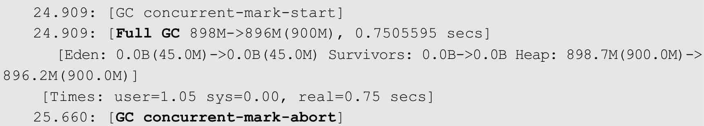

# 073-G1垃圾收集器-fullGC

[TOC]

- 并发回收由于让应用程序和GC线程交替工作，总是不能完全避免在特别繁忙的场合出现在回收过程中内存不充足的情况。

- 如果在混合GC时空间不足，或者在新生代GC时survivor区和老年代无法容纳幸存对象，都会导致一次Full GC。

当遇到这种情况时，G1也会转入一个Full GC。

## 实例

当G1在并发标记时，由于老年代被快速填充，G1会终止并发标记而转入一个Full GC。

此外，

