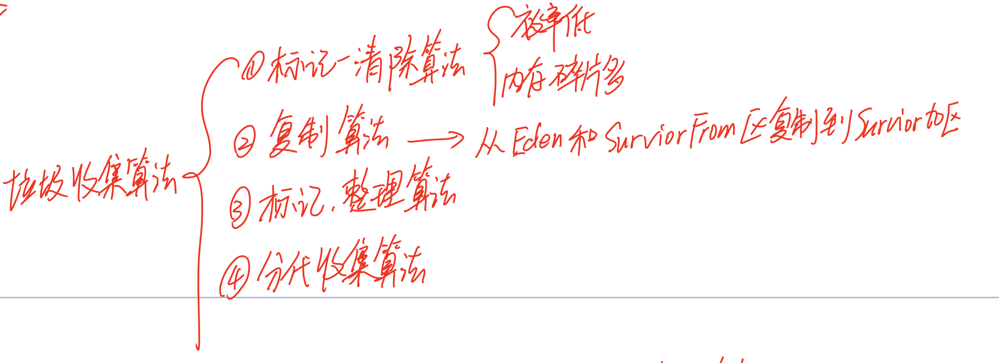
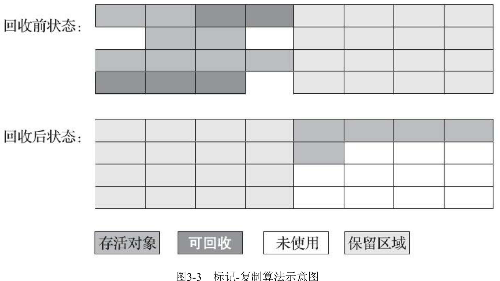

# JVM中常用的垃圾回收算法

## 目录

- [标记清除算法(Mark-Sweep)](#标记清除算法(Mark-Sweep))
- [复制(Coping)复制算法](#复制(Coping)复制算法)
- [标记压缩算法 (Mark-Compact)](#标记压缩算法 (Mark-Compact))
- [分代收集(Generational-Collection)](#分代收集(Generational-Collection)) 

## 标记清除算法(Mark-Sweep)

分为标记和清除两个阶段

- 标记阶段 : 标记阶段标记所有需要回收的对象
- 清除阶段: 清除可回收的对象并释放其占用的内存空间

#### 标记清除算法的缺点

**最大的问题是产生空间碎片**

- 由于标记清除算法在清理对象的后没有整理可用的内存空间,因此如果内存中被回收的小对象居多,则会引起内存碎片问题,继而会引起大对象无法获得连续空间的问题

- 执行效率不稳定,如果 Java 堆中包含了大量对象,而且其中大部分是需要被回收的,就必须进行大量标记和清除动作,导致执行效率都随对象数量的增长而降低

## 复制(Coping)复制算法

复制算法的核心思想是 : 将原有的内存空间划分为2块, 每次只使用其中一块,当垃圾收集发生时,将正在使用的内存中的的存活对象复制到未使用的内存块中,之后清除正在使用的内存块的所有对象,交换两个内存的对象,完成垃圾回收

> 复制算法为了解决标记清除算法内存碎片化的问题而设计的

标记复制算法

- 内存划分为两块大小相同的内存区域 1 和区域 2,
- 新生成的对象都被放在区域 1 中,在区域 1 满后对区域 1 进行标记,
- 标记后任然存活的对象全部复制到区域 2,直接清理区域 1 的内存

适用于

- 对象中的对象朝生夕死的状态时,效率高

但是

- 可用内存压缩为原来的一半,复制带来的开销

## 标记压缩算法 (Mark-Compact)

> 标记整理算法结合了标记清理和标记复制的优点,标记阶段和标记清理算法一致,在标记完成后将存活的对象一道内存的另一端,然后清除改端的对象并释放内存

缺点

- 如果要移动对象效率低,必须stop the world 

> 移动则内存回收会更加复杂,不移动则内存分配时会更加复杂

## 分代收集(Generational-Collection)

上面三种

- 标记清理
- 标记复制
- 标记整理

三个对所有类型的对象进行垃圾回收,

针对不同的对象类型,JVM 采用了不同的垃圾回收算法,这个算法成为分代收集算法

JVM 被划分成新生代和老年代

- [复制算法]新生代主要存放新生成的对象,特点是对象数量多,生命周期短,在每次进行垃圾回收时都有大量的对象被回收

> 因为存活的对象少,所以需要复制的对象也少,不存在大量对象来回复制的问题

- [标记清除]老年代主要存放大对象和生命周期长的对象,可回收的对象少

- 堆区分为两大块，一个是Old区，一个是Young区。 
- Young区分为两大块，一个是Survivor区(S0+S1)，一块是Eden区。 Eden:S0:S1=8:1:1 S0和S1一样大，也可以叫From和To。

垃圾回收时,清理 Eden 区和 ServivorFrom 区中的存活的对象复制到 ServivorTo 对象

#### 卡表数据结构

对于新生代和老年代来说，通常新生代回收的频率很高，但是每次回收的耗时很短，而老年代回收的频率比较低，但是会消耗更多的时间。

**为了支持高频率的新生代回收，虚拟机可能使用一种叫作卡表（Card Table）的数据结构。**

卡表为一个比特位集合，每一个比特位可以用来表示老年代的某一区域中的所有对象是否持有新生代对象的引用。

这样在新生代GC时，可以不用花大量时间扫描所有的老年代对象来确定每一个对象的引用关系，可以先扫描卡表，只有当卡表的标记位为1时，才需要扫描给定区域的老年代对象，而卡表位为0的老年代对象，一定不含有新生代对象的引用。

如图所示，卡表中每一位表示老年代4KB的空间，卡表记录为0的老年代区域没有任何对象指向新生代，只有卡表位为1的区域才有对象包含新生代引用，因此，在新生代GC时只需要扫描卡表位为1的老年代空间。使用这种方式，可以大大加快新生代的回收速度。

### GC触发的时机

- 如果Eden 区和 ServivorFrom 区 没有内存分配,会触发 MinorGC
- MinorGC 后, Eden区和 ServivorFrom 区  中存活的对象会被复制到 ServivorTo 区
- 如果 ServivorTo 区无法找到连续的内存空间存储对象,会直接将对象移动老年代
- 若是Servivor区的对象经过一次 GC后任然存活,年龄+1 .到 15岁,移动到老年区

