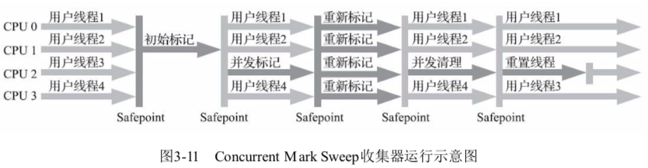

# CMS 垃圾收集器

关注点是 **停顿时间**

## CMS 代表什么

CMS = Concurrent Mark Sweep  收集器是一种以**获取最短回收时间为目标**的收集器

## 为什么要有 CMS 收集器

目前很大一部分 Java 应用集中在互联网网站或者基于浏览器的 B/S系统的服务端上,这类应用通常都会较为关注服务器的响应速度,希望停顿时间尽可能短,以给用户带来良好的交互体验

CMS 收集器就非常符合这类需求

## 收集步骤

Concurrent mark sweep 代表 并发标记清除

可以看出来他是基于标记复制算法实现的

- [初始标记](#初始标记) ( CMS initial mark ) 
- [并发标记](#并发标记) (CMS concurrent mark)
- [重新标记](#重新标记) ( CMS remark) 
- [并发清除](#并发清除) (CMS concurrent sweep)

## 初始标记

初始标记和重新标记这两步依然需要 Stop The World , 初始标记只是标记一下 GC Roots 能直接关联到的对象,速度很快

## 并发标记

CC Roots 的直接关联对象开始遍历整个对象图的过程,整个过程耗时较长但是不需要停顿用户线程,可以和垃圾收集器一起并发运行

## 重新标记

重新标记阶段是为了修正并发标记期间,因用户程序继续运作而导致标记产生变动的那一部分对象的标记记录

这个阶段的停顿时间通常会比初始标记时间长一点,但是远比并发标记阶段时间短

## 并发清除

清理删除掉标记阶段判断的已经死亡的对象,由于不需要移动存活对象,所以整个阶段也是可以与用户线程同时并发的

## CMS 优缺点

优点

- 并发收集,低停顿

缺点

- 对处理器资源敏感
- 无法处理浮动垃圾

## Card Table

CMS使用了CardTable ,记录引用了谁,防止全盘扫描整个老年代