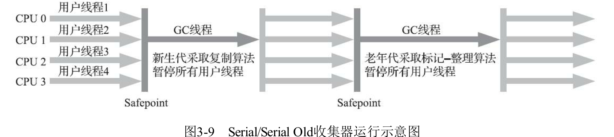

# Serial Old 收集器

> 单线程,针对老年代,标记整理算法(单线程版本采用的是复制算法,针对新生代)
>
> 这个收集器的主要意义也只是提供客户端模式下的 HotSpot 虚拟机使用,
>
> 如果在服务端模式下,有可能有两种用途
>
> - 一种是在 JDK5 以前的版本中与 Parallel Scavenge收集器配合使用
> - 一种是作为 CMS 收集器发生失败的后备预案

- 单线程
- 标记整理算法

#### 为什么用标记整理算法

- 新生代都是生命周期短的对象,适合使用标记复制算法

- 老年代主要存储长生命周期的对象,适合标记整理算法

