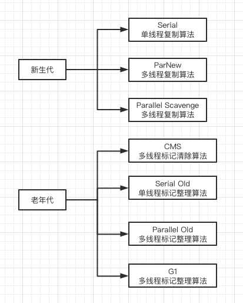
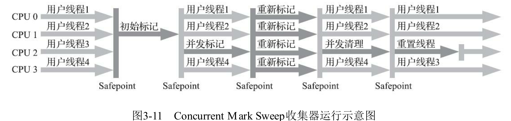

# 垃圾收集器

- 新生代垃圾收集器(通常采用复制算法)
  - [Serial 垃圾收集器: 单线程,复制算法](010-新生代-Serial垃圾收集器.md) 

    > 客户端默认收集器,单线程;复制算法

  - [ParNew 垃圾收集器: 多线程,复制算法](020-新生代-ParNew垃圾收集器.md) 

  - [Parallel Scavenge : 多线程,复制算法](030-新生代-Parallel-Scanvenge垃圾收集器.md) 

- 老年代垃圾收集器(通常采用标记整理算法)

  - [Serial Old 垃圾收集器: 单线程,标记整理算法](050-老年代Serial-Old垃圾收集器.md) 
  - [Parallel Old:多线程,标记整理算法 ](060-老年代Parallel-Old垃圾收集器.md) 
  - [CMS 垃圾回收器 基于标记清除算法实现](040-老年代-CMS垃圾收集器.md) 
  - [G1 垃圾收集器 ](070-老年代-G1垃圾收集器.md) 

## Parallel Old:多线程,标记整理算法

采用多线程并发垃圾回收,基于多线程标记整理算法实现

Parallel Old 优先考虑系统吞吐量,其次考虑停顿时间的等因素

新生代的 Parallel Scavenge 垃圾收集器和老年代的 Parallel Old 垃圾收集器的配合使用

## CMS 垃圾回收器 基于标记清除算法实现

CMS (Current Mark Sweep)垃圾回收期是为老年代设计的垃圾回收器,主要目的是达到最短的回收停顿时间

- 基于标记清除算法实现,多线程并发下最短的垃圾收集挺短时间

一共四步:

- 初始标记: 只标记 GC roots 直接关联的对象,速度很快,需要暂停所有工作现场
- 并发标志: 和用户线程一起工作,执行 GC roots 跟踪标记过程,不需要暂停工作线程
- 重新标记: 在并发标记过程中用户线程继续运行,导致在垃圾回收过程中,部分对象的状态发生变化,为了确保这部分对象的状态的正确性,需要对其重新标记并暂停工作线程
- 并发清除: 和用户线程一起工作,执行清除 GC roots 不可达的对象,不需要暂停工作线程

CMS垃圾回收期在和用户线程一起工作时,并发标记和并发清除,不需要暂停用户线程,有效缩短垃圾回收时系统的停顿时间,同时由于 CMS 垃圾收集器和用户线程一起工作,并行度和效率提升很大

## G1 垃圾收集器

G1 垃圾收集为了避免全区域垃圾收集引起的系统故障,把堆内存划分为大小固定的几个独立区域,独立使用这些区域的内存资源并且跟踪这些区域的垃圾收集进度,同时维护一个优先级列表,在垃圾回收的过程中根据系统允许的最长垃圾收集时间,优先回收垃圾最多的区域,

G1 垃圾回收过程中根据系统允许的最长垃圾收集时间,优先回收垃圾最多的区域,G1 垃圾收集器通过内存独立划分使用和根据不同优先级回收各区域垃圾的机制,确保 G1 垃圾收集器在优先时间内获得最高的垃圾收集效率

相对于 CMS , G1 垃圾收集器两个突出的改进:

- 基于标记整理算法,不产生内存碎片
- 可以精确地通知停顿时间,在补习生吞吐量的前提下实现短停顿垃圾回收

