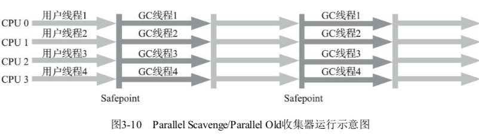

# Parallel Old 收集器

Parallel Old 是 Parallel Scanvenge 收集器的老年代版本,

- 支持多线程并发收集

- 基于标记 -整理算法
- 这个收集器是 JDK6 才提供短额

在 JDK 之前, 如果新生代采用了 Parallel Scanvenge 收集器,老年代除了 Serial Old ( PS MarkSweep) 收集器之外别无选择, 其他表现良好的老年代收集器,如 CMS 无法与它配合工作

由于老年代 Serial Old 收集器在服务器应用性能上的"拖累"

## 吞吐量优先

直到 Parallel Old 收集器出现后, 吞吐量优先收集器终于有了比较名副其实的搭配组合

#### 适用场景

在注重吞吐量或者处理器资源较为稀缺的场合,都可以优先考虑 Parallel Scanvenge + Parallel Scavenge 收集器这个组合

