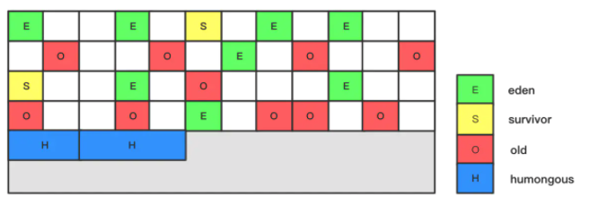

# 老年代-G1垃圾收集器

它设定的目标是在延迟可控的情况下获得尽可能高的吞吐量

## 图解

## 目录

- [G1收集器是什么](#G1收集器是什么)
- [MixedGC模式](#MixedGC模式)
- [运行过程](#运行过程)

## 标签

- 面向停顿时间

- **延迟可控的情况下获得尽可能高的吞吐量**

- **面向服务器端应用的垃圾收集器**

## G1收集器是什么

**延迟可控的情况下获得尽可能高的吞吐量**

G1(Garbage First) **延迟可控的情况下获得尽可能高的吞吐量** 是垃圾收集器技术的新思路 , JDK7 默认垃圾收集器

- 针对**停顿时间模型**

- 面向局部收集的设计思路
- [基于Region的内存布局形式](#基于Region的内存布局形式)

-  是一款 **面向服务器端应用的垃圾收集器**

## MixedGC模式

G1 可以面向 堆内存任何部分来组成回收集进行回收 , 衡量标准不再是它属于哪个年代,而是哪块内存中存放的垃圾数量最多, 回收收益最大, 这就是 G1收集器的 MixedGC模式

## 基于Region的内存布局形式

在G1算法中，采用了另外一种完全不同的方式组织堆内存，堆内存被划分为多个大小相等的内存块（Region），

每个Region是逻辑连续的一段内存，结构如下：

每个Region被标记了E、S、O和H，说明每个Region在运行时都充当了一种角色，

- 其中H是以往算法中没有的，它代表Humongous，这表示这些Region存储的是巨型对象（humongous object，H-obj），当新建对象大小超过Region大小一半时，直接在新的一个或多个连续Region中分配，并标记为H。

## 运行过程

- [初始标记](#初始标记)
- [并发标记](#并发标记)
- [最终标记](#最终标记)
- [筛选回收](#筛选回收)

## 初始标记

仅仅标记一个GC roots 能直接关联到的对象 , 这个阶段需要停顿用户线程,但是耗时很短

## 并发标记

从GC Roots 开始对堆中的对象进行可达性分析,递归扫描堆里的对象图,找到要回收的对象,这个过程和用户线程是并发执行的

## 最终标记

对用户线程做一个短暂的暂停,用于处理并发阶段结束后仍然遗留下来的最后的少量SATB记录

## 筛选回收

- 筛选

  > 根据各个Region的回收价值和成本进行排序,根据用户所期望的停顿时间来指定回收计划,可以自由选择任意多个region构成回收集特点

- 回收

  > 把决定回收的那一部分Region 的存放对象复制到空的Region中, 再清理掉整个Region的全部空间(这个过程涉及存活对象的Region中)再清理掉整个旧的Region

## 值得注意的是

G1收集器除了并发标记之外,其余阶段也是要完全暂停用户线程的 

所以 **G1收集器并非纯粹追求低延迟,官方给它设定的目标是在延迟可控的情况下获得尽可能高的吞吐量,所以才能撑起<全功能收集器>的重任和期望**

G1中 堆被划分为一组大小相等的(Region)，每个区域都是连续的虚拟内存范围。

- G1执行一个并发全局标记阶段，来确定堆中对象的是否存活。
- 标记阶段完成后，G1知道哪些区域大部分是空的。它首先在这些区域进行收集，这通常会产生大量的自由空间。

这就是为什么这种垃圾收集方法被称为垃圾优先的原因。顾名思义，G1将其收集和压缩活动集中在堆中可能充满可回收对象(即垃圾)的区域。

- G1使用一个暂停预测机制来满足用户定义的暂停时间目标，并根据指定的暂停时间目标选择要收集的区域数。

被G1确定为可以回收的区域是通过疏散来收集垃圾的。G1将对象从堆的一个或多个区域复制到堆上的单个区域，并在这个过程中压缩和释放内存。此疏散在多处理器上并行执行，以减少暂停时间并提高吞吐量。因此，对于每次垃圾收集，G1都在用户定义的暂停时间内持续工作以减少碎片。这超出了前面两种方法的能力。CMS(并发标记清除)垃圾收集不执行压缩。ParallelOld垃圾收集只执行整堆压缩，这会导致相当长的暂停时间。

需要注意的是，G1不是一个实时收集器。它满足设定的暂停时间目标的概率很高，但不是绝对确定的。基于以前收集的数据，G1估计在用户指定的目标时间内可以收集多少区域。因此，收集器对于收集区域的成本有一个相当准确的模型，它使用这个模型来确定要收集哪些区域和多少区域，同时保持在暂停时间目标内。

## G1和CMS的

- G1 是标记整理算法, CMS是标记清除算法 减少了空间碎片

- G1计划作为并发标记-清除收集器(CMS)的长期替代品。
- 与CMS相比，G1是一个更好的解决方案。一个不同之处在于G1是一个压缩收集器。
- G1非常紧凑，完全避免了使用细粒度的空闲列表进行分配，而是依赖于区域。
- 这大大简化了收集器的各个部分，并在很大程度上消除了潜在的碎片问题。
- 此外，G1比CMS收集器提供了更多可预测的垃圾收集暂停，并允许用户指定所需的暂停目标。

