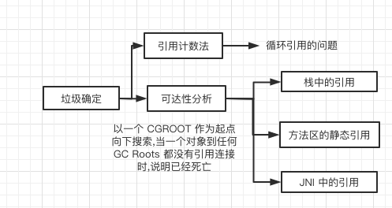
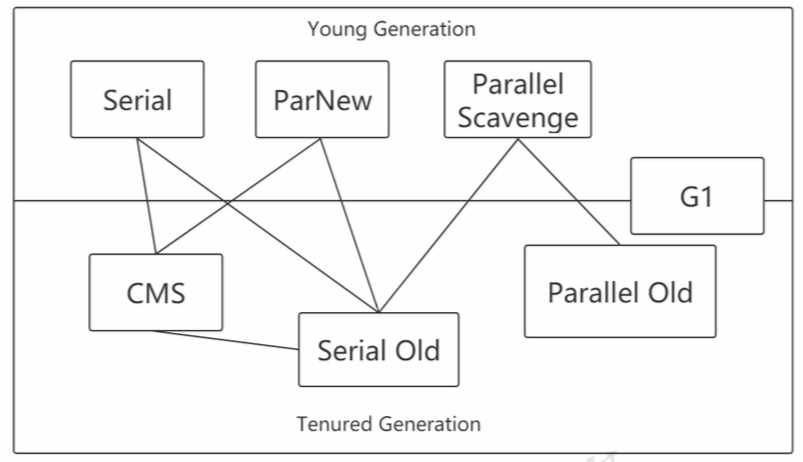

# 垃圾回收

[TOC]

垃圾收集无非就是三个问题:

- 哪些内存需要回收
- 什么时候回收
- 如何回收

灵魂拷问: 我们为什么要了解垃圾回收机制

## 灵魂拷问: 我们为什么要了解垃圾回收机制

- 当需要排查各种内存溢出,内存泄漏问题时
- 当垃圾收集成为系统达到更高并发量的瓶颈时

我们就需要把这些"自动化"技术实施必要的监控与调节

## 哪些内存需要回收

哪些不回收:

- 程序计数器不回收
- 虚拟机栈不回收
- 本地方法栈不回收

因为他们是线程私有的,栈中的栈帧随着方法的进入和退出而有条不紊地执行着出栈和入栈操作,每一个栈帧中分配多少内存基本上是在类的结构确定下来时已知了

**Java堆和方法区不一样, 他们需要回收**

- 一个接口的多个实现类需要的内存可能不一样
- 一个方法中的多个分支需要的内存页不一样

具体来说

- 虚拟机栈(栈帧中的本地变量表)中引用的对象
- 方法区中类静态属性引用的变量
- 方法区中常量引用的对象
- 本地方法栈中 navtive 方法引用的对象

所以只有在运行期间才能知道会创建哪些对象,这部分内存回收是动态的,垃圾回收器所关注的也是这部分内存

## 如何确定垃圾

Java 采用引用计数法和可达性分析来确定对象是否应该被回收,其中,

- 引用计数法容易产生循环引用的问题

- 可达性分析算法通过根搜索算法(GC roots Tracing)来实现,根搜索算法以一些列 GCROOTS 的点作为起点向下搜索,在一个对象到任意 GC roots都没有引用链项链的时候,说明已经死亡

  - GC roots 可以是:

    - 虚拟机栈本地变量表里的对象引用,
    - 方法区中的静态引用
    - JNI(native 方法中引用展开分析)

    
    
    # 垃圾收集器

