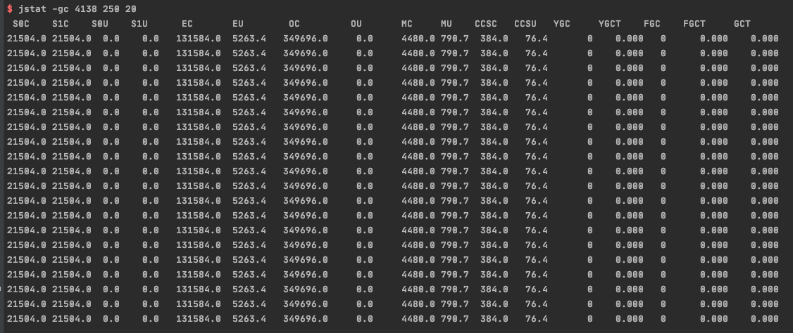
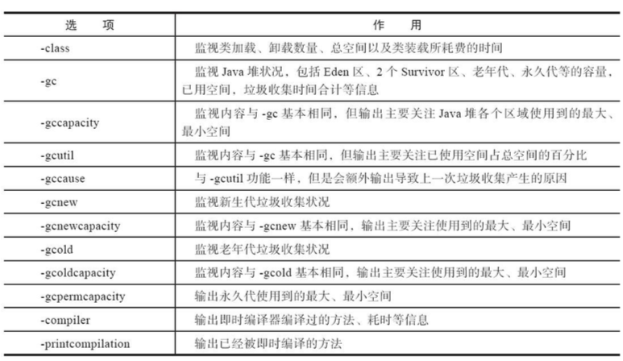

# jstat 虚拟机统计信息监视工具

jstat (JVM Statistic Monitoring Tool) 是用于监视虚拟机各个运行信息的命令行,它可以显示本地或者远程虚拟机进程中的类加载,内存,垃圾回收,即时编译等运行时数据,在没有 GUI 图形界面,只提供纯文本控制台环境的服务器上,它将是运行期间定位虚拟机性能的常用工具

#### jstat 虚拟机统计信息监控工具

命令格式

```
jstat [option vmid [interval [s|ms] [count]]]
```

对于命令格式中的 vmid 与 lvmid 需要特别说明一下: 如果是本地虚拟机进程, vmid 与 lvmid 是一直的,如果是远程虚拟机进程,那 vmid 的格式应当是:

参数 interval 和 count 代表查询间隔和次数,如果省略这 2 个参数,说明只查询一次,假设需要每 250 毫秒查询一次进程 2764 垃圾收集状况,一共查询 20 次

```
jstat -gc 2764 250 20
```

#### 示例



#### 参数



## 实例

```
$ jstat -gcutil 4138
  S0     S1     E      O      M     CCS    YGC     YGCT    FGC    FGCT     GCT   
  0.00   0.00   4.00   0.00  17.65  19.90      0    0.000     0    0.000    0.000

```

- E 代表 Eden 去 ,使用了 4%的空间
- S0 Survivor
- S1 Survivor
- O 老年代 
- P permanent 
- YGC Minor GC 次数
- FGC  Full GC 次数
- FGCT full GC time 表示 Full GC time 为 0.472
- GCT 所有 GC 总耗时