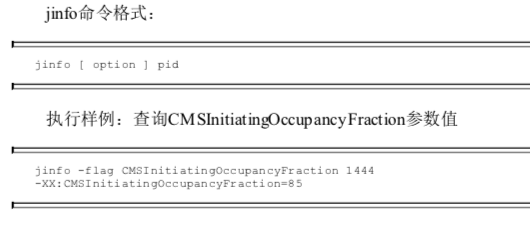

# Jinfo 配置信息工具

Jinfo 试试查看和调整虚拟机各项参数,使用 jps 命令的-v 参数可以查看虚拟机启动时显示指定的参数列表

如果你想知道未被显示指定的参数的系统默认值,可以使用 

- `jinfo -flag`

- `jinfo -sysprops` :  把虚拟机进程的 `System.getProperties()`

## 代码实例



## 实例

```
$ jinfo -flag MaxHeapSize 24381
-XX:MaxHeapSize=734003200
```

```
$ jinfo -flag UseG1GC 24381
-XX:-UseG1GC //减号表示没有使用
```

## 使用jinfo实时修改值

```
java -XX:+PrintFlagsFinal -version
```

或者在运行时添加

```
-XX:+PrintFlagsFinal
```


只有是managable 的才能够实时修改


## 使用jinfo查看修改过的值

```
[root@node1 ~]# jinfo -flags 92648
Attaching to process ID 92648, please wait...
Debugger attached successfully.
Server compiler detected.
JVM version is 25.171-b11
Non-default VM flags: -XX:CICompilerCount=4 -XX:CMSInitiatingOccupancyFraction=75 -XX:+CMSParallelRemarkEnabled -XX:CompressedClassSpaceSize=260046848 -XX:+DisableExplicitGC -XX:+HeapDumpOnOutOfMemoryError -XX:HeapDumpPath=null -XX:InitialHeapSize=4294967296 -XX:MaxDirectMemorySize=4294967296 -XX:MaxHeapSize=4294967296 -XX:MaxMetaspaceSize=268435456 -XX:MaxNewSize=4294443008 -XX:MetaspaceSize=134217728 -XX:MinHeapDeltaBytes=524288 -XX:NewSize=4294443008 -XX:OldSize=524288 -XX:-OmitStackTraceInFastThrow -XX:+PrintGC -XX:+PrintGCTimeStamps -XX:SurvivorRatio=10 -XX:ThreadStackSize=512 -XX:-UseAdaptiveSizePolicy -XX:+UseCMSInitiatingOccupancyOnly -XX:+UseCompressedClassPointers -XX:+UseCompressedOops -XX:+UseParallelGC
Command line:  -Xmx4096m -Xms4096m -Xmn4096m -Xss512k -XX:SurvivorRatio=10 -XX:MetaspaceSize=128m -XX:MaxMetaspaceSize=256m -XX:MaxDirectMemorySize=4096m -XX:-OmitStackTraceInFastThrow -XX:-UseAdaptiveSizePolicy -XX:+HeapDumpOnOutOfMemoryError -XX:HeapDumpPath=/data/hls-hzero/hls-seata/target/logs/java_heapdump.hprof -XX:+DisableExplicitGC -XX:+CMSParallelRemarkEnabled -XX:+UseCMSInitiatingOccupancyOnly -XX:CMSInitiatingOccupancyFraction=75 -Xloggc:/data/hls-hzero/hls-seata/target/logs/seata_gc.log -verbose:gc -Dio.netty.leakDetectionLevel=advanced -Dapp.name=seata-server -Dapp.pid=92648 -Dapp.repo=/data/hls-hzero/hls-seata/target/lib -Dapp.home=/data/hls-hzero/hls-seata/target -Dbasedir=/data/hls-hzero/hls-seata/target
```

