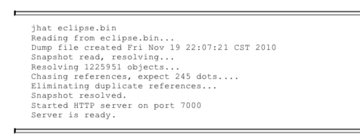
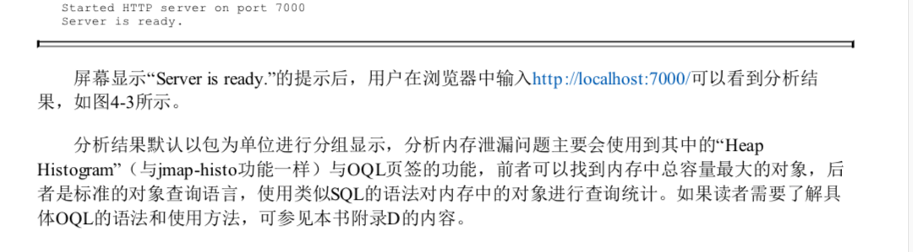
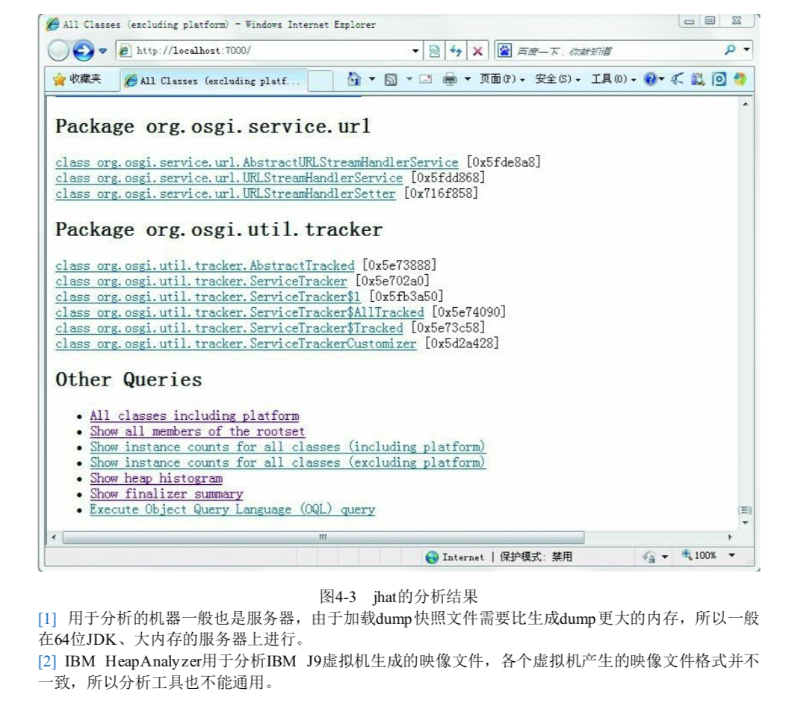

# Jhat 虚拟机堆转储快照分析工具

JDK提供 jhat (JVM Heap Analysis Tool )命令生成 jmap 搭配使用,分析 jmap 生成的转储快照

> 除非实际工作中,没有别的工具可用,否则大多数人不会直接使用 jhat 命令哎分析堆转储快照文件

- 不会再应用服务器上直接分析堆转储快照文件,耗费硬件资源
- jhat分析功能简陋

我们可以使用 mat 或者 jvisualVM 来分析

