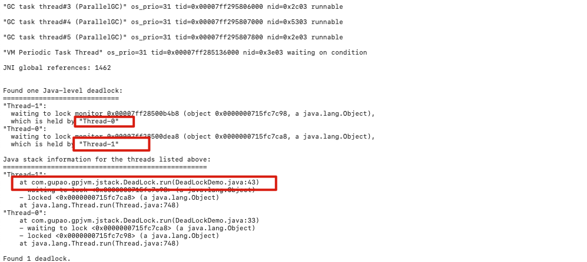

# Jstack 堆栈追踪工具

jstack (Stack Trace for Java) 命令用于生成虚拟机当前时刻的线程快照,一般称为 threaddump或者 javacore 文件

## 什么是虚拟机线程快照

线程快照是当前虚拟机内每一条线程正在执行的方法堆栈的集合,生成线程快照的目的通常是定位线程出现长时间停顿的原因

- 线程死锁
- 线程死循环
- 请求外部资源导致长时间挂起等等

## 命令

```
jstack [option] vmid
```

## 参数

| 选项 | 作用                                        |
| ---- | ------------------------------------------- |
| -F   | 当正常输出请求不被相应时,强制输出线程堆栈   |
| -l   | 除堆栈外,显示关于锁的附加信息               |
| -m   | 如果调用到本地方法的话,可以显示 c/c++的堆栈 |

## 例子

死锁

```
package com.gupao.gpjvm.jstack;

//运行主类
public class DeadLockDemo
{
    public static void main(String[] args)
    {
        DeadLock d1=new DeadLock(true);
        DeadLock d2=new DeadLock(false);
        Thread t1=new Thread(d1);
        Thread t2=new Thread(d2);
        t1.start();
        t2.start();
    }
}
//定义锁对象
class MyLock{
    public static Object obj1=new Object();
    public static Object obj2=new Object();
}
//死锁代码
class DeadLock implements Runnable{
    private boolean flag;
    DeadLock(boolean flag){
        this.flag=flag;
    }
    public void run() {
        if(flag) {
            while(true) {
                synchronized(MyLock.obj1) {
                    System.out.println(Thread.currentThread().getName()+"----if获得obj1锁");
                    synchronized(MyLock.obj2) {
                        System.out.println(Thread.currentThread().getName()+"----if获得obj2锁");
                    }
                }
            }
        }
        else {
            while(true){
                synchronized(MyLock.obj2) {
                    System.out.println(Thread.currentThread().getName()+"----否则获得obj2锁");
                    synchronized(MyLock.obj1) {
                        System.out.println(Thread.currentThread().getName()+"----否则获得obj1锁");

                    }
                }
            }
        }
    }
}

```

#### 使用命令导出堆栈信息

```
$ jstack 1170 > ~/software/stack.log
```



#### 