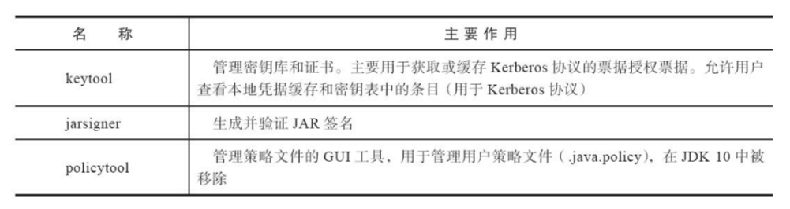
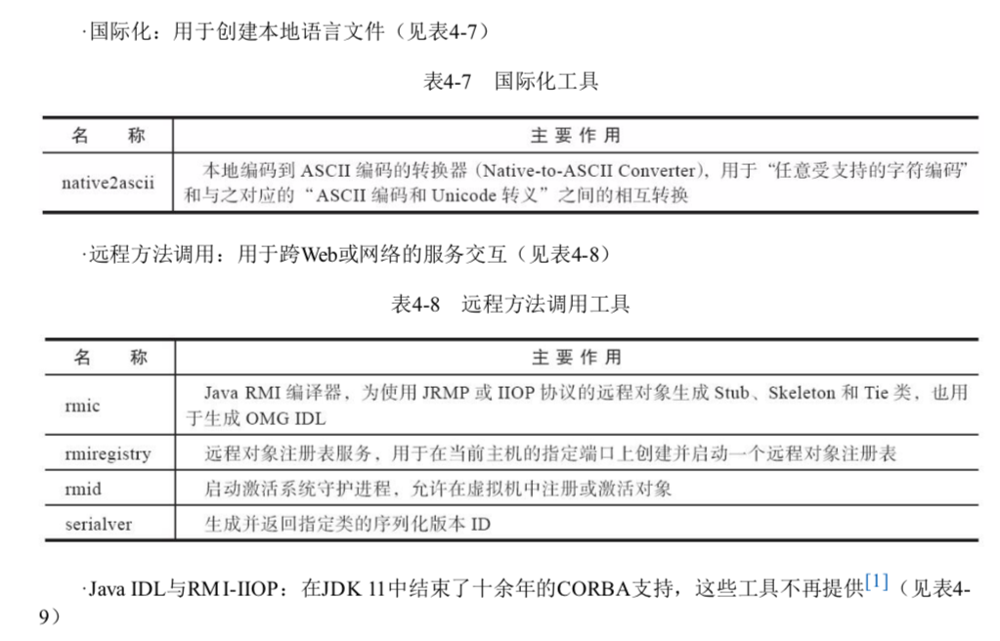
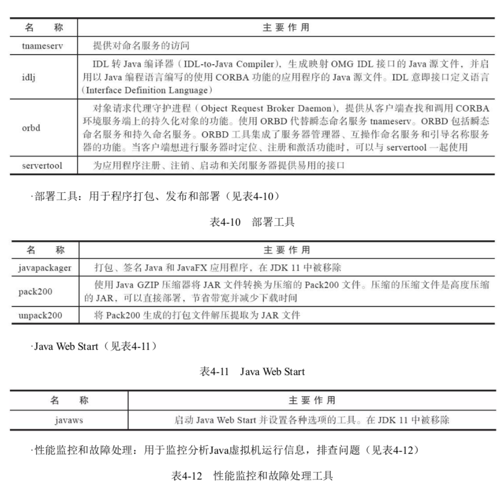
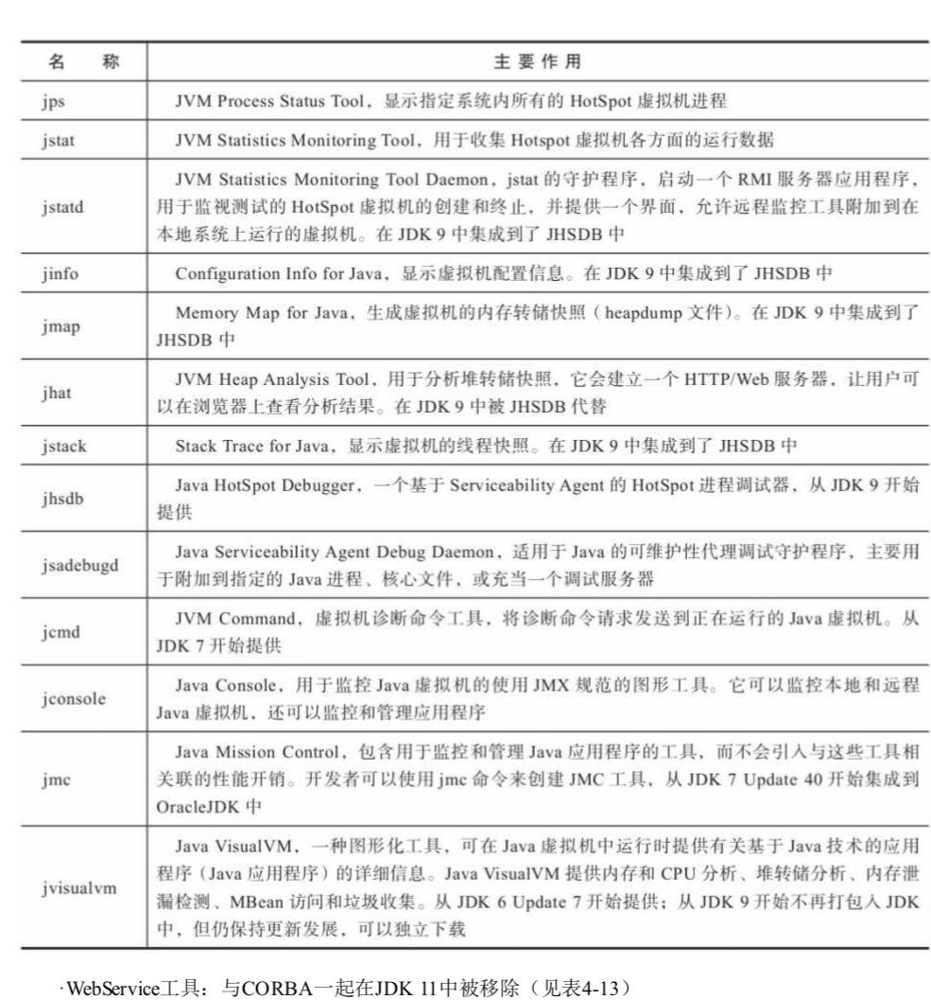
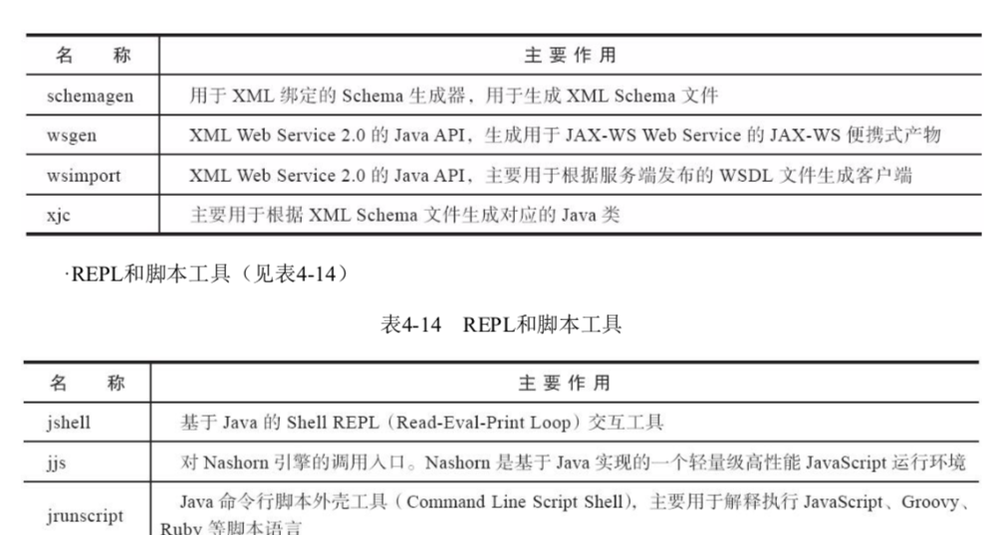

# 常用的基础工具

永不过时

## 性能故障和故障处理工具

| 名称      | 主要作用                                                     |      |
| --------- | ------------------------------------------------------------ | ---- |
| jps       | 显示指定系统内所有的 HotSpot 虚拟机进程                      |      |
| jstat     | JVM Statistics Monitoring Tool 用于收集 HotSpot 虚拟机各方面的运行数据 |      |
| Jstatd    | jstat 的守护线程,启动一个 RMI 服务器应用程序,用于监视测试的 HotSpot 虚拟机的创建和终止,并提供一个界面,允许远程监控工具附加到在本地系统运行商的虚拟机,在 JDK9 中集成到了 JHSDB中 |      |
| jinfo     | 显示虚拟机配置信息,在 JDK9 中集成到了 JHSDB                  | JDK8 |
| jmap      | 生成虚拟机的内存转储快照,在 JDK9 中集成到了 JHSDB            | JDK8 |
| jhat      | 用于分析堆转储快照,他会建立一个 HTTP/web服务器,让用户可以在浏览器上查看分析结果,在 JDK9 被 JHSDB | JDK8 |
| jstack    | 显示虚拟机快照,在 JDK9中集成到了 JHSDB                       | JDK8 |
| jhsdb     | 一个基于 Serviceability Agent 的 HotSpot 进程调试器,从 JDK9 开始提供 | JDK9 |
| jsadebugd | 适用于 Java 的可维护性代理调试守护程序,主要用于附加到指定的 Java 进程,核心文件,或者充当一个调试服务器 |      |
| jcmd      | 虚拟机诊断命令工具,将诊断命令请求发送到正在运行的 Java 虚拟机,从 JDK7开始提供 | JDK7 |
| jconsole  | 用于监控 Java 虚拟机的使用 JMX 规范的图形工具                |      |
| jmc       | 包含用于监控和管理 Java 应用程序的工具,而不会引入与这些工具相关联的性能开销,开发者可以使用 jmc 命令来创建 JMC 工具 |      |
| jvisualvm | 图形化工具,分析 CPU,堆转储分析,内存泄漏检测,MBean 访问和垃圾收集,从 JDK6 Update7 开始提供,从 JDK9 开始不再打包如 JDK中 | JDK8 |
| schemagen | 用于生成 XML Schema 文件                                     |      |
| wsgen     | 生成用于 JAS-WS Service 的 JAX-WS 便携式产物                 |      |
| wsimport  | 主要用于根据服务端发布的 WSDL 文件生成客户端                 |      |
| xjc       | 主要用于根据 XML Schema 文件生成对应的 Java 类               |      |

## 基础工具			

| 名称         | 主要作用                                                     |
| ------------ | ------------------------------------------------------------ |
| appletviewer | 不使用 web 浏览器的情况下运行和调试 Applet ,jdk11 中被移除   |
| extcheck     | 检查 jar 冲突的工具,JDK9 中被移除                            |
| jar          | 创建和管理 JAR 文件                                          |
| java         | java 运行工具,用于运行 Class文件或者 JAR 文件                |
| javac        | 用于 java 编程语言的编译器                                   |
| javadoc      | Java 的 API 文档生成器                                       |
| javah        | C语言头文件和 Stub函数生成器,用于编写 JNI 方法               |
| javap        | Java 字节码分析工具                                          |
| jlink        | 将 Module 和它的依赖打成一个运行时镜像文件                   |
| jdb          | 基于 JPDA 协议的调试器, 以类似于 GDB 的方式进行调试代码      |
| jdeps        | Java类依赖性分析器                                           |
| jdeprscan    | 用于搜索 Jar 包中使用了"deprecated"的类,从 JDK9 开始提供     |
| keytool      | 管理秘钥和证书,主要用于获取或者缓存 Kerberos 协议的票据授权票据,允许用户查看本地凭据缓存和秘钥表中的条目 |
| jarsigner    | 生成并验证 JAR签名                                           |
| policytool   | 管理策略文件的 GUI 工具,用于管理用户策略文件(.java.policy),在 JDK 10中被移除 |

## 国际化

用于创建本地语言文件

| 名称         | 主要作用                                                     |
| ------------ | ------------------------------------------------------------ |
| native2ascii | 本地编码到 ASCII 编码的转换器(Native-toASCII Converter) 用于任意受支持的字符串编码和与对应的 ASCII 编码和 Unicode 转义, 之间的互相转换 |
|              |                                                              |
|              |                                                              |

## 远程方法调用工具

| 名称        | 主要作用                                                     |
| ----------- | ------------------------------------------------------------ |
| rmic        | Java RMI 编译器,为使用 JRMP 或者 IIOP 协议的远程对象 生成 Srub,Skeletion 和 Tie 类, 也用于生成 OMG IDL |
| rmiregistry | 远程对象注册表注册,用于在当前主机的指定端口上创建并启动一个远程对象注册表 |
| rmid        | 启动激活系统守护进程,允许在虚拟机中注册或者激活对象          |
| serialver   | 生成并返回指定类的序列化版本 ID                              |

## 

| 工具名称       | 作用                                                       |
| :------------- | ---------------------------------------------------------- |
| appletviewer   | 不使用 web 浏览器的情况下运行和调试 Applet ,jdk11 中被移除 |
| extcheck       | 检查 jar 冲突的工具,JDK9 中被移除                          |
| idlj           |                                                            |
| jar            | 创建和管理 JAR 文件                                        |
| jarsigner      |                                                            |
| java           | java 运行工具,用于运行 Class 文件或者 JAR 包               |
| javac          | 用于 Java 编程语言的编译器                                 |
| javadoc        | Java 的 API 文档生成器                                     |
| javafxpackager |                                                            |
| javah          |                                                            |
| javap          |                                                            |
| javapackager   |                                                            |
| jcmd           |                                                            |
| jconsole       |                                                            |
| jdb            |                                                            |
| jdeps          |                                                            |
| jhat           |                                                            |
| jinfo          |                                                            |
| jjs            |                                                            |
| jmap           |                                                            |
| jmc            |                                                            |
| jps            |                                                            |
| jrunscript     |                                                            |
| jsadebugd      |                                                            |
| jstack         |                                                            |
| jstat          |                                                            |
| jstatd         |                                                            |
| jvisualvm      |                                                            |
| keytool        |                                                            |
| native2ascii   |                                                            |
| orbd           |                                                            |
| pack200        |                                                            |
| policytool     |                                                            |
| rmic           |                                                            |
| rmid           |                                                            |
| rmiregistry    |                                                            |
| schemagen      |                                                            |
| serialver      |                                                            |
| servertool     |                                                            |
| tnameserv      |                                                            |
| unpack200      |                                                            |
| wsgen          |                                                            |
| wsimport       |                                                            |
| xjc            |                                                            |

