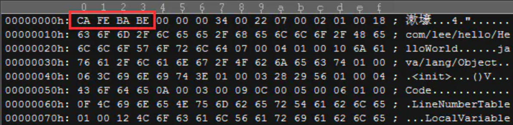
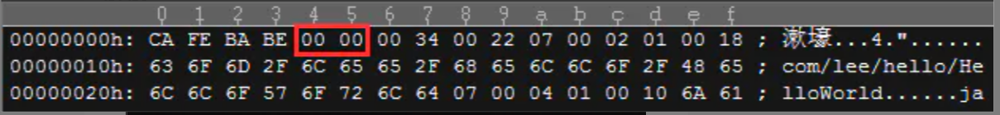
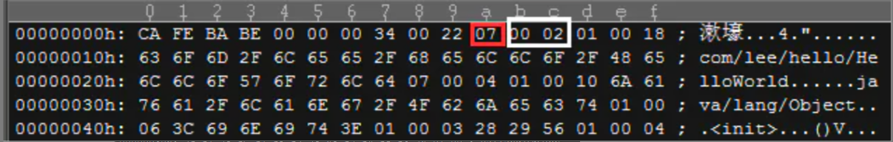
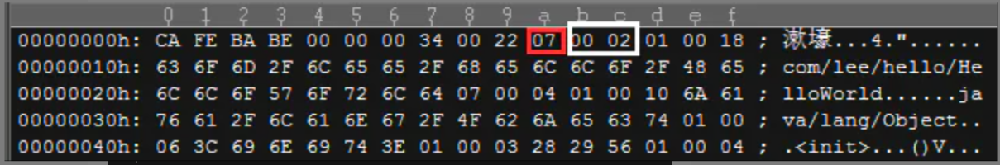
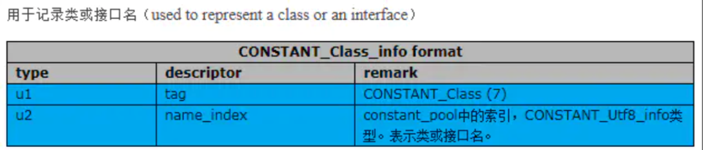
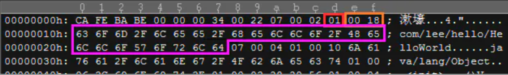
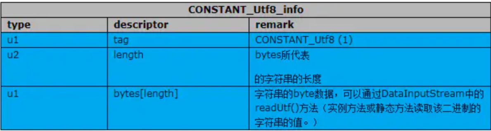
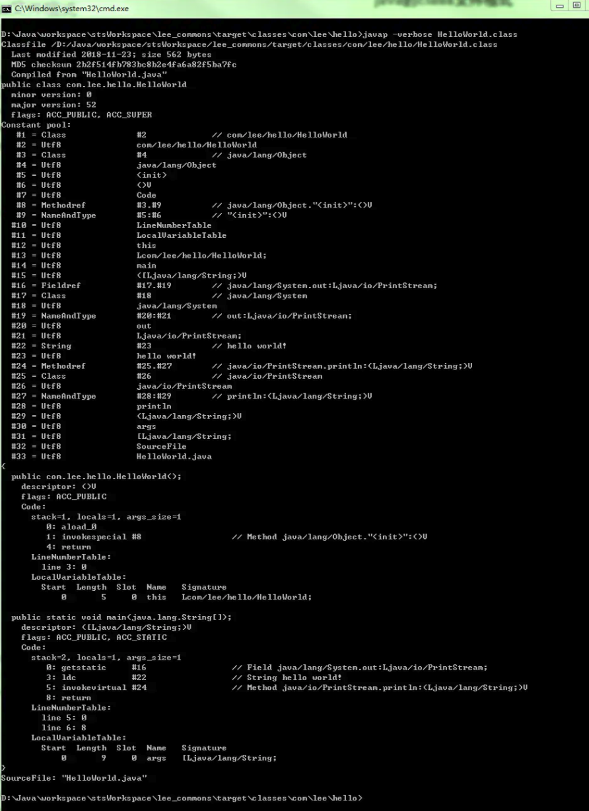

# Class类文件的结构

Class 文件是一组以 8 字节为基础单位的二进制流,各个数据项目严格按照顺序紧凑地排列在文件之中,中间没有任何分隔符,使得整个 Class文件中的存储内容几乎全部是程序运行的必要数据,没有空隙产生

当遇到 8 个字节以上空间的数据时,会按照高位在前的方式分隔成若干个 8 字节进行存储

## Class 文件的存储结构

- 无符号数

> 无符号数属于基本的数据结构,以 u1, u2 , u4 , u8 来分别代表 1 个字节,2 个字节,4 个字节,8 个字节的无符号数
>
> 可以用来描述 **数字** , **索引引用**, **数量值** ,**按照 UTF-8编码构成的字符串值**

- 表

> 是由多个无符号数或者其他表作为数据项构成的组合数据类型,为了便于区分,所有的表都习惯以_info 结尾
>
> 表用于描述有层次关系的符合结构的数据,整个 Class 文件本职上也可以视为一张表


总体格式表：

| **类型**       | **名称**            | **数量**                |
| -------------- | ------------------- | ----------------------- |
| u4             | magic               | 1                       |
| u2             | minor_version       | 1                       |
| u2             | major_version       | 1                       |
| u2             | constant_pool_count | 1                       |
| cp_info        | constant_pool       | constant_pool_count - 1 |
| u2             | access_flags        | 1                       |
| u2             | this_class          | 1                       |
| u2             | super_class         | 1                       |
| u2             | interfaces_count    | 1                       |
| u2             | interfaces          | interfaces_count        |
| u2             | fields_count        | 1                       |
| field_info     | fields              | fields_count            |
| u2             | methods_count       | 1                       |
| method_info    | methods             | methods_count           |
| u2             | attribute_count     | 1                       |
| attribute_info | attributes          | attributes_count        |

> class文件中的信息是一项一项排列的， 每项数据都有它的固定长度， 有的占一个字节， 有的占两个字节， 还有的占四个字节或8个字节， 数据项的不同长度分别用u1, u2, u4, u8表示， 分别表示一种数据项在class文件中占据1个字节， 2个字节， 4个字节和8个字节。 可以把u1, u2, u3, u4看做class文件数据项的“类型” 。

# 解读

## magic



```undefined
CA FE BA BE magic u4
```

## minor_version




```undefined
00 00   minor_version  u2
```

## major_version



```undefined
00 34   major_version
```

> 0x34 = 52，对应的是java 8的版本

## constant_pool_count


```undefined
00 10   constant_pool_count
```

> 代表接下来有0x10=16-1=15个常量。
>  cp_info = constant_pool_count - 1

## 第一个cp_info



第一个是标志位，07代表CONSTANT_Class_info：



> name_index需要读取两个字节，如上上图白框


```bash
07  CONSTANT_Class_info 07同时也是tag
    00 02   name_index：引用2号，记为#2
```

然后来解读一下2号(记为#2)，




第一个标志位01代表CONSTANT_Utf8_info，0018就是代表0x18=24个字节的字符串，就是接下来24个字节都是这个字符串的引用`com/lee/he11o/HelloWorld`：




也就是说，`CONSTANT_Class_info`引用的是#2，为`com/lee/he11o/HelloWorld`。

后面的解读都是这样操作即可。

# 借用工具解读

用肉眼一个一个解读就过于重复操作了，jdk提供了工具帮我们解读这个class文件，就是javap。




可以简单看看，#1对应的是class信息，引用的是#2，#2对应的是utf8，对应的字符串是`com/lee/hello/HelloWorld`。正好就是我们上面解读的信息。


