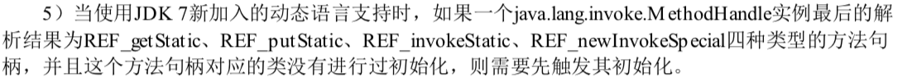
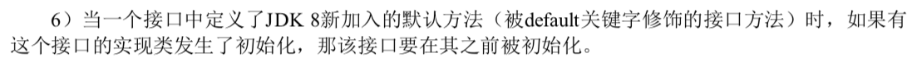
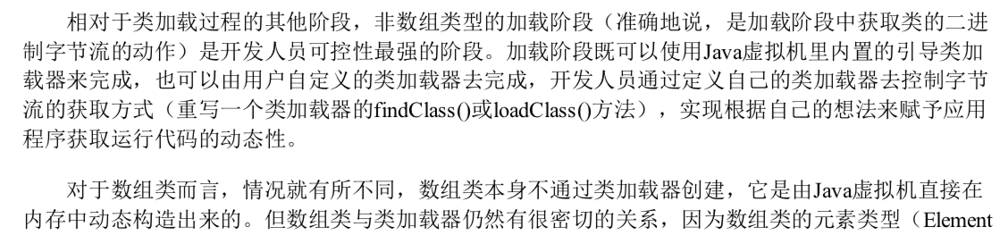
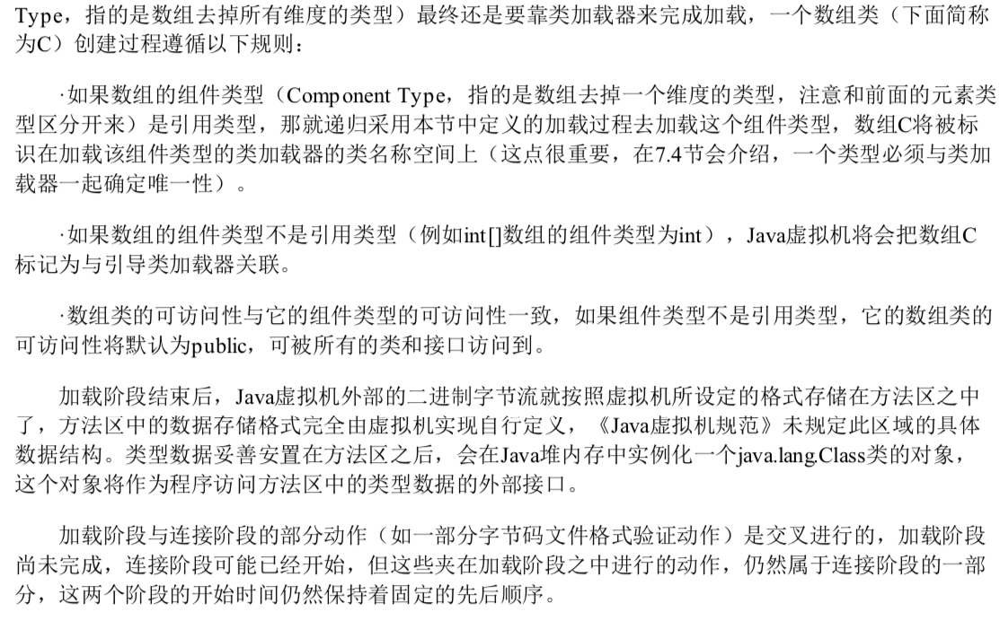
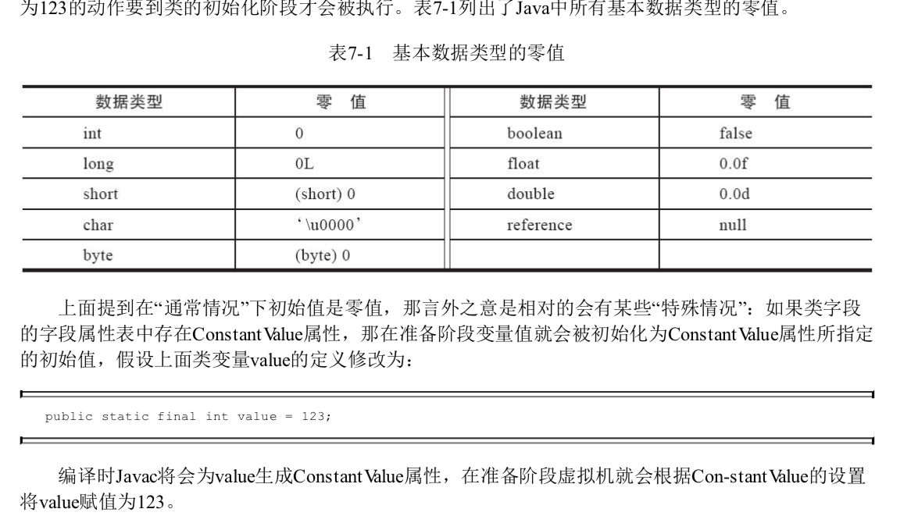
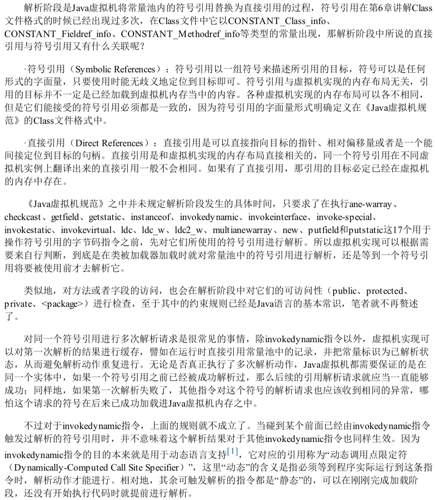

# 类加载的时机

类的生命周期


JVM 类的加载分为 5 个阶段

- 加载
- 验证
- 准备
- 解析

## 类的加载时机

- 

##### 6 种情况必须要对类进行初始化

**有且仅有**下面 6 种情况会执行类的初始化

当然初始化之前的加载,验证,准备,解析自然要执行

1. 遇到 new , getstatic , putstatic ,invokestatic 四条字节码指令时,如果类型没有进行过初始化,则首先触发其初始化

   > 

2. 使用 java.lang.reflect 包的方法对类型进行反射调用的时候,如果类型没有进行过初始化,则需要先触发其初始化

3. 当初始化类的时候,如果发现其父类还没有进行初始化,则先触发其父类的初始化

4. 当虚拟机启动的时候,用户需要制定一个要执行的主类(main 函数的类)虚拟机会初始化这个类

5. 当使用 jdk7 新加入的动态语言支持时

   > 

6. 当一个接口定义了 JDK8 加入的默认方法时

   > 

## 加载

JVM 读取 Class 文件,并且根据 Class 文件描述创建 java.lang.Class 对象的过程

类加载过程主要包含

1. 通过一个类的全限定名来获取定义这个类的二进制字节流
2. 将这个字节流所代表的静态存储结构转化为方法区的运行时数据结构
3. 在内存中生成一个代表这个类的 java.lang.Class 对象,作为方法区这个类的各种数据的访问入口

#### 类定义的字节流

可以试试是任意地方的,任意方式读取的字节流都可以加载,包括

- jar
- ear 
- war

- 可以从加密文件中获取,这是典型的防止 Class 文件反编译的保护措施,通过加载时解密 Class 文件来暴涨程序运行逻辑

- 等等各种方式,甚至可以网络中获取

> web applet

- 运行时计算获取,动态代理技术

> 比如 java.lang.reflect.Proxy 中,就用了 `ProxyGenerator.generateProxyClass()`来为特定接口生成形式为`*$Proxy`的代理类的二进制字节流

- 由其他文件生成,典型的就是 jsp,jsp 生成对应的 Class 文件
- 从数据库中读取, 比如一些中间件服务器(Sap Netweaver)可以选择吧程序安装到数据库中来完成集群间的分发

总结下:

- 将 Class文件读取到运行时区域的方法区内
- 在堆中创建 `java.lang.Class`对象,并封装类在方法区中的数据结构
- 读取 Class 文件时既可以通过文件形式读取,也可以通过 jar 包读取,war包读取,还可以通过代理自动生成 Class 或其他方式读取

#### 值得注意的是





## 验证

确保 Class文件符合当前虚拟机的要求,保障虚拟机自身的安全,只有通过验证的 Class 文件才能被 JVM 加载

- 文件格式校验
- 元数据校验
- 字节码校验
- 符号引用校验

## 准备

主要工作时在方法区中卫类变量分配内存空间并设置类的变量的初始值

初始值指的是不同数据类型的默认值,这里需要注意 final 类型的变量和非 final类型的变量在准备阶段数据数据初始化过程不同

```java
public static long value = 1000;
```

- 静态变量 value 在准备阶段初始值 0 
- 对象初始化阶段将 value 设置为 1000

这是因为静态变量的初始化操作是定义在构造器中

如果将变量定义为 final 变量

```
public static final int vlaue = 1000;
```

JVM 在编译阶段会为 final 类型的变量 value 生成器对应的 ConstantValue 属性,虚拟机在准备阶段会根据 ConstantValue 属性将 value 设置为 1000

> 

## 解析

JVM 会将常量池中的符号引用替换为直接引用

> 
>
> 

## 初始化

> `<client>` 方法是由编译器自动收集类中的所有类变量的复制动作和静态语句块 static {} 块 中的语句合并产生的
>
> 编译器的收集顺序是定义顺序
>
> 静态语句块中只能访问到定义在静态语句块之前的变量,定义在它之后的变量,在前面的静态语句块中可以赋值,但是不能访问

主要通过类的构造器`<client>` 方法对类进行初始化,`<client>`方法是编译阶段由编译器自动收集类中的静态语句块和变量的复制操作组成的,在一个类中既没有静态变量复制操作也没有静态语句时,编译器不会为该类生成`<client>`方法,

发生以下几种情况时,JVM 不会执行类的初始化

- 常量在编译的时候会将其常量值存入使用该常量类的常量池中,这个过程不需要调用常量所在的类,因此不会触发该常量类的初始化
- 在子类引用父类的静态字段时,不会触发子类的初始化,只会触发父类的初始化
- 定义对象数组,不会触发这个类的初始化
- 在使用类名获取 Class 对象时,不会触发累的初始化
- 在使用 Class.forName 加载指定的类时,可以通过 initialize 参数设置是否需要对类进行初始化
- 在使用 ClassLoader 默认的 loadClass 方法加载类的时候不会触发该类的初始化


