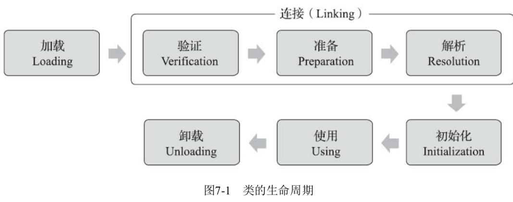

# 类加载机制-加载阶段

## 目录

[TOC]

## 图解



## 从哪里加载

任何包含字节码的形式

1. 从本地系统中直接加载
2. 通过网络下载.class文件
3. 从归档文件中加载.class文件
4. 从专用数据库中提取.class文件
5. 将Java源文件动态编译为.class文件,运行时计算而成
6. 从加密文件中获取

## 什么时候会触发类的加载

**有且仅有**下面6种情况会执行类的加载、连接、初始化

1. [四条字节码指令](#四条字节码指令)
2. [反射调用](#反射调用)
3. [对父类的初始化](#对父类的初始化)
4. [带有main函数的主类](#带有main函数的主类)
5. [jdk7的动态语言支持](#jdk7的动态语言支持)
6. [jdk8接口的默认方法](#jdk8接口的默认方法)

不会初始化:

1. 引用父类的静态字段,只会引起父类初始化,不会引起子类初始化

2. 使用类的final 常量不会引起初始化(ConstantValue)

3. 定义类数组不会引起类的初始化

   ```
   Person[] perlist = new Person[10];
   ```

   

### 四条字节码指令

遇到 new , getstatic , putstatic , invokestatice 这四条字节码指令时候,如果类型没有进行过初始化,则触发加载,连接,初始化

- new 指令: 使用new 关键字实例化对象的时候
- getstatic 指令 : 读取一个类型的静态字段 (被 final 修饰,已在编译器把结果放入常量池的静态字段除外) 的时候
- putstatic 指令 : 设置一个类型的静态字段 (被 final 修饰,已在编译器把结果放入常量池的静态字段除外) 的时候
- invokestatic 指令 : 调用一个类型的静态方法的时候

### 反射调用

使用 java.lang.reflect 包的方法对类型进行**反射调用**的时候,如果类型没有进行过初始化,则需要先触发其初始化

### 对父类的初始化

当初始化类的时候 , 如果发现其父类还没有进行初始化,**则先触发其父类的初始化**

### 带有main函数的主类

当虚拟机启动的时候,用户需要指定一个要执行的主类(main 函数的类)虚拟机会初始化这个类 , 虚拟机会先初始化这个主类

### jdk7的动态语言支持

当使用 JDK7 新加入的动态语言支持时, 如果一个 java.lang.invoke.MethodHandle 实例最后的解析结果为以下四种类型的方法句柄 , 并且这个方法句柄对应的类没有进行过初始化,则需要先触发其初始化

- REF_getStatic
- REF_putStatic
- REF_invokeStatic
- REF_newInvokeSpecial

### jdk8接口的默认方法

当一个接口定义了 JDK8 加入的默认方法时 , 如果有这个接口的实现类发生了初始化,那这个接口也要**在其之前**被初始化

## 类加载具体做了什么

加载 : JVM 读取 Class 文件,并且根据 Class 文件描述创建` java.lang.Class` 对象的过程

类加载过程主要包含3件事

1. 通过一个类的全限定名来获取定义这个类的二进制字节流
2. **将这个字节流所代表的静态存储结构转化为方法区的运行时数据结构**
3. 在内存中生成一个代表这个类的` java.lang.Class `对象,作为方法区这个类的各种数据的访问入口

#### 类定义的字节流

可以是任意地方的,任意方式读取的字节流都可以加载,包括

| 读取方式举例      | 备注                                                         |
| ----------------- | ------------------------------------------------------------ |
| 从zip压缩包中读取 | jar,ear,war等常见的压缩格式                                  |
| 从网络中获取      | web applet                                                   |
| 运行时计算生成    | 动态代理技术 java.lang.reflect.Proxy中,就使用 ProxyGenerator.geneerateProxyClass() 来为特定接口生成形式为 `*$Proxy` 的代理类的二进制流 |
| 由其他文件生成    | 典型场景JSP. 由JSP文件生成对应的Class文件                    |
| 从数据库中读取    | 有一些中间件服务器,例如SQP Netweaver可以选择把程序安装到数据库中来完成程序代码在集群间的分发 |
| 从加密文件中获取  | 典型防止Class文件被分编译的保护措施,通过在加载时解密class文件来保障程序运行逻辑不被窥探 |

正是有了这么多类加载的机制, 使得获取类的二进制字节流的动作 是开发人员可控性最强的阶段

- 可以使用Java虚拟机内置的引导类来完成
- 可以由用户自定的类加载器去完成 字节流的获取方式(重写类加载器的findClass 和loadClass方法) 

从未实现了根据自己的想法来赋予应用程序获取运行代码的动态性

## 数组加载具体做了什么

数据本身不通过类加载器创建,它是由Java虚拟机直接在内存中构建出来的,

**但是数组类与类加载器关系很密切**:

数组类的元素类型(Element Type, 指的是数组去掉所有纬度的类型) 最终还是要靠类加载器来完成加载

### 数组类创建规则

- 如果是引用类型,那么要递归去加载这个类型
- 如果不是引用类型(例如 int[]. 这是基本类型) , Java虚拟机会把这个数组标记为与引导类加载器(Bootstrap ClassLoader) 关联
- 数组类的可访问性和它的组件类型的可访问性一致, 如果组件类型不是引用类型,它的数组类的可访问性将默认为public , 可以被所有的类和接口访问到

## 加载阶段与连接阶段的关系

加载阶段和连接阶段是交叉进行的, 连接阶段主要是进行相应的校验

- 加载阶段尚未完成,连接阶段可能就已经开始,可能夹杂在加载阶段
- 两个阶段的开始时间依然保持固定的先后顺序

