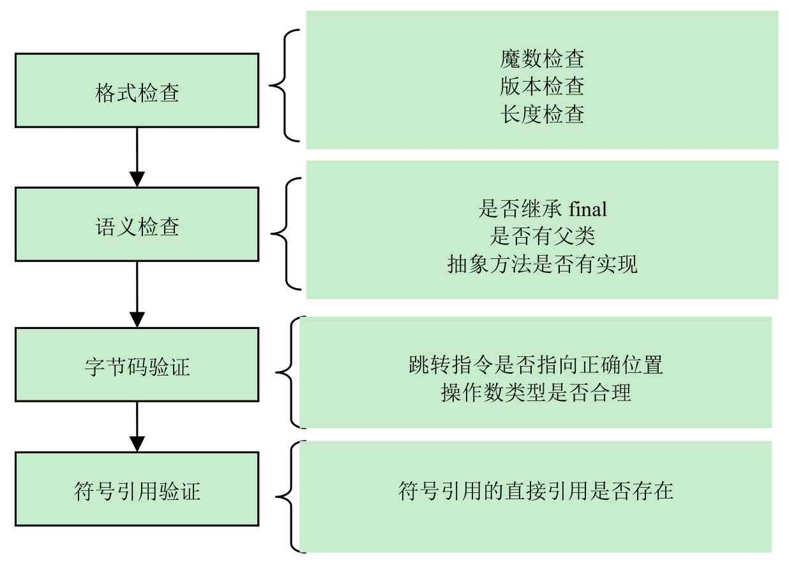
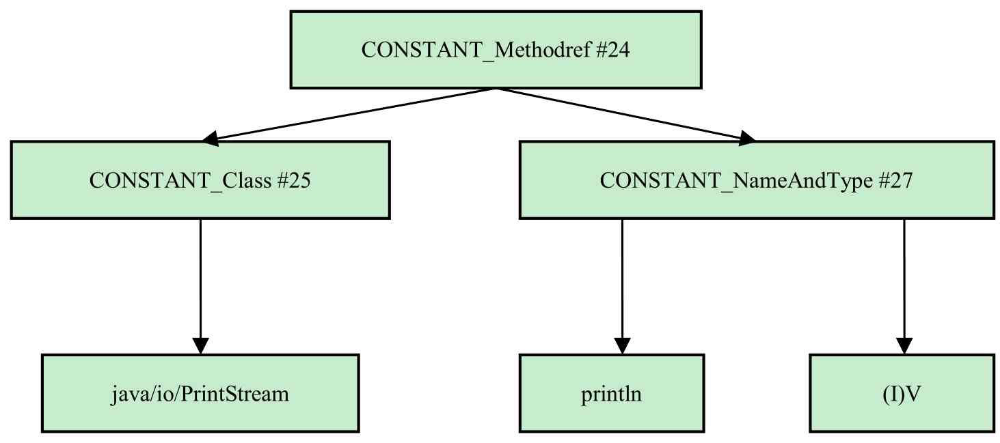

# 类加载机制-连接阶段

## 目录

- [加载图示](#加载图示)
- [连接流程](#连接流程)

----

## 加载图示


## 连接流程

- [连接第1阶段-验证](#连接第1阶段-验证)

  目的是保证加载的字节码是合法,合理并符合规范的

- [连接第2阶段-准备](#连接第2阶段-准备)

  虚拟机会给这个类分配内存空间,设置初始值

- [连接第3阶段-解析](#连接第3阶段-解析)

### 连接第1阶段-验证

目的是保证加载的字节码是合法,合理并符合规范的




确保 Class文件符合当前虚拟机的要求,保障虚拟机自身的安全,只有通过验证的 Class 文件才能被 JVM 加载

- 文件格式校验 

  > 验证字节流是否符合 Class 文件规范, 是否是 0xCAFEBABE 开头,主次版本号等等

- 元数据校验

  > 对字节码描述的信息进行语义分析,以保证其描述的信息符合 Java 语言规范的要求
  >
  > 例如, 除了 Object 都应该有父类

- 字节码校验

  > 主要目的是通过数据流分析和控制流分析,确定成语语义是否合法,符合逻辑的

- 符号引用校验

  > 该类是否缺少或者被禁止访问它依赖的某些外部类,方法,字段等资源
  >
  > - 符号引用通过字符串描述的全限定名能否找到对应的类
  >
  > - 指定类里是否包含符合方法的字段描述符以及简单名称锁描述的方法和字段

### 连接第2阶段-准备

虚拟机会给这个类分配内存空间,设置初始值

> 主要工作时在方法区中为**类变量分配内存空间**并设置类的变量的初始值

初始值指的是不同数据类型的默认值,这里需要注意 final 类型的变量和非 final类型的变量在准备阶段数据数据初始化过程不同

```java
public static long value = 1000;
```

- 静态变量 value 在准备阶段初始值 0 
- 对象初始化阶段将 value 设置为 1000

这是因为静态变量的初始化操作是定义在构造器中

如果将变量定义为 final 变量

```
public static final int vlaue = 1000;
```

JVM 在编译阶段会为 final 类型的变量 value 生成器对应的 ConstantValue 属性,虚拟机在准备阶段会根据 ConstantValue 属性将 value 设置为 1000


注意 :Java并不支持boolean类型，对于boolean类型，内部实现实际上是int类型，由于int类型的默认值是0，故对应的boolean类型的默认值就是false。

### 连接第3阶段-解析

解析阶段的工作是将类、接口、字段和方法的符号引用转化为直接引用

解析阶段的主要做的是 : **JVM 会将常量池中的符号引用替换为直接引用**

符号引用是 Class 文件格式内多次出现的, 以 

- CONSTANT_Class_info
- CONSTANT_Fieldref_info 
- CONSTANT_Methodref_info 

等类型的常量出现

#### 什么是符号引用

符号引用 (Symbolic Reference) :  符号引用以一组符号来描述所引用的目标, 符号可以是**任何形式的字面量** , 只要使用时能无歧义地定位到目标即可

符号引用 与虚拟机实现的内存布局无关,引用目标并不一定是已经加载到虚拟机内存当中的内容

各种虚拟机实现的内存布局可以各不相同, 但是它们能够接受的符号引用必须是一致的, 因为符号引用的字面量形式明确定义在<Java 虚拟机规范> 的 class 文件格式中

#### 什么是直接引用

直接引用(Direct refeerence) : 直接引用时可以直接指向目标的指针、相对偏移量或者是一个能够间接定位到目标的句柄 

**直接引用和虚拟机的内存实现直接相关** 同一个符号引用在不同虚拟机实例上翻译出来的直接引用一般不会相同, 如果有了直接引用, 那引用的目标必定已经在虚拟机的内存中存在

#### 解析发生的具体时间

java 虚拟机规范 中没有具体规定解析阶段发生的具体时间, 只要求了在执行 ane-warray , checkcast, getfield, getstatic, instanceof, invokebynamic, invokeinterface, invoke-special, invokestatic, ldc, ldc_w, ldc2_2 , multianewarray, new, putfield 和 putstatic  这 17 个用于操作符号引用的字节指令之前,先对他们所使用的符号引用进行解析

所以虚拟机实现可以根据需要来自行判断,到底是在类被加载器加载时就对常量池中的符号引用进行解析,还是等待一个符号引用将要被使用前才会解析它

## 解析阶段实例

命令

```java
System.out.println()
```

解析后命指令为

```java
invokevirtual #24 <java/io/PrintStream.println>
```

可以看出这里使用的常量池第24项,查看并分析常量池,可以看到下面结构




常量池第24项被invokevirtual使用，顺着CONSTANT_Methodref#24的引用关系查找，最终发现，所有对于Class及NameAndType类型的引用都是基于字符串的。

因此，可以认为invokevirtual的函数调用通过字面量的引用描述已经表达清楚。这就是符号引用。

在程序实际运行时，只有符号引用是不够的，当println()方法被调用时，系统需要明确知道该方法的位置。

以方法为例，Java虚拟机为每个类都准备了一张方法表，将其所有的方法都列在表中，当需要调用一个类的方法时，只要知道这个方法在方法表中的偏移量就可以直接调用。通过解析操作，符号引用可以转变为目标方法在类的方法表中的位置，从而使得方法被成功调用。

综上所述，**所谓解析就是将符号引用转为直接引用，也就是得到类或者字段、方法在内存中的指针或者偏移量**。可以说，如果直接引用存在，那么可以肯定系统中存在该类、方法或者字段。但只存在符号引用，不能确定系统中一定存在该对象。

最后来看一下CONSTANT_String的解析。字符串在程序开发中有着重要的作用，因此读者有必要了解一下String在Java虚拟机中的处理方法。在Java代码中直接使用字符串常量时，就会在类中出现CONSTANT_String，它表示字符串常量，并且会引用一个CONSTANT_UTF8常量项。在Java虚拟机内部运行时的常量池中，会维护一张字符串拘留表（intern），它会保存所有出现过的字符串常量，并且没有重复项。以CONSTANT_String形式出现的字符串也都会在这张表中。使用String.intern（）方法可以得到一个字符串在拘留表中的引用，因为该表中没有重复项，所以任何字面相同的字符串的String.intern()方法的返回值总是相等的。

```java
public static void main(String[] args) {
	 String a = Integer.toString(1) + Integer.toString(2) + Integer.toString(3);
   String b = "123";
   System.out.println(a.equals(b));
   System.out.println(a == b);
   System.out.println(a.intern() == b);
}
```

运行结果

```
true
false
true
```

- 因为a和b两个字符串都是字面量“123”，所以equals（）方法返回true，

- 而a和b并不是指向同一个对象，因此a==b返回false。
- 但是由于a在拘留表（intern）中的引用，就是b（这里b就是常量本身），因此a.intern（）==b返回true。