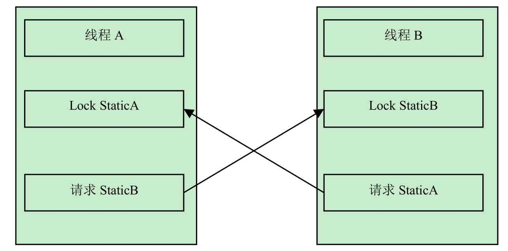

# 类加载机制-初始化阶段

## 目录

- [初始化阶段做了什么](#初始化阶段做了什么)
- [不触发初始化的情况](#不触发初始化的情况)
- [线程初始化造成死锁](#线程初始化造成死锁)
- [Java虚拟机保证多线程初始化](#Java虚拟机保证多线程初始化)

---


## 初始化阶段做了什么

加载,连接阶段程序员除了加载阶段可以通过自定义加载器的方式局部参与过程,其余动作完全由Java虚拟机来主导控制

直到初始化阶段,Java虚拟机才开始执行类中编写的Java代码, 将主导权移交给应用程序,所以:

初始化阶段就是执行类构造器`<client>()`方法的过程,

- `<client>()` 方法是 javac编译器的自动生成的。**它是由类静态成员的赋值语句及static语句块共同产生的。**

#### client

```java
public static SimpleStatic {
  public static int id =1;
  public static int number;
  static {
    number = 4;
  }
}
```

java编译器编译后会生成如下`<client>`方法

```
$ javap -c SimpleStatic 
Compiled from "SimpleStatic.java"
public class SimpleStatic {
  public static int id;

  public static int number;

  public SimpleStatic();
    Code:
       0: aload_0
       1: invokespecial #1                  // Method java/lang/Object."<init>":()V
       4: return

  static {};
    Code:
       0: iconst_1
       1: putstatic     #2                  // Field id:I
       4: iconst_4
       5: putstatic     #3                  // Field number:I
       8: return
}
```

可以看到，生成的<clinit>方法中，

- 整合了SimpleStatic类中的static赋值语句及static语句块，先后对id和number两个成员变量进行赋值。

在加载一个类之前，虚拟机总是会试图加载该类的父类，因此父类的<clinit>方法总是在子类的<clinit>方法之前被调用。也就是说，子类的static块的优先级高于父类的。


#### 非法前向引用变量


#### 第一个执行的一定是Object中的client方法

`<client>()`方法与类的构造函数不同,它不需要显示地调用父类的构造器,虚拟机会保证在子类的client 方法执行前,父类的client方法已经被执行了,因此Java虚拟机中第一个被执行client方法的一定是java.lang.Object

#### client方法的执行顺序

父类的client方法先执行,所以父类的静态语句要优先于子类的变量赋值操作,字段B 将会是2 而不是1

```java
static class Parent{
  	public static int A = 1;
  	static {
       A = 2;
    }
  public class Sub extends Parent{
    public static int B = A;
  }
  public static void main(String[] args){
    System.out.println(Sub.B);
  }
}
```

主要通过类的构造器`<client>` 方法对类进行初始化,`<client>`方法是编译阶段由编译器自动收集类中的静态语句块和变量的复制操作组成的,在一个类中既没有静态变量复制操作也没有静态语句时,编译器不会为该类生成`<client>`方法,

## Java虚拟机保证多线程初始化

Java虚拟机必须保证一个类的的 `<client>()`方法在多线程环境下被正确的加载通过,如果多个线程同时去初始化一个类,那么只会有其中一个线程去执行这个类的`<client>()`方法,其他线程都要**阻塞等待**,直到执行完成

所以`<client>()`方法不能有好时候很长的操作,这可能会造成多个进程阻塞


## 线程初始化造成死锁

`<client>()`方法的调用, 也就是类的初始化,虚拟机会在内部确保其多线程环境中的安全性, 也就是说当多个线程企图初始化同一类时,只有一个线程可以进入`<client>`方法,而其他线程必须等待,如果之前的类成功加载了类,则等在队列中的线程就没有机会再执行`<client>`方法了(当需要使用这个类时,虚拟机会直接返回给它已经准备好的信息)

正是因为`<client>` 方法是带锁线程安全的,所以在多线程环境下进行类的初始化时,可以能会引起死锁,并且这种死锁是很难发现的,因为他们看起来并没有可用的锁信息

#### 在StaticA静态代码块里初始化类StaticB

```java
public class StaticA {

    static {
        try {
            Thread.sleep(1000);
        } catch (Exception e) {
            e.printStackTrace();
        }
        try {
            //在StaticA静态代码块里初始化类StaticB
            Class.forName("init.StaticB");
        } catch (Exception e) {
            e.printStackTrace();
        }
        System.out.println("staticA init OK");
    }

}
```

#### 在StaticB静态代码块里初始化类StaticA

```java
public class StaticB {

    static {
        try {
            Thread.sleep(1000);
        } catch (Exception e) {
            e.printStackTrace();
        }
        try {
            //在StaticB静态代码块里初始化类StaticA
            Class.forName("init.StaticA");
        } catch (Exception e) {
            e.printStackTrace();
        }
        System.out.println("staticB init OK");
    }
}
```

使用两个线程去创建

```java
public class StaticDeadLockMain extends Thread {

    private char flag;

    public StaticDeadLockMain(char flag) {
        this.flag = flag;
        this.setName("Thread" + flag);
    }

    @Override
    public void run() {
        try {
            //初始化
            Class.forName("init.Static" + flag);
        } catch (ClassNotFoundException e) {
            e.printStackTrace();
        }
        System.out.println(getName() + " over");

    }

    public static void main(String[] args) {
        StaticDeadLockMain loadA = new StaticDeadLockMain('A');
        loadA.start();
        StaticDeadLockMain loadB = new StaticDeadLockMain('B');
        loadB.start();
    }
}

```

#### jstack查看死锁信息

```

"Attach Listener" #15 daemon prio=9 os_prio=31 tid=0x00007fe40e079000 nid=0x4e0b waiting on condition [0x0000000000000000]
   java.lang.Thread.State: RUNNABLE

"DestroyJavaVM" #14 prio=5 os_prio=31 tid=0x00007fe40f009000 nid=0x1603 waiting on condition [0x0000000000000000]
   java.lang.Thread.State: RUNNABLE

"ThreadB" #13 prio=5 os_prio=31 tid=0x00007fe3de021800 nid=0xa803 in Object.wait() [0x000070000c03d000]
   java.lang.Thread.State: RUNNABLE
        at java.lang.Class.forName0(Native Method)
        at java.lang.Class.forName(Class.java:264)
        at init.StaticB.<clinit>(StaticB.java:19)
        at java.lang.Class.forName0(Native Method)
        at java.lang.Class.forName(Class.java:264)
        at init.StaticDeadLockMain.run(StaticDeadLockMain.java:22)

"ThreadA" #12 prio=5 os_prio=31 tid=0x00007fe40e078800 nid=0x5503 in Object.wait() [0x000070000bf3a000]
   java.lang.Thread.State: RUNNABLE
        at java.lang.Class.forName0(Native Method)
        at java.lang.Class.forName(Class.java:264)
        at init.StaticA.<clinit>(StaticA.java:19)
        at java.lang.Class.forName0(Native Method)
        at java.lang.Class.forName(Class.java:264)
        at init.StaticDeadLockMain.run(StaticDeadLockMain.java:22)

"Service Thread" #11 daemon prio=9 os_prio=31 tid=0x00007fe3de019000 nid=0x4103 runnable [0x0000000000000000]
   java.lang.Thread.State: RUNNABLE

"C1 CompilerThread2" #10 daemon prio=9 os_prio=31 tid=0x00007fe3fe005000 nid=0x4203 waiting on condition [0x0000000000000000]
   java.lang.Thread.State: RUNNABLE

"C2 CompilerThread1" #9 daemon prio=9 os_prio=31 tid=0x00007fe40e823000 nid=0x4403 waiting on condition [0x0000000000000000]
   java.lang.Thread.State: RUNNABLE

"C2 CompilerThread0" #8 daemon prio=9 os_prio=31 tid=0x00007fe3de018000 nid=0x4603 waiting on condition [0x0000000000000000]
   java.lang.Thread.State: RUNNABLE

"JDWP Command Reader" #7 daemon prio=10 os_prio=31 tid=0x00007fe40e803000 nid=0x3c03 runnable [0x0000000000000000]
   java.lang.Thread.State: RUNNABLE

"JDWP Event Helper Thread" #6 daemon prio=10 os_prio=31 tid=0x00007fe3de000800 nid=0x4803 runnable [0x0000000000000000]
   java.lang.Thread.State: RUNNABLE

"JDWP Transport Listener: dt_socket" #5 daemon prio=10 os_prio=31 tid=0x00007fe40e028000 nid=0x4a07 runnable [0x0000000000000000]
   java.lang.Thread.State: RUNNABLE

"Signal Dispatcher" #4 daemon prio=9 os_prio=31 tid=0x00007fe3fe002800 nid=0x3a03 runnable [0x0000000000000000]
   java.lang.Thread.State: RUNNABLE

"Finalizer" #3 daemon prio=8 os_prio=31 tid=0x00007fe40f01b800 nid=0x5003 in Object.wait() [0x000070000b51c000]
   java.lang.Thread.State: WAITING (on object monitor)
        at java.lang.Object.wait(Native Method)
        - waiting on <0x0000000715588ed0> (a java.lang.ref.ReferenceQueue$Lock)
        at java.lang.ref.ReferenceQueue.remove(ReferenceQueue.java:144)
        - locked <0x0000000715588ed0> (a java.lang.ref.ReferenceQueue$Lock)
        at java.lang.ref.ReferenceQueue.remove(ReferenceQueue.java:165)
        at java.lang.ref.Finalizer$FinalizerThread.run(Finalizer.java:216)

"Reference Handler" #2 daemon prio=10 os_prio=31 tid=0x00007fe40f01a800 nid=0x3103 in Object.wait() [0x000070000b419000]
   java.lang.Thread.State: WAITING (on object monitor)
        at java.lang.Object.wait(Native Method)
        - waiting on <0x0000000715586bf8> (a java.lang.ref.Reference$Lock)
        at java.lang.Object.wait(Object.java:502)
        at java.lang.ref.Reference.tryHandlePending(Reference.java:191)
        - locked <0x0000000715586bf8> (a java.lang.ref.Reference$Lock)
        at java.lang.ref.Reference$ReferenceHandler.run(Reference.java:153)

"VM Thread" os_prio=31 tid=0x00007fe40e802800 nid=0x3003 runnable 
```

系统并没有给出足够的信息来判断死锁,但是死锁确实存在,所以我们要格外小心由类的初始化造成的死锁问题



## 不触发初始化的情况

发生以下几种情况时 , JVM **不会执行类的初始化**

- 常量在编译的时候会将其常量值存入使用该常量类的常量池中,这个过程不需要调用常量所在的类,因此不会触发该常量类的初始化
- 在子类引用父类的静态字段时,不会触发子类的初始化,只会触发父类的初始化
- 定义对象数组,不会触发这个类的初始化
- 在使用类名获取` Class` 对象时,不会触发类的初始化
- 在使用 `Class.forName` 加载指定的类时,可以通过` initialize `参数设置是否需要对类进行初始化
- 在使用 `ClassLoader`默认的` loadClass` 方法加载类的时候不会触发该类的初始化

