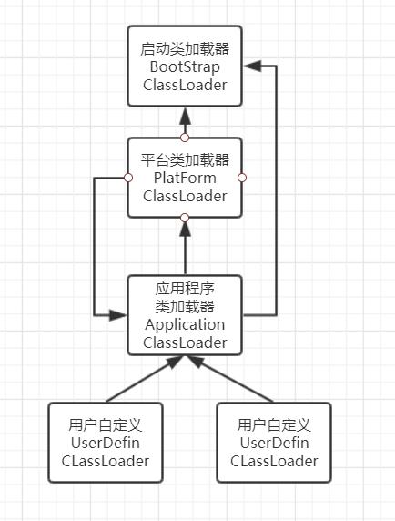

# 02-类加载器-JDK9之后

## 1.8以及之前

 [02-类加载器.md](02-类加载器.md) 

## 1.9之后

Java 9仍然保留了三层类加载器结构，不过为了支持模块系统，对它们做了一些调整。扩展机制被移除，扩展类加载器由于向后兼容性的原因被保留，不过被重命名为平台类加载器（platform class loader）。可以通过`ClassLoader`的新方法`getPlatformClassLoader()`来获取。Java 9中的内置类加载器如下所示。

- 引导类加载器：定义核心Java SE和JDK模块。
- 平台类加载器：定义部分Java SE和JDK模块。
- 应用或系统类加载器：定义CLASSPATH上的类和模块路径中的模块。

在Java 9中，平台类加载器和系统类加载器不再是`URLClassLoader`类的对象。这会影响一个常见的用来在运行时向系统类加载器的查找路径中添加条目的hack。在下面的代码中，该hack把系统类加载器转型成`URLClassLoader`并调用其`addURL()`方法。该hack在Java 9无法工作，因为转型为`URLClassLoader`会失败。

```java
public static void addPath(String s) throws Exception {
  File f = new File(s);
  URL u = f.toURL();
  URLClassLoader urlClassLoader = (URLClassLoader)
      ClassLoader.getSystemClassLoader();
  Class urlClass = URLClassLoader.class;
  Method method = urlClass.getDeclaredMethod("addURL", new Class[]{URL.class});
  method.setAccessible(true);
  method.invoke(urlClassLoader, new Object[]{u});
}
```

在Java 9中，类加载器有了名称。该名称在构造方法中指定，可以通过`getName()`方法来获取。平台类加载器的名称是`platform`，应用类加载器的名称是`app`。类加载器的名称在调试与类加载器相关的问题时会非常有用。

最后再补充一点，Java 9中可以访问到引导类加载器了，即`jdk.internal.loader.BootLoader`。不过在编译时和运行时需要参数`--add-exports java.base/jdk.internal.loader=ALL-UNNAMED`来开放`jdk.internal.loader`包到未命名模块，或者你自己的应用模块。

## 图示



## Bootstrap类加载器

Bootstrap类加载器加载的模块有

- java.base
- java.datatransfer
- java.desktop
- java.instrument
- java.logging
- java.management
- java.management.rmi
- java.naming
- java.prefs
- java.rmi
- java.security.sasl
- java.xml

和一些JDK内部的模块

