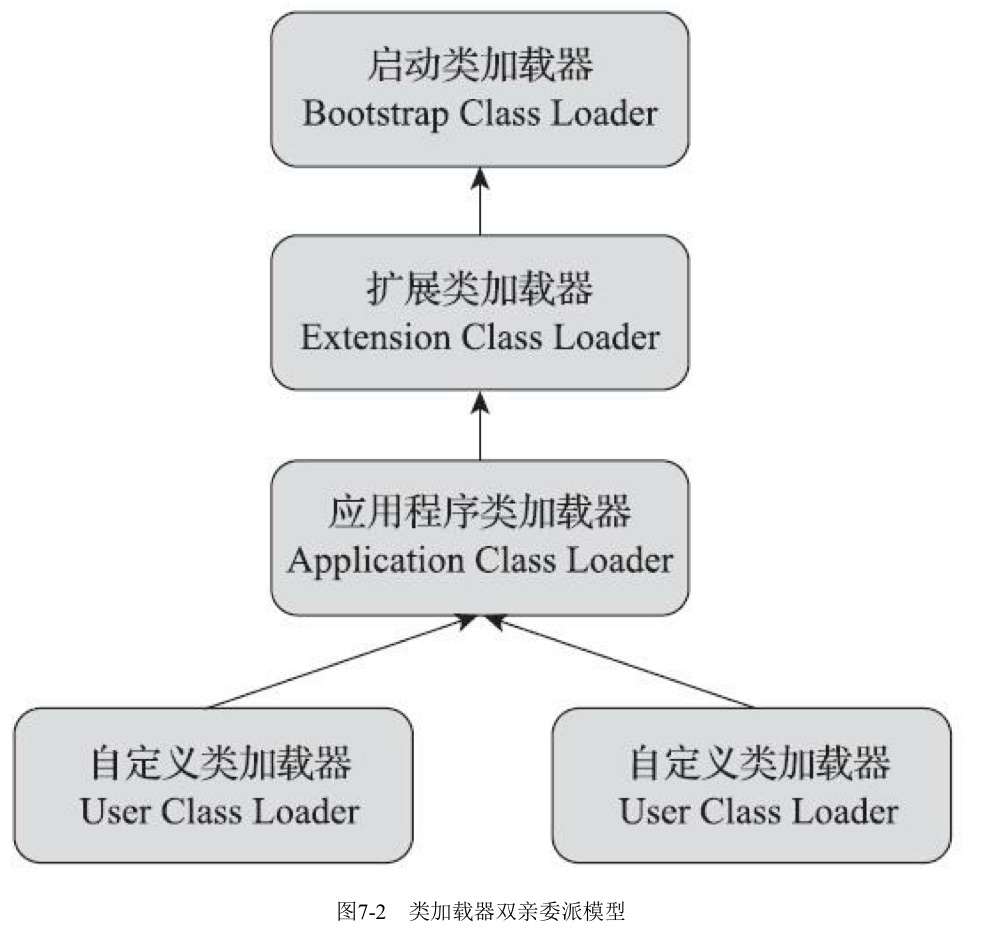
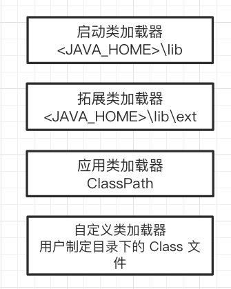

# 双亲委派机制

## 目录

[TOC]

---

## 什么是双亲委派机制

双亲委派机制值得是一个类加载器在收到类加载请求后,不会尝试自己加载这个类,而是吧这个类加载请求向上委托给自己的父类,以此类推



最终都会委托到 Bootstrap 类加载器中,如果父类不能加载则交给子类去加载,直到类加载成功,如果找不到类,JVM 会抛出 `ClassNotFound`异常

## 双亲委派模型类加载流程



| 加载顺序 | 类加载器                               | 加载范围                                                     |
| -------- | -------------------------------------- | ------------------------------------------------------------ |
| 1        | 启动类加载器(Bootstrap Class Loader)   | `%JAVA_HOME/lib`  路径下的 jar 包                            |
| 2        | 拓展类加载器(Extension Class Loader)   | `%JAVA_HOME/lib/ext` 路径下的 jar 包<br />或者使用`java.ext.dirs`指定 |
| 3        | 程序类加载器(Application Class Loader) | ClassPath 路径下制定,如果没有设置,则为应用程序当前路径       |
| 4        | 自定义类加载器                         | 加载用户制定目录下的 Class 文件                              |

## 为什么要有双亲委派机制

双亲委派机制的核心是确保类的**唯一性**和**安全性**

- 唯一性

> JVM 类的唯一性的判断只有在同一个类加载器行比较才有意义.双亲委派机制确保了一个类会被同一个类加载器加载

- 安全性

> 比如我们在加载 rt.jar 包中的`java.lang.Object`类的时候,无论是哪个类加载器加载这个类,最终都会委托给启动类(Bootstrap)加载器 , 这样就保证了类不会被恶意覆盖,可以编译,但是无法正常运行

## 双亲委派机制的弊端

上下文加载器作为中介,使得启动类加载器可以访问应用类加载器的类


**委托过程是单向的**

很多系统设计,SPI , 包括JDBC等技术, 

- 接口都是在rt.jar包中定义的 ,这些jar包是**启动类加载器(Bootstrap Class Loader)**加载的
- 具体实现类在 classpath下被引用的, 也就是 **程序类加载器(Application Class Loader)** 类加载的


## 源码

先检查请求加载的类型是否已经被加载过,乳沟没有则调用父类的加载器 的 loadClass 方法

如果父类加载器为空则默认使用启动类加载器

```java
protected Class<?> loadClass(String name, boolean resolve)
    throws ClassNotFoundException
{
    synchronized (getClassLoadingLock(name)) {
        // First, check if the class has already been loaded
      	// 先检查类是否存在
        Class<?> c = findLoadedClass(name);
        if (c == null) {
            try {
                if (parent != null) {
                    c = parent.loadClass(name, false);
                } else {
                    // 使用的是 Bootstrap 类加载器 native 方法
                    c = findBootstrapClassOrNull(name);
                }
            } catch (ClassNotFoundException e) {
              //如果父类加载器抛出 ClassNotFoundException  说明父类加载器无法完成加载请求
                // ClassNotFoundException thrown if class not found
                // from the non-null parent class loader
            }

            if (c == null) {
                // If still not found, then invoke findClass in order to find the class.
								//父类无法加载,自己尝试加载
                c = findClass(name);
            }
        }
        if (resolve) {
            resolveClass(c);
        }
        return c;
    }
}
```


