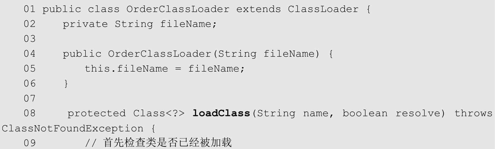
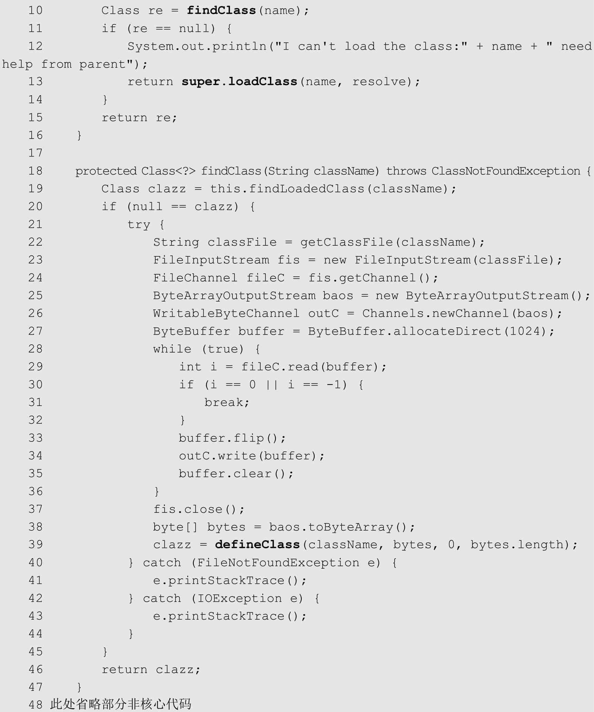
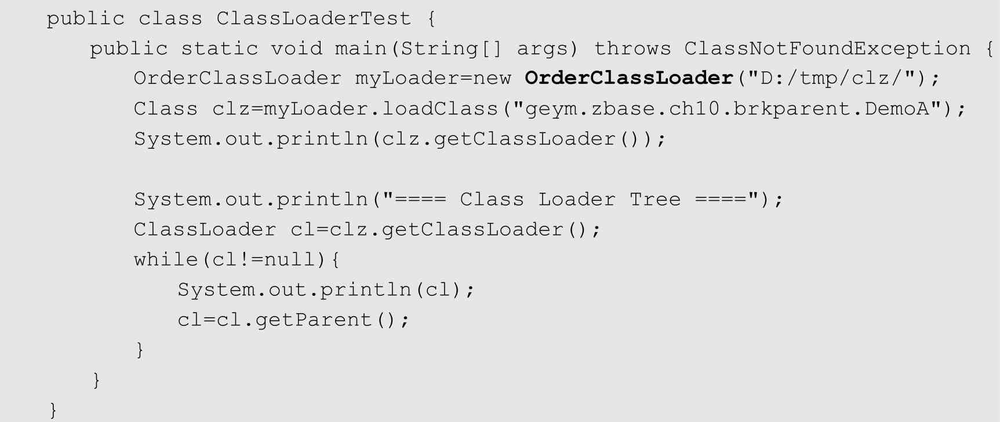
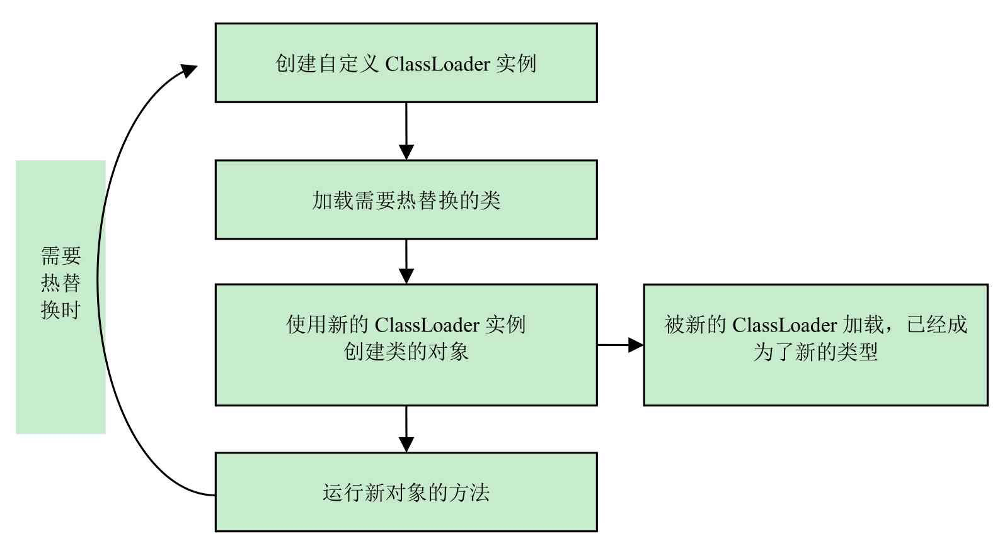
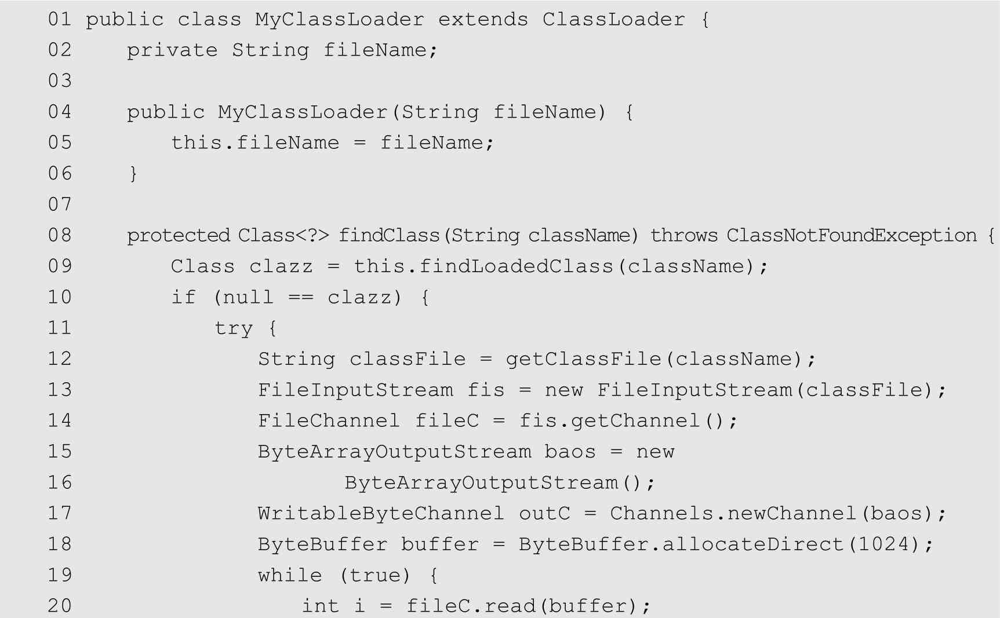
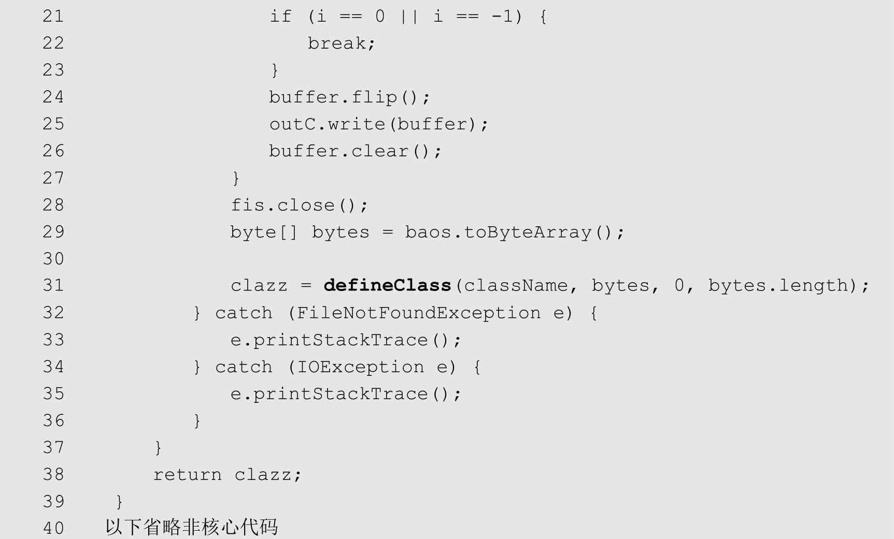
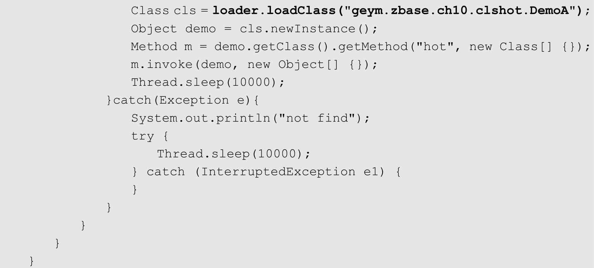

# 031-破坏双亲委派机制

## 目录

[TOC]

---

## 重载ClassLoader实现破坏

双亲模式的类加载方式是虚拟机默认的行为，但并非必须这么做，通过重载ClassLoader可以修改该行为。事实上，不少应用软件和框架都修改了这种行为，比如Tomcat和OSGi框架，都有各自独特的类加载顺序。下面将演示如何打破默认的双亲模式。





以上代码通过自定义ClassLoader重载loadClass()方法，改变了默认的委托双亲加载的方式。

第10行通过findClass()方法读取class文件，并将二进制流定义为Class对象。如果加载不到，则委托双亲加载，这种方式颠倒了默认的加载顺序。

下面的ClassLoaderTest使用上述OrderClassLoader进行工作


以上代码创建了OrderClassLoader对象，将“D:/tmp/clz/”目录作为其类的搜索路径，然后使用OrderClassLoader加载DemoA类（DemoA类在当前ClassPath中），但是从程序的输出可以看到，实际加载DemoA的是OrderClassLoader（即使它的双亲应用类加载器也能加载到该类）。
运行以上代码，输出如下：



可以看到，程序首先试图由OrderClassLoader加载Object类，但由于“D:/tmp/clz/”路径中没有该类信息，故加载失败，抛出异常，但随后就由应用类加载器加载成功。接着尝试加载DemoA，OrderClassLoader顺利在“D:/tmp/clz/”中找到该类信息，并且加载成功（该实验中DemoA在ClassPath中，可以由应用类加载器加载），打印加载DemoA类的ClassLoader，显示为OrderClassLoader，打印ClassLoader的层次，依次为

- OrderClassLoader
- AppClassLoader
- ExtClassLoader

## 热替换的实现原理

### 什么是热替换

热替换是指在程序的运行过程中，不停止服务，只通过替换程序文件来修改程序的行为。

热替换的关键需求在于服务不能中断，修改必须立即表现在正在运行的系统中。

大部分脚本语言都是天生支持热替换的，比如PHP，只要替换了PHP源文件，这种改动就会立即生效，无须重启Web服务器。

对Java来说，并非天生就支持热替换，如果一个类已经加载到系统中，通过修改类文件无法让系统再来加载并重定义这个类。因此，在Java中实现这一功能的一个可行的方法就是灵活运用ClassLoader。

### 代码实例

**说明：在这里，希望读者首先理解一个概念：由不同ClassLoader加载的同名类属于不同的类型，不能相互转化和兼容。**

可以用来模拟热替换的实现，基本思路如图所示。在实现时，首先需要自定义ClassLoader，以下代码自定义了ClassLoader，它可以在给定目录下查找目标类，主要的实现思路是重载findClass()方法



## 





在findClass()方法的实现中，在第9行查找已经加载的类，如果类已经加载，则不重复加载。

- 第11~29行，通过文件查找，读取Class的二进制数据流。
- 第31行，将此二进制数据流定义为Class，并返回该Class对象。

准备一个需要被热替换的类，命名为DemoA，代码如下，调用hot()方法，将打印字符串“OldDemoA”。


将生成的DemoA的class文件放于目录D:\tmp\clz下。

建立热替换支持类DoopRun，它使用MyClassLoader在路径D:/tmp/clz下查找并且更新DemoA的实现。




因为每次循环中都重新构建了一个类加载器,不同的类加载器加载的类时不同的

以上代码每次在调用DemoA.hot()方法之前，都会重新加载DemoA，从而实现热替换。运行以上代码，程序将不停输出“OldDemoA”字符串。
修改DemoA.hot()方法的输出字符为“NewDemoA”，重新生成新的class文件，并将其覆盖到D:/tmp/clz下，在不停止DoopRun程序的情况下发现DemoA可以被更新：

```
OldDemoA
NewDemo1A
NewDemoA
```

