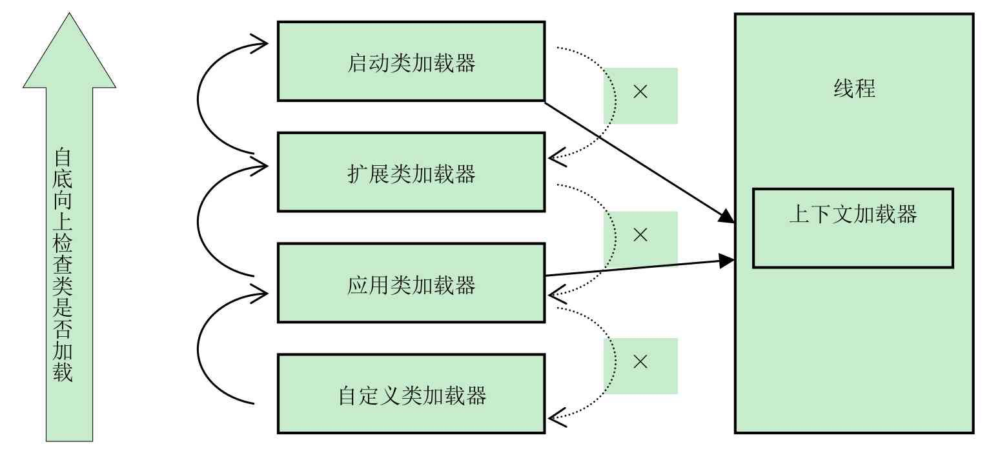
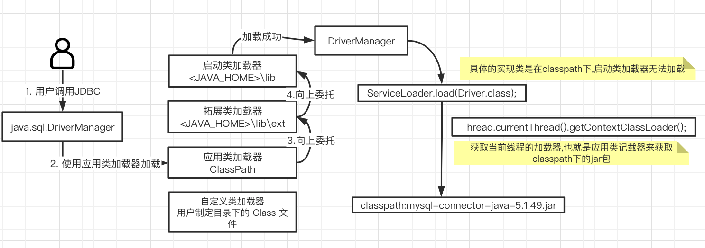

# 上下文类加载器

## 目录

- [什么是线程上下文类加载器](#什么是线程上下文类加载器)
- [上下文类加载器图示](#上下文类加载器图示)

---

## 什么是线程上下文类加载器

上下文类加载器可以通过 `java.lang.Thread#setContextClassLoader()` 方法为线程设置一个类加载

> - 如果创建线程的时候没有设置,默认会从父线程集成一个
>- 如果在应用程序的全局范围内没有设置,那么类加载器默认就是应用程序类加载器(Application ClassLoader)

## 上下文类加载器图示

## 为什么要有上下文类加载器? 它解决什么问题

双亲委派机制的过程是单向的, **但是上层的ClassLoader无法访问下层的ClassLoader所加载的类** 

- 启动类加载器中的类为系统核心类，包括一些重要的系统接口，而在应用类加载器中为应用类。

按照这种模式，应用类访问系统类自然没有问题，但是系统类访问应用类就会出现问题。

比如，在系统类中提供了一个接口，该接口需要在应用中得以实现，还绑定一个工厂方法，用于创建该接口的实例，而接口和工厂方法都在启动类加载器中。

这时，就会出现该工厂方法无法创建由应用类加载器加载的应用实例的问题。有这种问题的组件很多，比如JDBC、Xml Parser等。

## 

- JNDI  ,  由启动类加载器来完成加载

  > 主要是用来对资源进行查找和集中管理,它需要调用由其他厂商实现并部署在应用程序 CLassPath 下的 JNDI 服务提供者接口(Service Provider API , SPI)

- JDBC , 通过指定 LoaderService 的加载器为当前线程,从而将加载的方式通过厂商来实现

   [010-SPI在JDBC中的应用.md](../../16-JSR/01-JDBC/010-SPI在JDBC中的应用.md) 

- JCE

- JAXB

- JBI

- Xml Parser

等等

我们可以通过设置一个线程的类加载器,去加载这些所需要的 SPI 服务,

其实 SPI 是 父类加载器去请求子类夹杂器完成类加载的行为,这种行为实际上是逆向使用双亲委派	

## spi

JDK6 时, JDK 提供了一个` java.util.ServiceLoader` 类, `以META-INF/service` 中的配置信息,在加上责任链模式

 [spi笔记](../../04-java/01-basic/spi-service-provider-interface.md) 

## 

