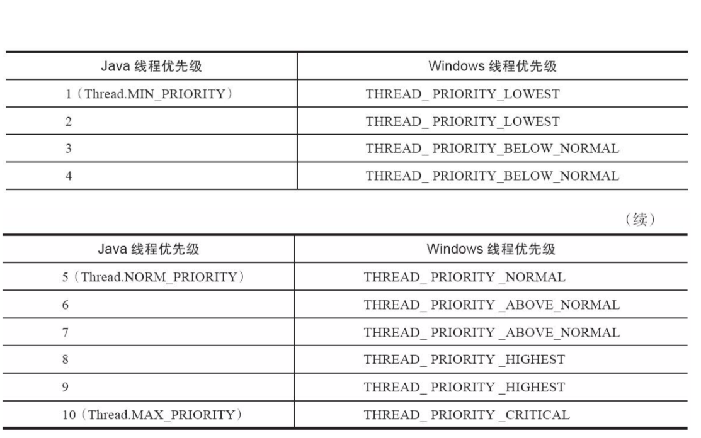

# 线程调度

[TOC]

## 线程调度的分类

线程调度是指为线程分配处理器使用权的过程,主要有两种

- 协同式调度(coopreative)
- 抢占式调度(preemptive)

抢占式线程调度器确定一个线程正常地轮到其CPU时间时会暂停这个线程,将CPU控制权交给另外的线程

协同式线程调度器会等待正在运行的线程自己暂停,然后在将CPU控制权交给其他线程

使用协同式调度有可能会导致线程陷入 **饥饿**, 因为一个高优先级的非协作线程会独占整个CPU

## 协同式是调度

线程的执行时间由线程本身来控制,线程把工作执行完成之后,要主动通知系统切换到另外一个线程,

协同方式多线程的好处是实现简单

缺点: 

> 执行时间不可控
>
> 如果一个线程的代码编写有问题,一直不告诉系统进行线程切换,那么程序就会一直阻塞在哪里

## 抢占式调度

由系统分配时间,前程切换线程本身说的不算

譬如在 Java 中, Thread::yield 方法可以让出执行时间,但是没有线程主动获取执行时间的方法

线程的执行时间是由系统控制的

## 线程的优先级

Java 线程调度是由系统自动完成的,但是我们可以建议操作系统给某些线程多分配一些执行时间

,另外的一些线程可以少分配一些

Java 中有 10 个级别的优先级

- Thread.MIN_PRIOPITY
- ...
- Thread.MAX_PRIOPITY

当两个线程同时处于 Ready 状态时,优先级越高的越容易被系统选择执行

**但是**

线程优先级不是一个稳定的调节手段

因为主流虚拟机上的 Java线程都是被映射到系统的原生线程上来实现的,所以线程调度最终还是操作系统说的算

- Solaris 中的线程优先级有 2 的 31 次幂
- Windows 只有 7 种,所以

1 和 2 , 3 和 4, 6和 7,8,9 效果是完全相同的

