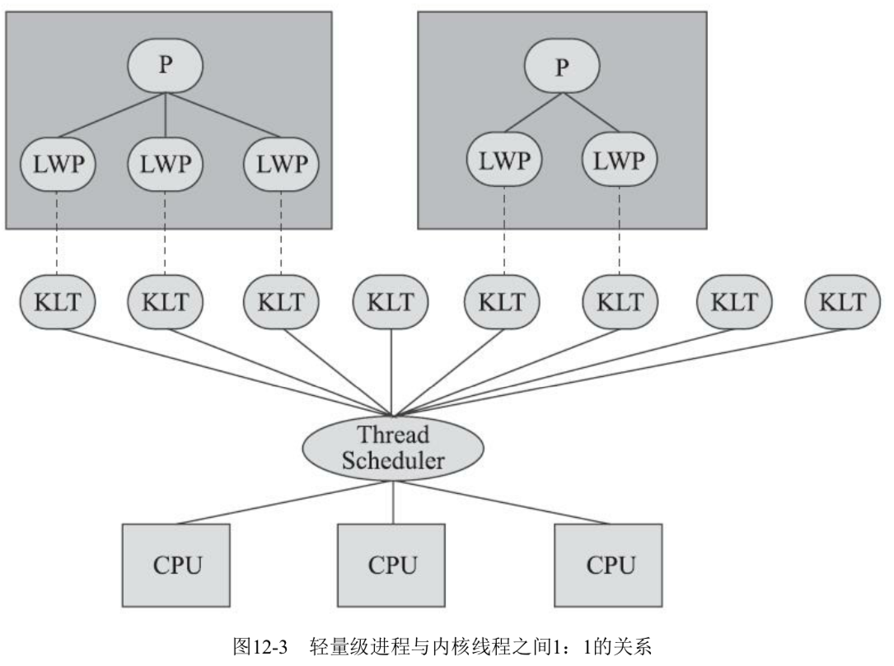
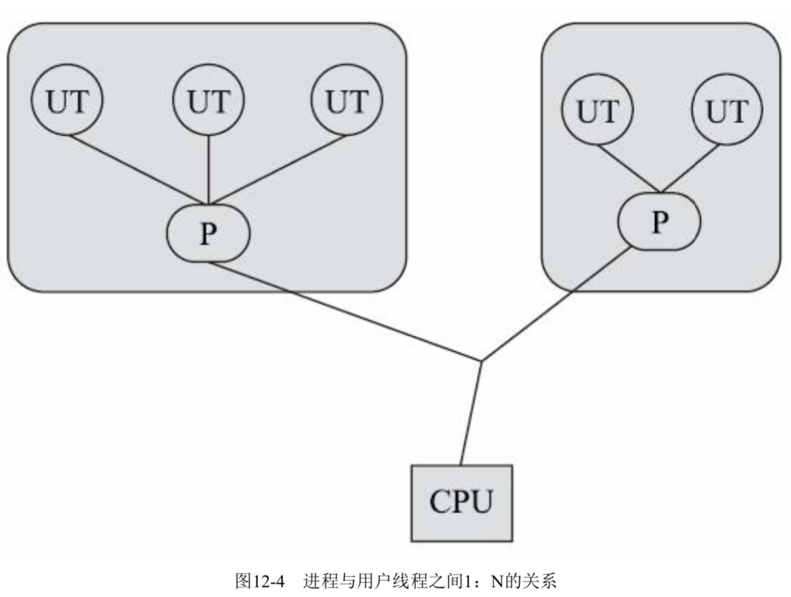
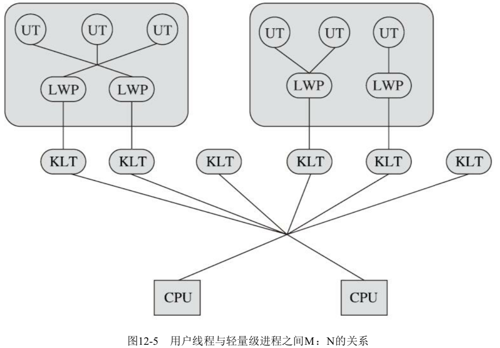

# 线程的实现

> 以 hotSpot 为例子, 每一个 Java 线程都是直接映射到操作系统原生线程来实现的, 中间没有任何额外的间接结构,所以以 HotSpot 自己是不会干涉线程调度的(可以设置线程优先级给操作系统提供调度建议)
>
> 全权交给操作系统去处理,所以合适解冻或者唤醒线程,该给线程分配多少处理器执行时间,该把线程安排给哪个处理器核心去执行等等,都是操作系统去完成的,也都是操作系统全权决定的

- 线程是比进程更轻量级的执行单位

> 线程的引入可以把一个进程资源和执行调度分开
>
> 各个线程既可以共享进程资源(内存地址, 文件 IO 等等), 又可以独立调度

- 线程是 Java里进行处理器资源调度的最基本的单位

> 如果日后 Loom 项目能够成功为 Java 引入纤程(Fiber) 的话,可能就会改变这一点

- 为什么Java Thread 中的 start 方法是个 native 方法?

> 实际上native 方法往往意味着这个方法没有办法 **使用平台无关**的手段来实现

实现线程的方式有三种

- 内核线程实现 1:1 
- 使用用户线程实现 1:N 实现
- 使用用户线程加轻量级进程混合实现 (N :  M)

## 内核进程实现  一对一

这里的1: 1 意思是指的是 

**轻量级进程和内核线程之间的 1:1 的关系**

> 轻量级进程实际上就是我们所说的线程

#### 什么是内核线程(Kernel-Level Thread KLT)

> 内核线程(Kernel-Level Thread KLT) 是直接由操作系统内核(Kernel, 内核) 支持的线程,这种线程由内核来完成线程切换,内核通过操纵调度器(Scheduler) 对线程进行调度,并负责将线程的任务映射到各个处理器上

每个内核线程可以视为内核的一个分身,这样操作系统就有能力同时处理多件事情,支持多线程的内核就成为多线程内核

程序一般不会直接使用内核线程,而是使用内核线程的一种高级接口 -- 轻量级进程(Light Weight Process , LWP)

> 轻量级进程就是我们通常意义上讲的线程 , 由于每个轻量级进程都由一个内核线程支持, 因此只有先支持内核线程,才能有轻量级进程

#### 系统支持轻量级进程是有限的

由于内核线程的支持,每个轻量级进程都成为了一个独立的调度单元,即使其中某一个轻量级进程在系统调用中被阻塞了,也不会影响整个进程继续工作

轻量级进程的局限性:

- 由于急于内核线程来实现,所以各种线程操作 . 创建, 析构以及同步, 都需要进行系统调用, 而系统调用的代价相对较高,需要从 用户态(User Mode) 和内核态(Kernel Mode)之间来回切换
- 每个轻量级进程都需要有一个内核线程支持,因此轻量级进程要消耗一定的内核资源(如内核线程的栈空间),因此一个系统支持轻量级进程的数量是有限的

## 使用用户线程实现

使用用户线程实现的方式被称为 1:N 实现

从广义的角度来讲 : 一个线程只要不是内核线程, 那就是用户线程

>  轻量级线程实际上属于用户线程,但是轻量级线程的实现始终是建立在内核之上的,许多操作都要进行系统调用,效率会受到影响,并不具备用户线程的优点

从狭义上来讲,用户线程指的是完全建立在用户空间上的线程库上的,系统内核不能感知到用户线程的存在以及如何实现

用户线程的建立、同步、销毁和调度完全在用户态中完成,不需要内核的帮助

如果程序实现得当,这种线程不需要切换到内核态,因此操作可以是快速且低消耗的,也能够支持规模更大的线程数量,部分高性能数据库中的多线程就是由用户线程实现的

- 所有操作都是由用户自己去处理,线程的创建,销毁切换和调度都是用户必须考虑的问题
- 操作系统只吧处理区资源分配到进程,注入 阻塞如何处理, 多处理器系统中如何将线程映射到其他处理器上这种问题解决起来就非常困难
- Java ,Ruby等语言都曾经支持过用户线程,但是最终还是放弃了它
- 以高并发为卖点的语言如 Golang Erlang 等 , 使得用户线程使用率上有所回升

## 混合实现

将内核线程与用户线程一起使用,被称为 N:M 实现,

用户线程还是完全建立在用户空间中,因此用户线程的创建,切换,析构等操作依然廉价, 并且可以支持大规模的用户线程并发

操作系统支持的轻量级进程作为用户线程和内核线程的桥梁,这样可以使用内核提供的线程调度功能以及处理器映射,并且用户线程的系统调度要通过轻量级进程来完成,大大降低了整个进程被完全阻塞的风险

 

