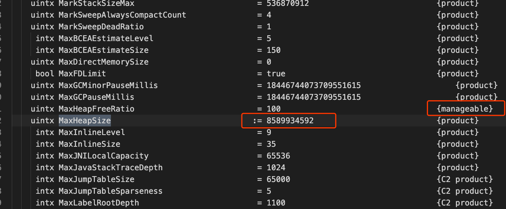

# JVM参数

## 目录

- [JVM参数分类](#JVM参数分类)
- [查看JVM正在使用的参数](#查看JVM正在使用的参数)
- [设置参数的方式](#设置参数的方式)

## JVM参数分类

- [标准参数](#标准参数)

  > 不会随着jdk版本的变化而变化的参数

- [-X参数](#-X参数)

  > 非标准参数，也就是在JDK各个版本中可能会变动

- [-XX参数](#-XX参数)

- [其他参数](#其他参数)

## 标准参数

```
$ java -Xint -version
java version "1.8.0_201"
Java(TM) SE Runtime Environment (build 1.8.0_201-b09)
Java HotSpot(TM) 64-Bit Server VM (build 25.201-b09, interpreted mode 
```

- interpreted mode  解释执行
- java -Xmixed -version 混合
- java -Xcomp -version 编译执行

```
java -version
java -help
java -server
java -cp
```

## -X参数

> 非标准参数，也就是在JDK各个版本中可能会变动

```
-Xint 解释执行
-Xcomp 第一次使用就编译成本地代码 
-Xmixed 混合模式，JVM自己来决定
```

## -XX参数

- 使用得最多的参数类型
- 非标准化参数，相对不稳定，主要用于JVM调优和Debug

```
a.Boolean类型
	格式:-XX:[+-]<name> +或-表示启用或者禁用name属性 比如:-XX:+UseConcMarkSweepGC 表示启用CMS类型的垃圾回收器
-XX:+UseG1GC 表示启用G1类型的垃圾回收器
b.非Boolean类型 
	格式:-XX<name>=<value> 表示name属性的值是value 比如:-XX:MaxGCPauseMillis=500
```

## 其他参数

所以这块也相当于是-XX类型的参数

```
-Xms1000 等价于 -XX:InitialHeapSize=1000 
-Xmx1000 等价于 -XX:MaxHeapSize=1000 
-Xss100  等价于  -XX:ThreadStackSize=100
```

## 查看JVM正在使用的参数

```
java -XX:+PrintFlagsFinal -version > flags.txt
```

## 查看JVM具体使用的参数

```
jinfo
```



- 红框` :=`  的意思是已经修改过了
- manageable  代表的意思是在运行时可以修改

## 设置参数的方式

- 开发工具中设置比如IDEA，eclipse
- 运行jar包的时候:java -XX:+UseG1GC xxx.jar
- web容器比如tomcat，可以在脚本中的进行设置 通过jinfo实时调整某个java进程的参数(参数只有被标记为
- manageable的flags可以被实时修改)

## 实践

1. 设置堆内存大小和参数打印

   > -Xmx100M -Xms100M -XX:+PrintFlagsFinal

2. 查询+PrintFlagsFinal的值 :=true

3. 查询堆内存大小MaxHeapSize := 104857600

4. 换算 104857600(Byte)/1024=102400(KB) 102400(KB)/1024=100(MB)

5. 结论 104857600是字节单位

## 