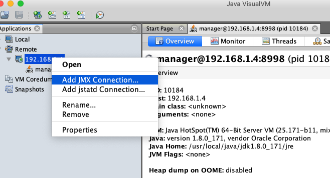
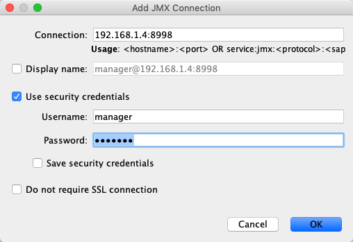

## 


### 创建文件jmxremote.access

用于存储权限信息

```
touch jmxremote.access
```

文件内容如下

```
guest readonly
manager readwrite
```

## 创建用户名和密码

用于存储用户名和密码

```
touch jmxremote.password
```

文件内容如下

```
guest guest 
manager manager
```

## 配置host

如果是阿里云服务器

内网ip和公网ip要记得映射

```
172.26.255.240 39.100.39.63
```

## 查看tomcat监听的端口

```
[root@centos-linux conf]# lsof -i:8080
COMMAND  PID USER   FD   TYPE DEVICE SIZE/OFF NODE NAME
java    9823 root   52u  IPv6 139205      0t0  TCP *:webcache (LISTEN)
```





