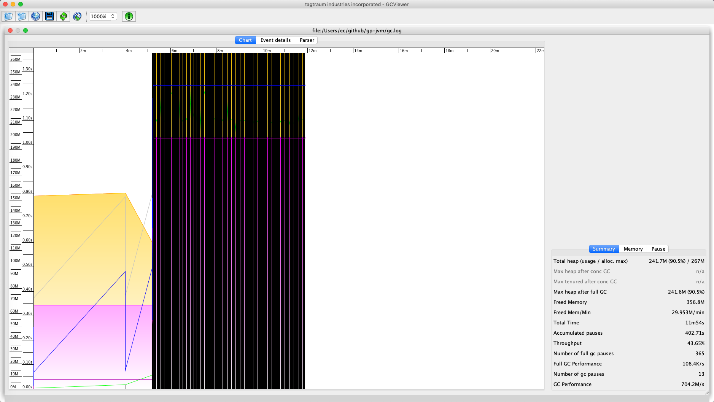
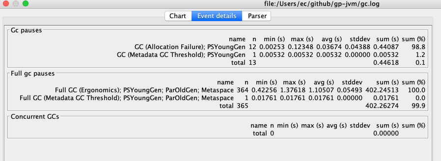
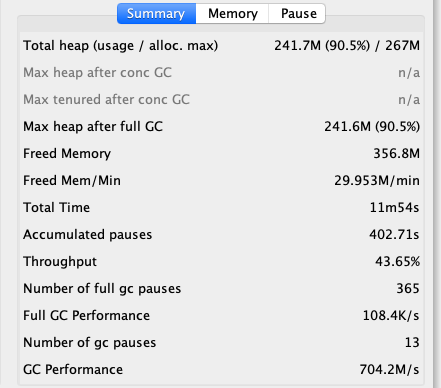
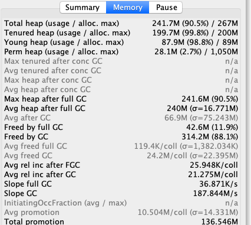
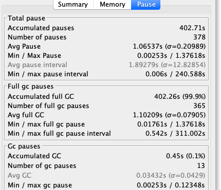

# GC日志

-  gceasy
- GCViewer

#### 打开日志开关

```
-XX:+PrintGCDetails -XX:+PrintGCTimeStamps -XX:+PrintGCDateStamps -Xloggc:gc.log
```




## 查看时间详情



- 可以看到GC停顿信息
- FULL GC停顿信息
- 并发GC数

## 概述



## 内存信息



## 停顿信息

