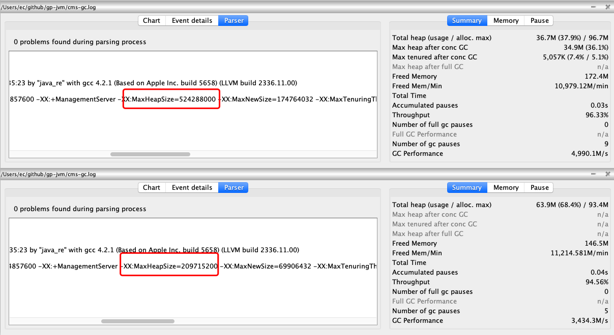
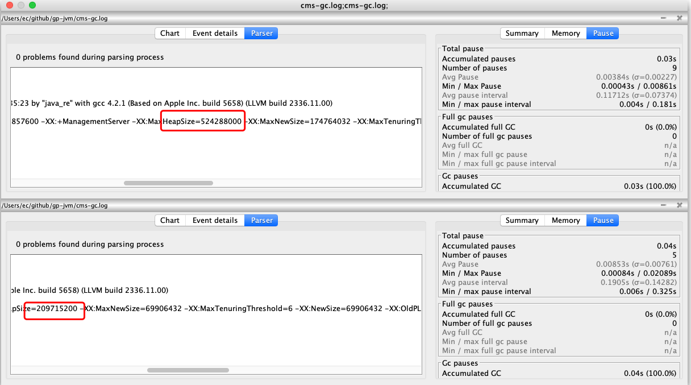

# CMS收集器GC日志

## 目录

- [日志命令行](#日志命令行)


CMS收集器是老年代的收集器,从图中我们可以看到与之配合的新生代的收集器有

- Serial  单线程的标记复制算法收集器
- ParNew 多线程的标记复制算法收集器

## 启用CMS

```
-XX:+PrintGCDetails -XX:+PrintGCTimeStamps -XX:+PrintGCDateStamps -Xloggc:cms-gc.log -XX:+UseConcMarkSweepGC
```

其中 `-XX:+UseConcMarkSweepGC `代表启动CMS收集器

## 日志命令行

```
CommandLine flags: -XX:-BytecodeVerificationLocal -XX:-BytecodeVerificationRemote -XX:InitialHeapSize=536870912 -XX:+ManagementServer -XX:MaxHeapSize=8589934592 -XX:MaxNewSize=523452416 -XX:MaxTenuringThreshold=6 -XX:OldPLABSize=16 -XX:+PrintGC -XX:+PrintGCDateStamps -XX:+PrintGCDetails -XX:+PrintGCTimeStamps -XX:TieredStopAtLevel=1 -XX:+UseCompressedClassPointers -XX:+UseCompressedOops -XX:+UseConcMarkSweepGC -XX:+UseParNewGC 
```

从上面的日志可以看出

- -XX:+UseConcMarkSweepGC 我们用了CMS收集器

- -XX:+UseParNewGC  使用的是ParNew收集器 ,并行标记复制算法

# CMS日志

```
// 分配失败,触发GC
2020-09-10T16:28:58.421-0800: 1.130: [GC (Allocation Failure) 2020-09-10T16:28:58.421-0800: 1.130: [ParNew: 139776K->13608K(157248K), 0.0092879 secs] 139776K->13608K(506816K), 0.0093885 secs] [Times: user=0.02 sys=0.01, real=0.01 secs]
// 初始标记
2020-09-10T16:29:00.433-0800: 3.141: [GC (CMS Initial Mark) [1 CMS-initial-mark: 0K(349568K)] 115343K(506816K), 0.0311429 secs] [Times: user=0.11 sys=0.00, real=0.03 secs] 
//并发标记
2020-09-10T16:29:00.464-0800: 3.173: [CMS-concurrent-mark-start]
2020-09-10T16:29:00.467-0800: 3.176: [CMS-concurrent-mark: 0.003/0.003 secs] [Times: user=0.00 sys=0.00, real=0.00 secs] 
2020-09-10T16:29:00.467-0800: 3.176: [CMS-concurrent-preclean-start]
2020-09-10T16:29:00.472-0800: 3.181: [CMS-concurrent-preclean: 0.005/0.005 secs] [Times: user=0.01 sys=0.00, real=0.01 secs] 
2020-09-10T16:29:00.472-0800: 3.181: [CMS-concurrent-abortable-preclean-start]
 CMS: abort preclean due to time 2020-09-10T16:29:05.536-0800: 8.244: [CMS-concurrent-abortable-preclean: 1.826/5.064 secs] [Times: user=1.81 sys=0.01, real=5.06 secs] 
 //重新标记
2020-09-10T16:29:05.536-0800: 8.244: [GC (CMS Final Remark) [YG occupancy: 116275 K (157248 K)]2020-09-10T16:29:05.536-0800: 8.244: [Rescan (parallel) , 0.0074314 secs]2020-09-10T16:29:05.543-0800: 8.252: [weak refs processing, 0.0002650 secs]2020-09-10T16:29:05.544-0800: 8.252: [class unloading, 0.0023944 secs]2020-09-10T16:29:05.546-0800: 8.255: [scrub symbol table, 0.0029548 secs]2020-09-10T16:29:05.549-0800: 8.258: [scrub string table, 0.0003021 secs][1 CMS-remark: 0K(349568K)] 116275K(506816K), 0.0139544 secs] [Times: user=0.04 sys=0.00, real=0.02 secs] 
//并发清理
2020-09-10T16:29:05.550-0800: 8.258: [CMS-concurrent-sweep-start]
2020-09-10T16:29:05.550-0800: 8.259: [CMS-concurrent-sweep: 0.000/0.000 secs] [Times: user=0.00 sys=0.00, real=0.00 secs] 
2020-09-10T16:29:05.550-0800: 8.259: [CMS-concurrent-reset-start]
2020-09-10T16:29:05.602-0800: 8.311: [CMS-concurrent-reset: 0.052/0.052 secs] [Times: user=0.03 sys=0.03, real=0.05 secs] 
```


## 使用GCViewer查看

#### 测试参数

```
-Xms100m -Xmx500m -XX:+PrintGCDetails -XX:+PrintGCTimeStamps -XX:+PrintGCDateStamps -Xloggc:cms-gc.log -XX:+UseConcMarkSweepGC
```

#### gc-日志总览



#### 停顿



| 关注点       | 值                      | ParallelGC 完全默认8G | CMS -Xmx=200M值 | CMS-Xmx=500M值 |
| ------------ | ----------------------- | --------------------- | --------------- | -------------- |
| 吞吐量       | Throughput              | 63.37%                | 94.56%          | **96.33%**     |
| 最小停顿时间 | Min pause               | 0.00513               | 0.00084         | **0.00043**    |
| 最大停顿时间 | Max pause               | 0.01853               | 0.02089         | **0.00891**    |
| 平均停顿时间 | Avg pause               | 0.01142               | 0.00853         | **0.00384**    |
| full gc 次数 | number of full gc pause | 1                     | 0               | 0              |
| gc 次数      | number of gc pause      | 5                     | **5**           | 9              |

**可以看到内存从200 设置成为 500 后吞吐量增强,停顿时间也变小了**

停顿时间不要太严格

关注点

- CPU飙升
- 内存空间不够用
- gc次数太多
  - 用户代码执行会受影响
  - cpu使用率会高

我们希望

-  尽可能提高吞吐量,停顿时间比较少

## 调大内存

| 关注点       | 值                      | 最大内存200M | 最大内存500M值 |
| ------------ | ----------------------- | ------------ | -------------- |
| 吞吐量       | Throughput              | 90.44%       | 22.14%         |
| 最小停顿时间 | Min pause               |              | 0.00047s       |
| 最大停顿时间 | Max pause               |              | 1.1717s        |
| 平均停顿时间 | Avg pause               |              | 0.59s          |
| full gc 次数 | number of full gc pause | 4            | 95             |
| gc 次数      | number of gc pause      | 18           | 85             |