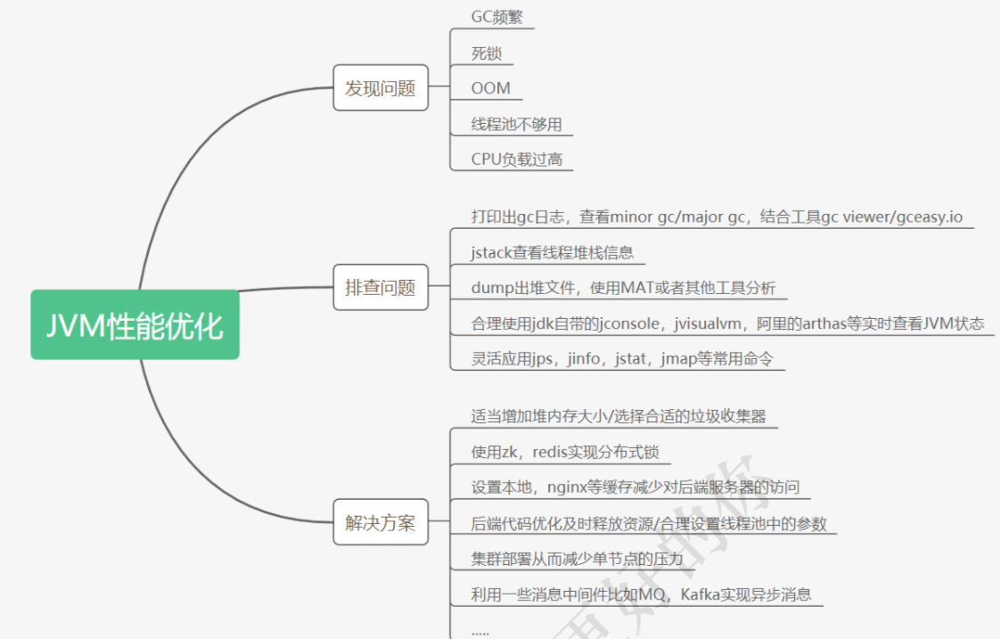
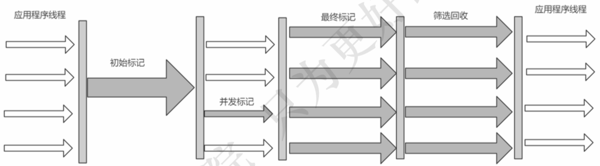

# 009-收集器调优-G1

[TOC]

## 重要的参数

对于G1，可以使用-XX:+UseG1GC标记打开G1的开关，

#### -XX:MaxGCPauseMillis

对G1进行设置时，最重要的一个参数就是-XX:MaxGCPauseMillis

它用于指定目标最大停顿时间。如果任何一次停顿超过这个设置值，G1就会尝试调整新生代和老年代的比例、调整堆大小、调整晋升年龄等，试图达到预设目标。对于性能调优来说，有时候总是鱼和熊掌不可兼得，如果停顿时间缩短，对于新生代来说，这意味着很可能要增加新生代GC的次数。对于老年代来说，为了获得更短的停顿时间，在混合GC时，一次收集的区域数量也会变少，这样无疑增加了进行Full GC的可能性。

#### ParallelGCThreads

另外一个重要的参数是-XX:ParallelGCThreads，它用于设置并行回收时GC的工作线程数量。

#### InitiatingHeapOccupancyPercent

此外，-XX:InitiatingHeapOccupancyPercent 参数可以指定当整个堆使用率达到多少时，触发并发标记周期的执行。默认值是45，即当整个堆的占用率达到45%时，执行并发标记周期。InitiatingHeapOccupancyPercent一旦设置，始终都不会被G1修改，这意味着G1不会试图改变这个值来满足MaxGCPauseMillis的目标。

- 如果InitiatingHeapOccupancyPercent 值设置得偏大，会导致并发周期迟迟得不到启动，那么引起Full GC的可能性也大大增加，

- 反之，一个过小的InitiatingHeapOccupancyPercent值会使得并发标记周期执行非常频繁，大量GC线程抢占CPU，导致应用程序的性能有所下降。
  

## 是否适合使用G1收集器

是否选用G1垃圾收集器的判断依据:

> https://docs.oracle.com/javase/8/docs/technotes/guides/vm/G1.html#use_cases

G1的第一个重点是为运行需要大堆且GC延迟有限的应用程序的用户提供解决方案,这意味着堆大小大约为6GB或更大，稳定且可预测的暂停时间低于0.5秒。

如果满足以下三种条件,则可以从默认的 ` Parallel Scavenge + Parallel Old`  后者 CMS 转入 到 G1

- 50%以上的堆被存活对象占用 
- 对象分配和晋升的速度变化非常大 
- 垃圾回收时间比较长或者停顿时间长(高于0.5s 到 1s)

## 启动时指定G1收集器

```shell
-XX:+PrintGCDetails -XX:+PrintGCTimeStamps -XX:+PrintGCDateStamps -Xloggc:g1-gc.log -XX:+UseG1GC
```

## 调优步骤



- 使用G1GC垃圾收集器

```
 -XX:+UseG1GC
```

- 修改配置参数，获取到gc日志，使用GCViewer分析吞吐量和响应时间

```
Throughput       Min Pause       Max Pause      Avg Pause       GC count
  99.16%         0.00016s         0.0137s        0.00559s          12
```

- 调整内存大小再获取gc日志分析

```
-XX:MetaspaceSize=100M   //元数据空间
-Xms300M								 //最小内存
-Xmx300M								 //最大内存
```

有两个结果

- 好的发展方向是 吞吐量增加了, GC次数也减少了
- 不好的方向是 停顿时间变大了(因为要回收的内存变大)

获取到gc日志，使用GCViewer分析吞吐量和响应时间

- 调整最大停顿时间

```
-XX:MaxGCPauseMillis=20 设置最大GC停顿时间指标
```

比如设置最大停顿时间，获取到gc日志，使用GCViewer分析吞吐量和响应时间

```
Throughput       Min Pause       Max Pause      Avg Pause       GC count
  98.96%          0.00015s        0.01737s       0.00574s          12
```

- 启动并发GC时堆内存占用百分比

```
-XX:InitiatingHeapOccupancyPercent=45 
```

G1用它来触发并发GC周期,基于整个堆的使用率,而不只是某一代内存的 使用比例。值为 0 则表示“一直执行GC循环)'. 默认值为 45 (例如, 全部的 45% 或者使用了45%).

```
Throughput       Min Pause       Max Pause      Avg Pause       GC count
  98.11%          0.00406s        0.00532s       0.00469s          12
```

## 调优注意事项

- 不要手动设置新生代和老年代的大小，只要设置整个堆的大小

  > G1收集器在运行过程中，会自己调整新生代和老年代的大小 其实是通过 adapt 代的大小来调整对象晋升的速度和年龄，从而达到为收集器设置的暂停时间目标 如果手动设置了大小就意味着放弃了G1的自动调优

- 不断调优暂停时间目标 -XX:MaxGCPauseMillis

  > 一般情况下这个值设置到100ms或者200ms都是可以的(不同情况下会不一样)，但如果设置成50ms就不太合理。暂停 时间设置的太短，就会导致出现G1跟不上垃圾产生的速度。最终退化成Full GC。所以对这个参数的调优是一个持续 的过程，逐步调整到最佳状态。暂停时间只是一个目标，并不能总是得到满足。

- 使用-XX:ConcGCThreads=n来增加标记线程的数量

  > IHOP如果阀值设置过高，可能会遇到转移失败的风险，比如对象进行转移时空间不足。如果阀值设置过低，就会使标 记周期运行过于频繁，并且有可能混合收集期回收不到空间。 IHOP值如果设置合理，但是在并发周期时间过长时，可以尝试增加并发线程数，调高ConcGCThreads。

- MixedGC调优

  > -XX:InitiatingHeapOccupancyPercent
  > -XX:G1MixedGCLiveThresholdPercent
  > -XX:G1MixedGCCountTarger
  > -XX:G1OldCSetRegionThresholdPercent

- 适当增加堆内存的大小


## 实例

#### 启动一个G1收集器的jvm

```
-XX:-BytecodeVerificationLocal -XX:-BytecodeVerificationRemote -XX:InitialHeapSize=536870912 -XX:+ManagementServer -XX:MaxHeapSize=8589934592 -XX:+PrintGC -XX:+PrintGCDateStamps -XX:+PrintGCDetails -XX:+PrintGCTimeStamps -XX:TieredStopAtLevel=1 -XX:+UseCompressedClassPointers -XX:+UseCompressedOops -XX:+UseG1GC 
```

- 可以看到 -XX:+UseG1GC 



#### 实例日志

堆内存的使用率达到45%

```
[Times: user=0.02 sys=0.01, real=0.01 secs] 
2020-09-10T16:44:18.677-0800: 1.312: [GC pause (Metadata GC Threshold) (young) (initial-mark), 0.0104708 secs]
   [Parallel Time: 5.3 ms, GC Workers: 6]
      [GC Worker Start (ms): Min: 1311.9, Avg: 1312.0, Max: 1312.2, Diff: 0.3]
      [Ext Root Scanning (ms): Min: 1.0, Avg: 1.1, Max: 1.3, Diff: 0.4, Sum: 6.8]
      [Update RS (ms): Min: 0.0, Avg: 0.1, Max: 0.3, Diff: 0.3, Sum: 0.7]
         [Processed Buffers: Min: 0, Avg: 0.5, Max: 1, Diff: 1, Sum: 3]
      [Scan RS (ms): Min: 0.0, Avg: 0.0, Max: 0.0, Diff: 0.0, Sum: 0.0]
      [Code Root Scanning (ms): Min: 0.0, Avg: 0.2, Max: 0.5, Diff: 0.5, Sum: 1.2]
      [Object Copy (ms): Min: 3.3, Avg: 3.6, Max: 3.9, Diff: 0.6, Sum: 21.6]
      [Termination (ms): Min: 0.0, Avg: 0.0, Max: 0.0, Diff: 0.0, Sum: 0.1]
         [Termination Attempts: Min: 1, Avg: 17.7, Max: 24, Diff: 23, Sum: 106]
      [GC Worker Other (ms): Min: 0.0, Avg: 0.0, Max: 0.0, Diff: 0.0, Sum: 0.0]
      [GC Worker Total (ms): Min: 4.8, Avg: 5.1, Max: 5.2, Diff: 0.3, Sum: 30.5]
      [GC Worker End (ms): Min: 1317.0, Avg: 1317.0, Max: 1317.1, Diff: 0.0]
   [Code Root Fixup: 0.1 ms]
   [Code Root Purge: 0.0 ms]
   [Clear CT: 0.1 ms]
   [Other: 5.0 ms]
      [Choose CSet: 0.0 ms]
      [Ref Proc: 4.8 ms]
      [Ref Enq: 0.0 ms]
      [Redirty Cards: 0.0 ms]
      [Humongous Register: 0.0 ms]
      [Humongous Reclaim: 0.0 ms]
      [Free CSet: 0.1 ms]
   [Eden: 82.0M(300.0M)->0.0B(290.0M) Survivors: 6144.0K->16.0M Heap: 89.7M(512.0M)->17.7M(512.0M)]
 [Times: user=0.03 sys=0.00, real=0.01 secs] 
2020-09-10T16:44:18.688-0800: 1.322: [GC concurrent-root-region-scan-start]
2020-09-10T16:44:18.691-0800: 1.326: [GC concurrent-root-region-scan-end, 0.0033212 secs]
2020-09-10T16:44:18.691-0800: 1.326: [GC concurrent-mark-start]
2020-09-10T16:44:18.691-0800: 1.326: [GC concurrent-mark-end, 0.0002759 secs]
2020-09-10T16:44:18.691-0800: 1.326: [GC remark 2020-09-10T16:44:18.691-0800: 1.326: [Finalize Marking, 0.0007276 secs] 2020-09-10T16:44:18.692-0800: 1.327: [GC ref-proc, 0.0005769 secs] 2020-09-10T16:44:18.693-0800: 1.327: [Unloading, 0.0016569 secs], 0.0031377 secs]
 [Times: user=0.01 sys=0.00, real=0.00 secs] 
2020-09-10T16:44:18.695-0800: 1.329: [GC cleanup 19M->17M(512M), 0.0003702 secs]
 [Times: user=0.00 sys=0.00, real=0.00 secs] 

```

#### 测试参数

```
-Xms100m -Xmx500m -XX:+PrintGCDetails -XX:+PrintGCTimeStamps -XX:+PrintGCDateStamps -Xloggc:cms-gc.log -XX:+UseG1GC 
```

#### gc-日志总览

| 关注点       | 值                      | ParallelGC 完全默认8G | UseG1GC | CMS-Xmx=500M值 |
| ------------ | ----------------------- | --------------------- | ------- | -------------- |
| 吞吐量       | Throughput              | 63.37%                | 96.95%  | **96.33%**     |
| 最小停顿时间 | Min pause               | 0.00513               | 0.00084 | **0.00043**    |
| 最大停顿时间 | Max pause               | 0.01853               | 0.02089 | **0.00891**    |
| 平均停顿时间 | Avg pause               | 0.01142               | 0.00853 | **0.00384**    |
| full gc 次数 | number of full gc pause | 1                     | 0       | 0              |
| gc 次数      | number of gc pause      | 5                     | **5**   | 9              |

**可以看到内存从200 设置成为 500 后吞吐量增强,停顿时间也变小了**

## G1调优与最佳指南

是否选用G1垃圾收集器的判断依据


- 50%以上的堆被存活对象占用 
- 对象分配和晋升的速度变化非常大 
- 垃圾回收时间比较长

思考 :https://blogs.oracle.com/poonam/increased-heap-usage-with-g1-gc

使用G1GC垃圾收集器: -XX:+UseG1GC

- [堆不够用了](#堆不够用了)
- [设置停顿时间](#设置停顿时间)
- [堆内存使用占比](#堆内存使用占比)


## 设置停顿时间

- -XX:MaxGCPauseMillis=200ms  G1最大停顿时间  **暂停时间不能太小**，太小的话就会导致出现G1跟不上垃圾产生的速度。最终退化成Full GC。所以对这个参数的 调优是一个持续的过程，逐步调整到最佳状态。

优势: 停顿时间可以控制了 

劣势: GC次数增加了

## 堆内存使用占比

- 启动并发GC时,堆内存使用占比,默认45%

- -XX:InitiatingHeapOccupancyPercent  启动并发GC周期时堆内存使用占比G1之类的垃圾收集器用它来触发并发GC周期,基于整个堆 的使用率,而不只是某一代内存的使用比. 值为 0 则表 示”一直执行GC循环”. 默认值为 45

## 目标

不断调整参数,直到调整到最佳的值

