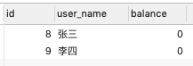

# Read Uncommitted 读未提交

Read Uncommitted是隔离级别最低的一种事务级别。在这种隔离级别下，一个事务会读到另一个事务更新后但未提交的数据，如果另一个事务回滚，那么当前事务读到的数据就是脏数据，这就是脏读（Dirty Read),引发的问题有:

- 脏读
- 幻读
- 不可重复读

## 读未提交-代码实例

##### 设置本次查询 session 的隔离级别为 Read Uncommited

```sql
SET SESSION TRANSACTION ISOLATION LEVEL READ UNCOMMITTED;
```

##### 表结构

```sql
DROP TABLE IF EXISTS account;
CREATE TABLE `account` (
`id` BIGINT ( 20 ) NOT NULL AUTO_INCREMENT,
`user_name` VARCHAR ( 36 ) NOT NULL,
`balance` BIGINT ( 20 ) NOT NULL,
PRIMARY KEY ( `id` ),
UNIQUE KEY `id` ( `id` ) 
) ENGINE = INNODB AUTO_INCREMENT = 8 DEFAULT CHARSET = utf8;

INSERT INTO account (user_name,balance) values ('张三',100);
INSERT INTO account (user_name,balance) values ('李四', 0);

```

##### SESSION 开启事务

```sql
-- SESSION 1
START TRANSACTION;
SELECT * FROM ACCOUNT;
--  张三转账
UPDATE account SET balance=balance-100 WHERE user_name='张三';
```

在 SESSION 1 没有提交的情况下 SESSION2 查看

```
SET SESSION TRANSACTION ISOLATION LEVEL READ UNCOMMITTED;
SELECT * FROM ACCOUNT; -- SESSION2 
```



​                                                                                                                                                                                                                                                                                                                                                                                                                             																																																																																																																																																																																																																																																																																																																																																																																																																																																																																																																																																																																																																																																																																																																																																																																																																																																																																																																																																																																																																																																																																																				 

在读未提交的隔离级别下,`SESSION2` 依然可以读到`SESSION1`未提交的更改,这就是读未提交

## 脏读（dirty read)

事务B读到了事务A回滚前的脏数据

| 时刻 | 事务A                                                        | 结果集 | 事务B                                                     | 结果集    |
| :--- | :----------------------------------------------------------- | ------ | :-------------------------------------------------------- | --------- |
| 1    | SET SESSION TRANSACTION ISOLATION LEVEL READ UNCOMMITTED;    |        | SET SESSION TRANSACTION ISOLATION LEVEL READ UNCOMMITTED; |           |
| 2    | START TRANSACTION;                                           |        | START TRANSACTION;                                        |           |
| 3    | UPDATE account SET balance=balance-100 WHERE user_name='张三'; | 0      |                                                           |           |
| 4    |                                                              |        | SELECT * FROM ACCOUNT WHERE user_name='张三';             | 0(脏数据) |
| 5    | ROLLBACK;                                                    | 100    |                                                           |           |
| 6    |                                                              |        | SELECT * FROM ACCOUNT WHERE user_name='张三';             | 100       |
| 7    |                                                              |        | COMMIT;                                                   |           |

事务 B 发现第4 步和第 6 步读到的数据不一致,这就是脏读

## 不可重复读(Non Repeatable Read)

不可重复读是指，在一个事务内，多次读同一数据，在这个事务还没有结束时，如果另一个事务恰好修改了这个数据，那么，在第一个事务中，两次读取的数据就可能不一致。

| 时刻 | 事务A                                                        | 结果集 | 事务B                                                     | 结果集 |
| :--- | :----------------------------------------------------------- | ------ | :-------------------------------------------------------- | ------ |
| 1    | SET SESSION TRANSACTION ISOLATION LEVEL READ UNCOMMITTED;    |        | SET SESSION TRANSACTION ISOLATION LEVEL READ UNCOMMITTED; |        |
| 2    | BEGIN;                                                       |        | BEGIN;                                                    |        |
| 3    |                                                              |        | SELECT * FROM ACCOUNT WHERE user_name='张三';             | 100    |
| 4    | UPDATE account SET balance=balance-100 WHERE user_name='张三'; | 0      |                                                           |        |
| 5    | COMMIT;                                                      | 0      |                                                           |        |
| 6    |                                                              |        | SELECT * FROM ACCOUNT WHERE user_name='张三';             | 0      |
| 7    |                                                              |        | COMMIT;                                                   |        |

在Read Uncommitted隔离级别下，事务B不可重复读同一条记录，因为很可能读到的结果不一致。

## 幻读(Phantom Read)

幻读是指，在一个事务中，第一次查询某条记录，发现没有，但是，当试图更新这条不存在的记录时，竟然能成功，并且，再次读取同一条记录，它就神奇地出现了。

一句话: **幻读就是一个事务能够更新成功它没有查到的数据,再次读取就又出现了**

| 时刻 | 事务A                                                        | 结果集 | 事务B                                                        | 结果集                |
| :--- | :----------------------------------------------------------- | ------ | :----------------------------------------------------------- | --------------------- |
| 1    | SET SESSION TRANSACTION ISOLATION LEVEL READ UNCOMMITTED;    | 成功   | SET SESSION TRANSACTION ISOLATION LEVEL READ UNCOMMITTED;    | 成功                  |
| 2    | BEGIN;                                                       |        | BEGIN;                                                       |                       |
| 3    |                                                              |        | SELECT * FROM ACCOUNT WHERE user_name='张三';                | null                  |
| 4    | INSERT INTO account (user_name,balance) values ('张三',100); | 100    |                                                              |                       |
| 5    | COMMIT;                                                      |        |                                                              |                       |
| 6    |                                                              |        | SELECT * FROM ACCOUNT WHERE user_name='张三';                | null                  |
| 7    |                                                              |        | UPDATE account SET balance=balance-100 WHERE user_name='张三'; | 竟然成功了,是不是幻觉 |
| 8    |                                                              |        | SELECT * FROM ACCOUNT WHERE user_name='张三';                | 0                     |
| 9    |                                                              |        | COMMIT;                                                      |                       |

- 事务B在第3步第一次读取`张三`的记录时，读到的记录为空，说明不存在张三的记录。

- 事务A在第4步插入了一条`张三`的记录并提交。
- 事务B在第6步再次读取`张三`的记录时，读到的记录仍然为空.
- 事务B在第7步试图更新这条不存在的记录时，竟然成功了幻觉!
- 事务B在第8步再次读取`张三`的记录时，记录出现了。幻觉!

可见，幻读就是没有读到的记录，以为不存在，但其实是可以更新成功的，并且，更新成功后，再次读取，就出现了。