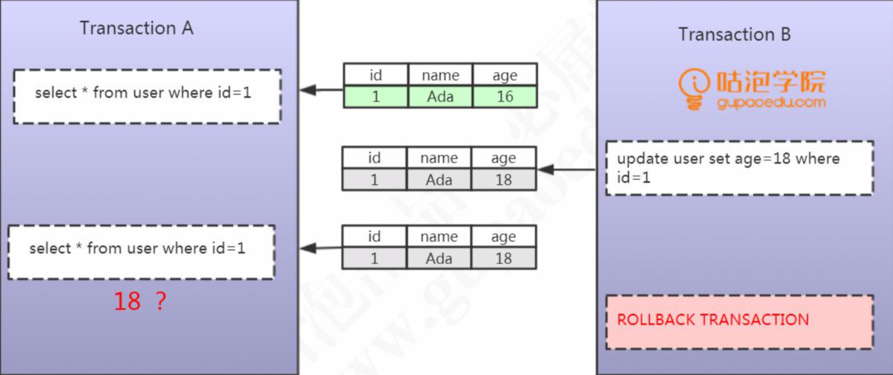

# 脏读（dirty read)

[TOC]

## 定义

脏读是在书屋隔离级别读未提交(RU)中出现的一种情况

**一个事务读取到了其他事务还没有提交的数据**

## 图示

## 解释

- 事务 A 查询了一条 ID = 1 的数据
- 事务 B 更新了这条 ID = 1 的数据
- 事务 A 再次查询, 发现 数据变化了
- 事务 B 进行了回滚

  **这种读取到其他事务未提交的数据的情况，我们把它叫做脏读。**

## 示例 2

事务B读到了事务A回滚前的脏数据

| 时刻 | 事务A                                                        | 结果集 | 事务B                                                     | 结果集    |
| :--- | :----------------------------------------------------------- | ------ | :-------------------------------------------------------- | --------- |
| 1    | SET SESSION TRANSACTION ISOLATION LEVEL READ UNCOMMITTED;    |        | SET SESSION TRANSACTION ISOLATION LEVEL READ UNCOMMITTED; |           |
| 2    | START TRANSACTION;                                           |        | START TRANSACTION;                                        |           |
| 3    | UPDATE account SET balance=balance-100 WHERE user_name='张三'; | 0      |                                                           |           |
| 4    |                                                              |        | SELECT * FROM ACCOUNT WHERE user_name='张三';             | 0(脏数据) |
| 5    | ROLLBACK;                                                    | 100    |                                                           |           |
| 6    |                                                              |        | SELECT * FROM ACCOUNT WHERE user_name='张三';             | 100       |
| 7    |                                                              |        | COMMIT;                                                   |           |

事务 B 发现第4 步和第 6 步读到的数据不一致,这就是脏读