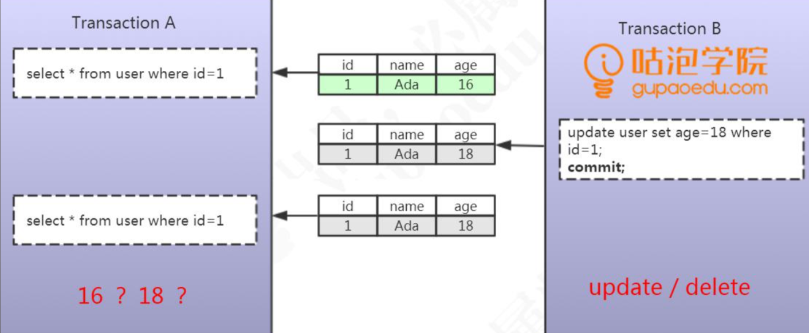

# 不可重复读(Non Repeatable Read)

## 定义

一个事务中,读取到了其他事务针对旧数据的修改记录(update 或者 delete)

## 图示

- 事务 A 查询了一条 ID = 1 的数据
- 事务 B 更新了这条 ID = 1 的数据 并提交
- 事务 A 再次查询, 发现 数据变化了

这种一个事务读取到了其他事务已提交的数据导致前后两次读取数据不一致的情 况，我们把它叫做不可重复读。

## 示例 2

不可重复读是指，在一个事务内，多次读同一数据，在这个事务还没有结束时，如果另一个事务恰好修改了这个数据，那么，在第一个事务中，两次读取的数据就可能不一致。

| 时刻 | 事务A                                                        | 结果集 | 事务B                                                     | 结果集 |
| :--- | :----------------------------------------------------------- | ------ | :-------------------------------------------------------- | ------ |
| 1    | SET SESSION TRANSACTION ISOLATION LEVEL READ UNCOMMITTED;    |        | SET SESSION TRANSACTION ISOLATION LEVEL READ UNCOMMITTED; |        |
| 2    | BEGIN;                                                       |        | BEGIN;                                                    |        |
| 3    |                                                              |        | SELECT * FROM ACCOUNT WHERE user_name='张三';             | 100    |
| 4    | UPDATE account SET balance=balance-100 WHERE user_name='张三'; | 0      |                                                           |        |
| 5    | COMMIT;                                                      | 0      |                                                           |        |
| 6    |                                                              |        | SELECT * FROM ACCOUNT WHERE user_name='张三';             | 0      |
| 7    |                                                              |        | COMMIT;                                                   |        |

在Read Uncommitted隔离级别下，事务B不可重复读同一条记录，因为很可能读到的结果不一致。