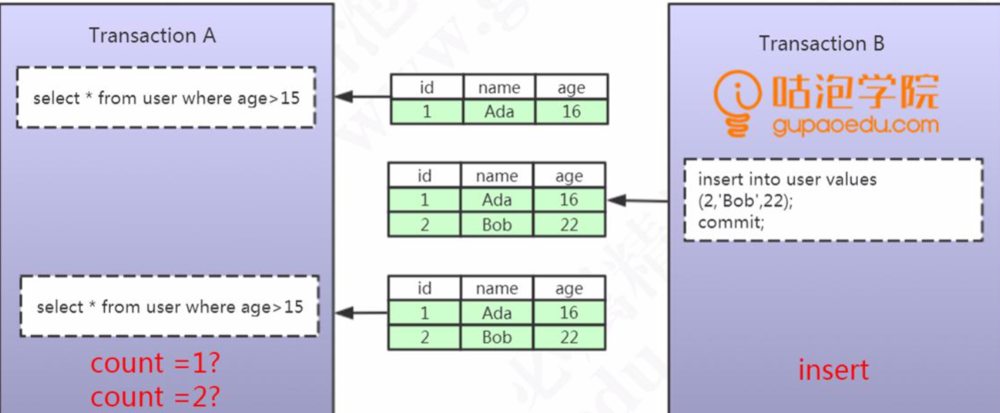

## 幻读(Phantom Read)

## 介绍

幻读指的是在其中一个事务中,读取到了其他事务新增的数据,仿佛出现了幻觉(常见的操作是 insert 语句)

## 图示

- 事务 A 执行了范围查询, 得到一条结果
- 事务 B 执行了插入操作 , 并提交
- 事务 A 执行了范围查询, 得到 2 条结果

一个事务前后两次读取数据数据不一致，是由于其他事务插入数据造成的，这种情 况我们把它叫做幻读。

## 不可重复读和幻读，的区别在那里呢?

  不可重复读是修改或者删除，幻读是插入。

## 实例 2

幻读是指，在一个事务中，第一次查询某条记录，发现没有，但是，当试图更新这条不存在的记录时，竟然能成功，并且，再次读取同一条记录，它就神奇地出现了。

一句话: **幻读就是一个事务能够更新成功它没有查到的数据,再次读取就又出现了**

| 时刻 | 事务A                                                        | 结果集 | 事务B                                                        | 结果集                |
| :--- | :----------------------------------------------------------- | ------ | :----------------------------------------------------------- | --------------------- |
| 1    | SET SESSION TRANSACTION ISOLATION LEVEL READ UNCOMMITTED;    | 成功   | SET SESSION TRANSACTION ISOLATION LEVEL READ UNCOMMITTED;    | 成功                  |
| 2    | BEGIN;                                                       |        | BEGIN;                                                       |                       |
| 3    |                                                              |        | SELECT * FROM ACCOUNT WHERE user_name='张三';                | null                  |
| 4    | INSERT INTO account (user_name,balance) values ('张三',100); | 100    |                                                              |                       |
| 5    | COMMIT;                                                      |        |                                                              |                       |
| 6    |                                                              |        | SELECT * FROM ACCOUNT WHERE user_name='张三';                | null                  |
| 7    |                                                              |        | UPDATE account SET balance=balance-100 WHERE user_name='张三'; | 竟然成功了,是不是幻觉 |
| 8    |                                                              |        | SELECT * FROM ACCOUNT WHERE user_name='张三';                | 0                     |
| 9    |                                                              |        | COMMIT;                                                      |                       |

- 事务B在第3步第一次读取`张三`的记录时，读到的记录为空，说明不存在张三的记录。

- 事务A在第4步插入了一条`张三`的记录并提交。
- 事务B在第6步再次读取`张三`的记录时，读到的记录仍然为空.
- 事务B在第7步试图更新这条不存在的记录时，竟然成功了幻觉!
- 事务B在第8步再次读取`张三`的记录时，记录出现了。幻觉!

可见，幻读就是没有读到的记录，以为不存在，但其实是可以更新成功的，并且，更新成功后，再次读取，就出现了。

## 如何解决幻读

InnoDB 使用间隙锁解决幻读问题

 [03-MySQL间隙锁.md](../../13-persistence/01-MySQL/03-事务和锁/03-MySQL间隙锁.md) 