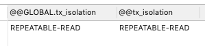

# 事务

## 什么是事务

事务是以一种可靠、一致的方式,访问和操作数据库中的数据的程序单元(要么都完成,要么都不完成)

## 原则

一般来说，事务是必须满足4个条件（ACID）：：原子性（**A**tomicity，或称不可分割性）、一致性（**C**onsistency）、隔离性（**I**solation，又称独立性）、持久性（**D**urability）。

- **原子性：**一个事务（transaction）中的所有操作，要么全部完成，要么全部不完成，不会结束在中间某个环节。事务在执行过程中发生错误，会被回滚（Rollback）到事务开始前的状态，就像这个事务从来没有执行过一样。
- **一致性：**在事务开始之前和事务结束以后，数据库的完整性没有被破坏。这表示写入的资料必须完全符合所有的预设规则，这包含资料的精确度、串联性以及后续数据库可以自发性地完成预定的工作。
- **隔离性：**数据库允许多个并发事务同时对其数据进行读写和修改的能力，隔离性可以防止多个事务并发执行时由于交叉执行而导致数据的不一致。事务隔离分为不同级别，包括读未提交（Read uncommitted）、读已提交（Read committed）、可重复读（Repeatable read）和串行化（Serializable）。
- **持久性：**事务处理结束后，对数据的修改就是永久的，即便系统故障也不会丢失。

## 事务隔离级别

MySQL数据库针对这四种特性，为我们提供的四种隔离级别，这四个级别可以逐个解决脏读、不可重复读、幻读这几类问题,默认的隔离级别是 可重复读（Repeatable read）

|      | 隔离级别                                              | 脏读   | 不可重复读 | 幻读   |
| ---- | ----------------------------------------------------- | ------ | ---------- | ------ |
| 1    | [读未提交（read uncommitted)](01-read-uncommitted.md) | 脏读   | 可能       | 可能   |
| 2    | [读已提交（read committed)](01-read-uncommitted.md)   | 不可能 | 可能       | 可能   |
| 3    | [可重复读（repeatable read)](03-repeatable-read.md)   | 不可能 | 不可能     | 可能   |
| 4    | [串行化 (serializable)](04-serializable.md)           | 不可能 | 不可能     | 不可能 |

##### 查询MySQL 数据库的隔离级别

```sql
SELECT @@GLOBAL.tx_isolation, @@tx_isolation;
```



可以看到默认的隔离级别是可重复度

##### 设置本次查询 session 的隔离级别为 Read Uncommited

```sql
SET SESSION TRANSACTION ISOLATION LEVEL READ UNCOMMITTED;
```

##### 设置全局隔离界别

```
SET GLOBAL TRANSACTION ISOLATION LEVEL READ UNCOMMITTED;
```


## 默认隔离级别

如果没有指定隔离级别，数据库就会使用默认的隔离级别。

- 在MySQL中，如果使用InnoDB，默认的隔离级别是`Repeatable Read`。


