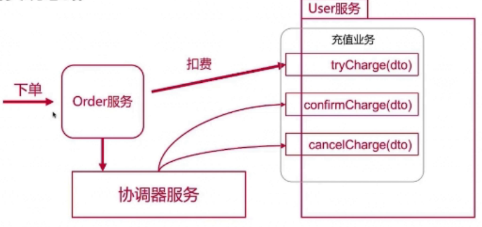

# TCC 模式

TCC 模式的全称是

- TCC实现阶段一：Try
- TCC实现阶段二：Confirm
- TCC实现阶段三：Cancel

## TCC 模式实现思路

每个需要实现事务的接口,都需要 3 个接口:

- try : 业务检查,预留资源
- confirm : 执行业务,使用资源
- cancel : 回滚业务,释放资源

#### TCC事务模型总共有三个状态

- Initial 状态: 是最初始的状态,接到 Try 请求时变成 Reserved 状态
- Reserved 状态 : 接受 Confirm 请求时变成 Final 状态,如果接手 Cancel 请求或者等待超时则退回到 Initial 状态
- Final 状态 : TCC 事务成功状态

## 

## TCC协调器的功能

- 接管事务管理,类似于 JTA的独立事务管理器 (非两阶段提交)
- 保存每个资源上的事务记录,跟踪状态、检查超时
- 保证每个资源的事务性
- 处理各种错误:超时、重试、网络异常,服务不可用

## servicecomb-pack 中的 TCC

TCC (try-confirm-cancel)与Saga事务处理方式相比多了一个Try方法。事务调用的发起方来根据事务的执行情况协调相关各方进行提交事务或者回滚事务。

### 成功场景

成功场景下， 每个事务都会有开始和对应的结束事件

### 异常场景

异常场景下，事务发起方会向alpha上报异常事件，然后alpha会向该全局事务的其它已完成的子事务发送补偿指令，确保最终所有的子事务要么都成功，要么都回滚。

## TCC 与 2PC

与 2PC 不同,

- TCC的模式把原来 2PC 的 prepare 操作从事务管理中剥离出来,规范为 try 操作,并且变成 Reserverd 状态
- 撤销的 prepare 的操作范围为 cancel 操作,并且变为 Initial 状态

