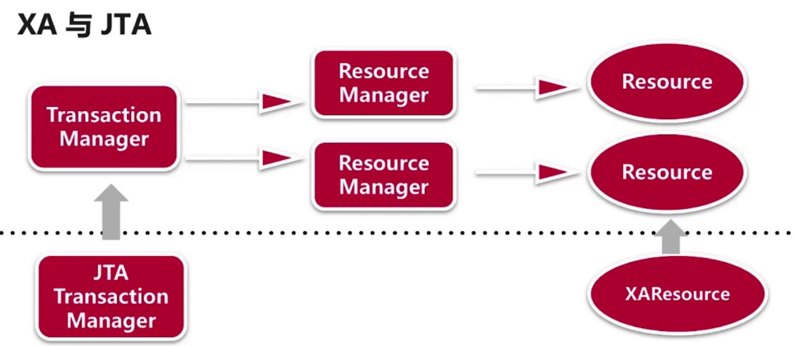
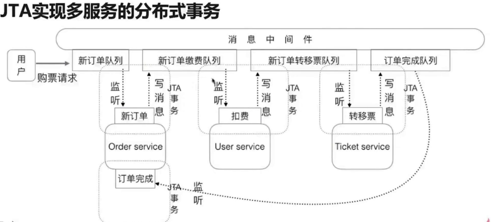

# JTA : Java事务API（Java Transaction API)

JTA 是  [XA](03-xa.md)   协议的 Java 实现

- JTATransactionManager 对应 XA 中的 Transaction Manager 

- XAResource 对应这个 XA中的 Resource

## JTA 实现多服务的分布式事务

## 使用 Spring JTA

- 使用如 JBoss 之类的应用服务器提供的JTA事务管理器,程序中通过 JNDI的方式获取到
- 可以使用Atomikos、Bitronix 之类的第三方库提供的 JTA事务管理器