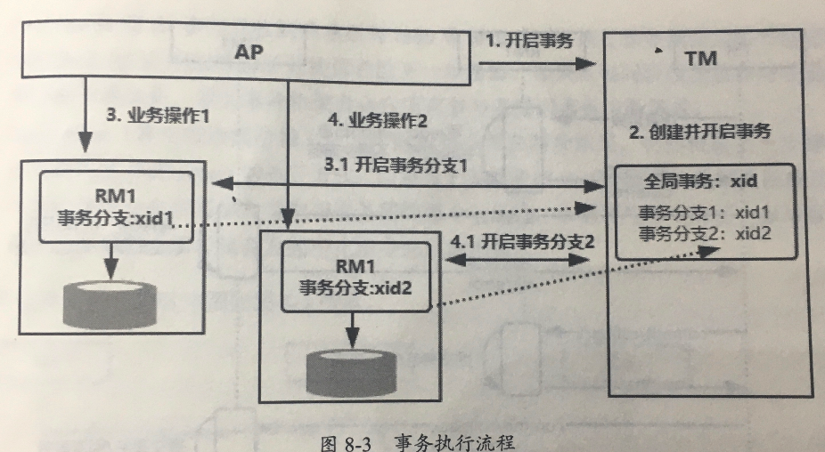

# X/Open 分布式模型

x/open DTP (Distibuted Transaction Processing Reference Model)  是 X/Open 组织定义的一套分布式事务标准

**这个标准提出了两阶段提交**来保证分布式事务的完整性

>  [030-两阶段提交协议.md](030-两阶段提交协议.md) 

## 三种角色

在这个标准下, 有三种角色:

- AP

  > application 表示应用服务器

- RM 

  > ResourceManager 资源管理器

- TM

  > Transaction Manager 标识事务管理器 , 一般指的是事务协调者 , 负责协调和管理事务
  >
  > 提供 AP 编程接口或者 管理 RM , 可以理解为 Spring 的事务管理器 Transaction Manager

## 基本原理

- 多个 资源管理器 RM 注册到事务管理器 TM 上

- 应用通过 资源管理器 TM 获取到连接 , 如果 rm 是数据库则是 JDBC 数据库

- 应用 AP 向 事务管理器 TM 发送一个全局事务 ,生成一个全局事务 ID(XID) ;XID 会通知各个 RM

- 应用 AP 通过第二步获得连接直接操作 RM 完成数据操作

  > 实际上就是带着全局事务 ID ,请求连接直接操作

- 应用 AP 结束事务请求, 事务管理器 TM 会通知各个 RM
- 根据各个 RM 的事务执行结果,执行提交或者回滚

### 值得注意的是

事务管理器 TM 和它的多个资源管理器 RM 之间使用的是 XA 协议来完成的, 当然它是 X/Open 组织提出的

像 Oracle / MySQL /BD2 都实现了 XA接口	

