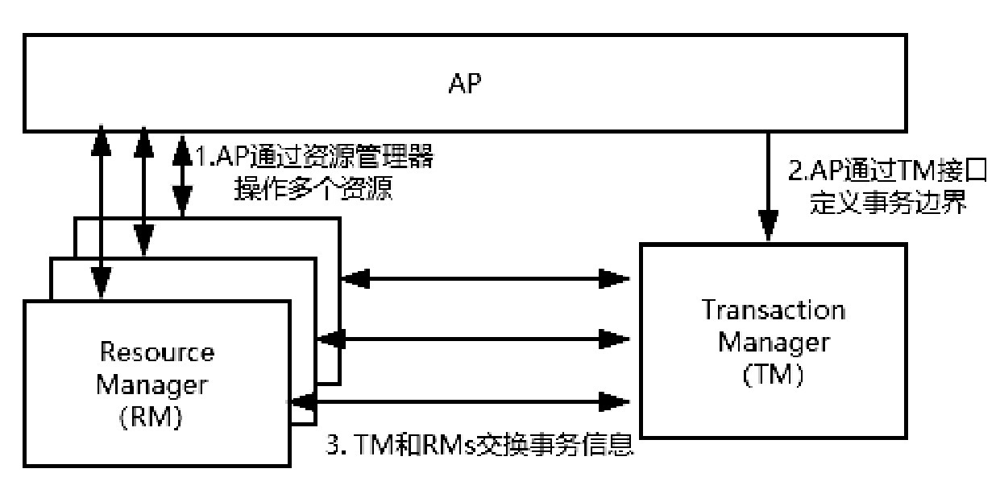
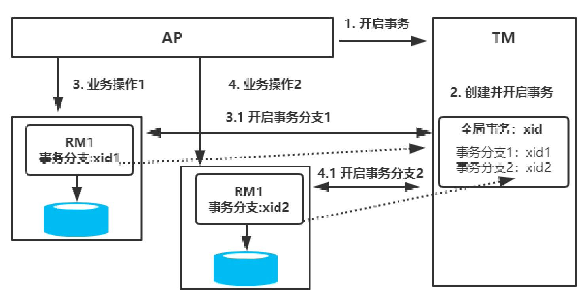

# 020-XOpen分布式事务模型

[TOC]

## X/Open模型是什么

X/Open DTP（X/Open Distributed Transaction Processing Reference Model）是X/Open这个组织定义的一套分布式事务的标准。

这个标准提出了使用两阶段提交（2PC，Two-Phase-Commit）来保证分布式事务的完整性。

- [两阶段提交协议](030-两阶段提交协议.md) 
- [三阶段提交协议](040-三阶段提交协议.md) 

## X/Open三种角色

如下图所示，X/Open DTP中包含以下三种角色。

- AP：Application，表示应用程序。
- RM：Resource Manager，表示资源管理器，比如数据库。
- TM：Transaction Manager，表示事务管理器，一般指事务协调者，负责协调和管理事务，提供AP编程接口或管理RM。可以理解为Spring中提供的Transaction Manager。

- 多个资源管理器 RM 注册到事务管理器 TM 上

- 应用通过 资源管理器 TM 获取到连接 , 如果 rm 是数据库则是 JDBC 数据库

- 应用 AP 向 事务管理器 TM 发送一个全局事务 ,生成一个全局事务 ID(XID) ;XID 会通知各个 RM

- 应用 AP 通过第二步获得连接直接操作 RM 完成数据操作

  > 实际上就是带着全局事务 ID ,请求连接直接操作

- 应用 AP 结束事务请求, 事务管理器 TM 会通知各个 RM
- 根据各个 RM 的事务执行结果,执行提交或者回滚

## 事务执行流程

如果此时RM代表数据库，那么TM需要能够管理多个数据库的事务，大致实现步骤如下：

- 配置TM，把多个RM注册到TM，相当于TM注册RM作为数据源。
- AP从TM管理的RM中获取连接，如果RM是数据库则获取JDBC连接。
- AP向TM发起一个全局事务，生成全局事务ID（XID），XID会通知各个RM。
- AP通过第二步获得的连接直接操作RM完成数据操作。这时，AP在每次操作时会把XID传递给RM。
-  AP结束全局事务，TM会通知各个RM全局事务结束。
- 根据各个RM的事务执行结果，执行提交或者回滚操作。

实际上这里会涉及全局事务的概念。也就是说，在原本的单机事务下，会存在跨库事务的可见性问题，导致无法实现多节点事务的全局可控。而TM就是一个全局事务管理器，它可以管理多个资源管理器的事务。TM最终会根据各个分支事务的执行结果进行提交或者回滚，如果注册的所有分支事务中任何一个节点事务执行失败，为了保证数据的一致性，TM会触发各个RM的事务回滚操作。

#### 值得注意的是

需要注意的是，TM和多个RM之间的事务控制，是基于XA协议（XA Specification）来完成的。

XA协议是X/Open提出的分布式事务处理规范，也是分布式事务处理的工业标准，它定义了xa_和ax_系列的函数原型及功能描述、约束等。

目前Oracle、MySQL、DB2都实现了XA接口，所以它们都可以作为RM

