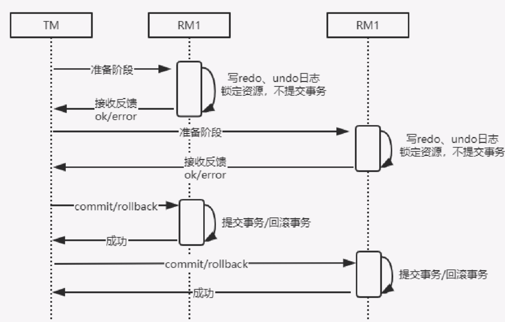

# 两阶段提交协议

## 目录

- [什么是两阶段提交](#什么是两阶段提交)
- [两阶段提交执行流程](#两阶段提交执行流程)
- [两阶段提交协议的优缺点](#两阶段提交协议的优缺点)

## 什么是两阶段提交

TM实现了多个RM事务的管理，实际上会涉及两个阶段的提交:

- 第一阶段是事务的准备阶段。
- 第二阶段是事务的提交或者回滚阶段。

## 两阶段提交执行流程

这两个阶段都是由事务管理器发起的。两阶段提交协议的执行流程如下。

- 准备阶段：事务管理器（TM）通知资源管理器（RM）准备分支事务，记录事务日志，并告知事务管理器的准备结果。
- 提交/回滚阶段：
  - 如果所有的资源管理器（RM）在准备阶段都明确返回成功，则事务管理器（TM）向所有的资源管理器（RM）发起事务提交指令完成数据的变更。
  - 如果任何一个资源管理器（RM）明确返回失败，则事务管理器（TM）会向所有资源管理器（RM）发送事务回滚指令。

### 两阶段提交图示

## 两阶段提交协议的优缺点

两阶段提交将一个事务的处理过程分为投票和执行两个阶段，它的优点在于充分考虑到了分布式系统的不可靠因素，并且采用非常简单的方式（两阶段提交）就把由于系统不可靠而导致事务提交失败的概率降到最小。

#### 缺点

- 同步阻塞：从图的执行流程来看，所有参与者（RM）都是事务阻塞型的，对于任何一次指令都必须要有明确的响应才能继续进行下一步，否则会处于阻塞状态，占用的资源一直被锁定。

- 过于保守：任何一个节点失败都会导致数据回滚。

-  事务协调者的单点故障：如果协调者在第二阶段出现了故障，那么其他的参与者（RM）会一直处于锁定状态。

-  **脑裂**导致数据不一致问题：

  > 在第二阶段中，事务协调者向所有参与者（RM）发送commit请求后，发生局部网络异常导致只有一部分参与者（RM）接收到了commit请求，这部分参与者（RM）收到请求后会执行commit操作，但是未收到commit请求的节点由于事务无法提交，导致数据出现不一致问题。
  > 

