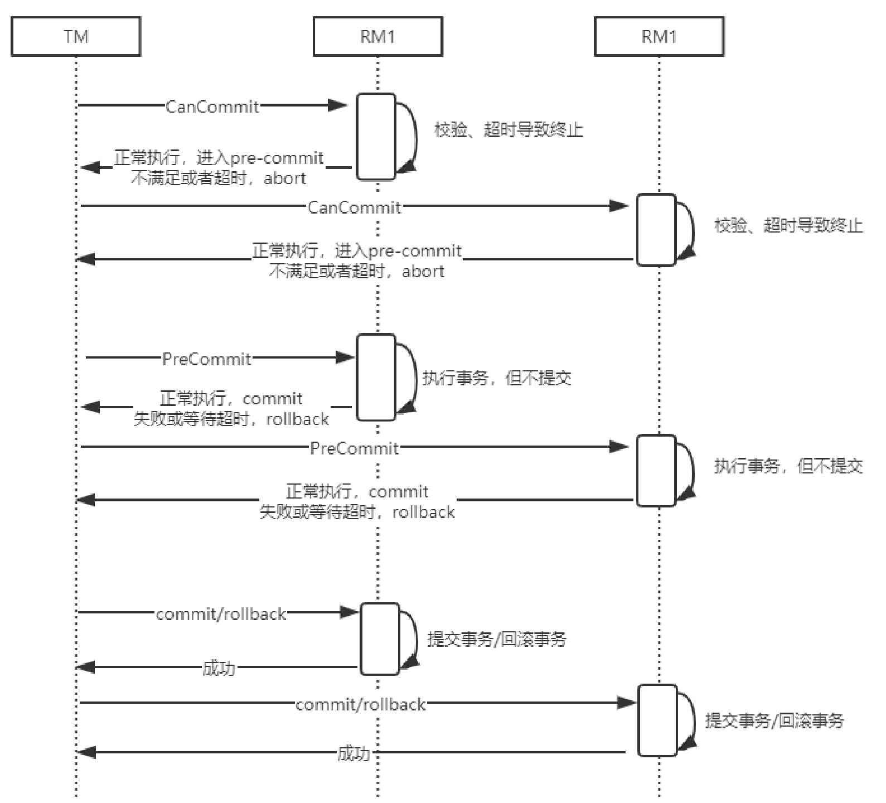

# 三阶段提交协议

## 目录

- [什么是三阶段提交协议](#什么是三阶段提交协议)
- [三阶段协议时序图](#三阶段协议时序图)
- [三阶段和二阶段提交的区别](#三阶段和二阶段提交的区别)
- [三阶段提交的优缺点](#三阶段提交的优缺点)
- [值得注意的是](#值得注意的是)

## 什么是三阶段提交协议

三阶段提交协议是两阶段提交协议的改进版本，它利用超时机制解决了同步阻塞的问题，三阶段提交协议的具体描述如下。

- **CanCommit（询问阶段）**：

  > 事务协调者 (TM) 向参与者发送事务执行请求，询问是否可以完成指令，参与者(RM) 只需要回答是或者不是即可，不需要做真正的事务操作，这个阶段会有超时中止机制。

- **PreCommit（准备阶段**）：

  > 事务协调者会根据参与者的反馈结果决定是否继续执行，
  >
  > - 如果在询问阶段所有参与者都返回可以执行操作，则事务协调者会向所有参与者发送 PreCommit 请求，参与者收到请求后写 redo 和 undo日志，执行事务操作但是不提交事务，然后返回 ACK 响应等待事务协调者的下一步通知。
  > - 如果在询问阶段任意参与者返回不能执行操作的结果，那么事务协调者会向所有参与者发送事务中断请求。

- **DoCommit（提交或回滚阶段）**：

  > 这个阶段也会存在两种结果，仍然根据上一步骤的执行结果来决定DoCommit的执行方式。
  >
  > - 如果每个参与者在PreCommit阶段都返回成功，那么事务协调者会向所有参与者发起事务提交指令。
  > - 反之，如果参与者中的任一参与者返回失败，那么事务协调者就会发起中止指令来回滚事务。

## 三阶段协议时序图

## 三阶段和二阶段提交的区别

- 三阶段提交协议增加了一个CanCommit阶段，用于询问所有参与者是否可以执行事务操作并且响应，它的好处是，可以尽早发现无法执行操作而中止后续的行为。
- 在准备阶段之后，事务协调者和参与者都引入了超时机制，一旦超时，事务协调者和参与者会继续提交事务，并且认为处于成功状态，因为在这种情况下事务默认为成功的可能性比较大。

## 三阶段提交的优缺点

- 最大的好处就是基于超时机制来避免资源的永久锁定。

- 在三阶段提交协议下仍然可能出现数据不一致的情况，当然概率是比较小的。

## 值得注意的是

**需要注意的是，不管是两阶段提交协议还是三阶段提交协议，都是数据一致性解决方案的实现，我们可以在实际应用中灵活调整。**

比如ZooKeeper集群中的数据一致性，就用到了优化版的两阶段提交协议，优化的地方在于，**它不需要所有参与者在第一阶段返回成功才能提交事务**，而是利用少数服从多数的投票机制来完成数据的提交或者回滚。

