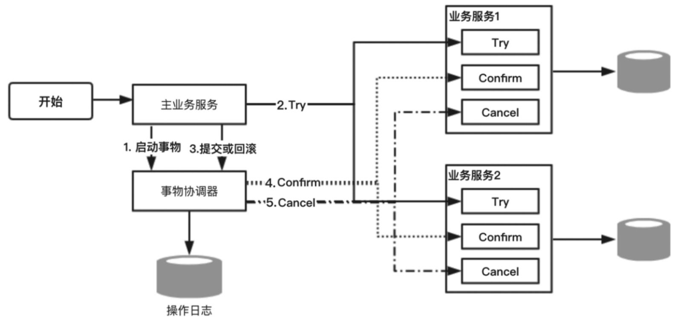

## TCC补偿型方案

## 目录

- [什么是TCC补偿方案](#什么是TCC补偿方案)
- [TCC执行流程图](#TCC执行流程图)
- [TCC的账户余额例子](#TCC的账户余额例子)
- [服务突然宕机无法收到事务协调器](#服务突然宕机无法收到事务协调器)

## 什么是TCC补偿方案

TCC（Try-Confirm-Cancel）是一种比较成熟的分布式数据一致性解决方案，它实际上是把一个完整的业务拆分为如下三个步骤。

- Try：这个阶段主要是对数据的校验或者资源的预留。
- Confirm：确认真正执行的任务，只操作Try阶段预留的资源。
- Cancel：取消执行，释放Try阶段预留的资源。

**其实TCC是一种两阶段提交的思想**

 [030-两阶段提交协议.md](030-两阶段提交协议.md) 

- 第一阶段通过Try进行准备工作
- 第二阶段Confirm/Cancel 表示Try阶段操作的确认和回滚。

在分布式事务场景中，每个服务实现TCC之后，就作为其中的一个资源，参与到整个分布式事务中。然后主业务服务在第一阶段中分别调用所有TCC服务的Try方法。最后根据第一个阶段的执行情况来决定对第二阶段的Confirm或者Cancel。

## TCC执行流程图

## TCC的账户余额例子

对于TCC的工作机制，我们举一个比较简单的例子。在一个理财App中，用户通过账户余额购买一个理财产品，这里涉及两个事务操作：

- 在账户服务中，对用户账户余额进行扣减。
- 在理财产品服务中，对指定理财产品可申购金额进行扣减。

这两个事务操作在微服务架构下分别对应的是两个不同的微服务，以及独立的数据库操作，在TCC的工作机制中，首先针对账户服务和理财产品服务分别提供Try、Confirm和 Cancel 三个方法。

- 在账户服务的Try方法中对实际申购金额进行冻结，Confirm方法把Try方法冻结的资金进行实际的扣减，Cancel方法把Try方法冻结的资金进行解冻。
- 理财产品服务的Try方法中将本次申购的部分额度进行冻结，Confirm方法把Try方法中冻结的额度进行实际扣减，Cancel方法把Try方法中冻结的额度进行释放。

在一个主业务方法中，分别调用这两个服务对外提供的处理方法（资金扣减、理财产品可申购额度扣减），这两个服务做实际业务处理时，会先调用Try方法来做资源预留，如果这两个方法处理都正常，TCC事务协调器就会调用Confirm方法对预留资源进行实际应用。否则TCC事物协调器一旦感知到任何一个服务的Try方法处理失败，就会调用各个服务的Cancel方法进行回滚，从而保证数据的一致性。

## 服务突然宕机无法收到事务协调器

**在一些特殊情况下，比如理财产品服务宕机或者出现异常，导致该服务并没有收到TCC事务协调器的Cancel或者Confirm请求，怎么办呢？**

没关系，TCC事务框架会记录一些分布式事务的操作日志，保存分布式事务运行的各个阶段和状态。TCC事务协调器会根据操作日志来进行重试，以达到数据的最终一致性。

**需要注意的是，TCC服务支持接口调用失败发起重试，所以TCC暴露的接口都需要满足幂等性。**

