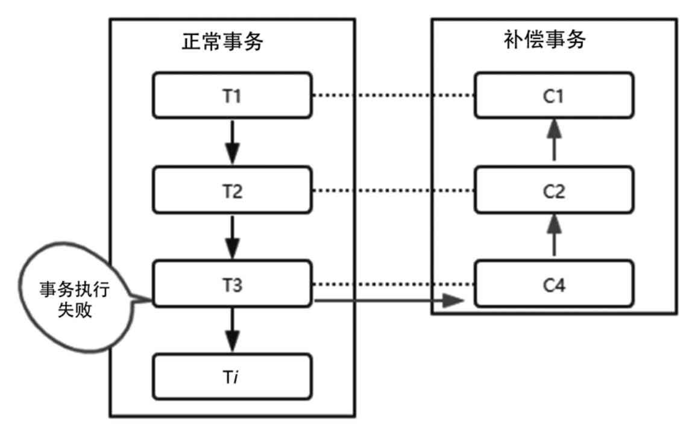

# Saga补偿方案

## 目录

- [什么是Saga](#什么是Saga)
- [Saga核心思想](#Saga核心思想)
- [Saga的执行流程](#Saga的执行流程)
- [Saga的优劣势](#Saga的优劣势)

- [Saga和TCC的对比](#Saga和TCC的对比)

## 什么是Saga

Saga模式又称为长事务解决方案，它是由普林斯顿大学的Hector Garcia-Molina 和 Kenneth Salem提出的，主要描述的是在没有两阶段提交的情况下如何解决分布式事务问题。

Saga 和 TCC 一样，也是一种补偿事务，但是它没有 try 阶段，而是把分布式事务看作一组本地事务构成的事务链。

## Saga核心思想

其核心思想是：

- 把一个业务流程中的长事务拆分为多个本地短事务，

- 业务流程中的每个参与者都提交真实的提交给该本地短事务，当其中一个参与者事务执行失败，则通过补偿机制补偿前面已经成功的参与者。

Saga由一系列 sub-transaction Ti组成，每个Ti都有对应的补偿动作Ci，补偿动作用于撤销Ti造成的数据变更结果。

它和TCC相比，少了Try这个预留动作，每一个Ti操作都真实地影响到数据库。

## Saga的执行流程

按照Saga的工作模式，有两种执行方式：

- T1，T2，T3，...，Ti：这种方式表示所有事务都正常执行。
- T1，T2，...，Tj，Cj，...，C2，C1（其中0<j<i）：这种方式表示执行到Tj事务时出现异常，通过补充操作撤销之前所有成功的sub-transaction。

另外，Saga提供了以下两种补偿恢复方式。

- 向后恢复，如果任一子事务执行失败，则把之前执行的结果逐一撤销。
- 向前恢复，也就是不进行补偿，而是对失败的事务进行重试，这种方式比较适合于事务必须要执行成功的场景。

不管是向后恢复还是向前恢复，都可能出现失败的情况，在最坏的情况下只能人工干预处理

## Saga的优劣势

和XA或者TCC相比，它的优势包括：

- 一阶段直接提交本地事务；没有锁等待，性能较高；
- 在事件驱动的模式下，短事务可以异步执行；
- 补偿机制的实现比较简单。

缺点

- Saga并不提供原子性和隔离性支持，隔离性的影响是比较大的，比如用户购买一个商品后系统赠送一张优惠券，如果用户已经把优惠券使用了，那么事务如果出现异常要回滚时就会出现问题。

## Saga不支持隔离性

Saga 事务是可以保障事务的三个特性：

- 原子性：Saga 协调器可以协调事务链中的本地事务要么全部提交，要么全部回滚。
- 一致性：Saga 事务可以实现最终一致性。
- 持久性：基于本地事务，所以这个特性可以很好实现。

但是 Saga 不保证事务隔离性的，本地事务提交后变更就对其他事务可见了。其他事务如果更改了已经提交成功的数据，可能会导致补偿操作失败。

比如扣款失败，但是钱已经花掉了，业务设计上需要考虑这种场景并从业务设计上规避这种问题。

## 方案设计时的策略

Saga 事务和 TCC 事务一样，对业务实现要求高，要求业务设计实现上遵循三个策略：

- 允许空补偿：网络异常导致事务的参与方只收到了补偿操作指令，因为没有执行过正常操作，因此要进行空补偿。
- 保持幂等性：事务的正向操作和补偿操作都可能被重复触发，因此要保证操作的幂等性。
- 防止资源悬挂：网络异常导致事务的正向操作指令晚于补偿操作指令到达，则要丢弃本次正常操作，否则会出现资源悬挂问题。

# Saga和TCC的对比

虽然 Saga 和 TCC 都是补偿事务，但是由于提交阶段不同，所以两者也是有不同的：

- Saga 是不完美补偿，补偿操作会留下之前原始事务操作的痕迹，需要考虑对业务上的影响。
- TCC 是完美补偿，补偿操作会彻底清理之前的原始事务操作，用户是感知不到事务取消之前的状态信息的。
- TCC 的事务可以更好的支持异步化，但是 Saga 模式一般在补偿阶段比较适合异步化。

Saga 模式非常适合于业务流程长的长事务的场景，实现上对业务侵入低，所以非常适合微服务架构的场景。同时 Saga 采用的是一阶段提交模式，不会对资源长时间加锁，不存在“木桶效应”，所以采用这种模式架构的系统性能高、吞吐高。

阿里巴巴的 Seata 开源项目和华为的 ServiceComb 开源项目都支持 Saga 模式。