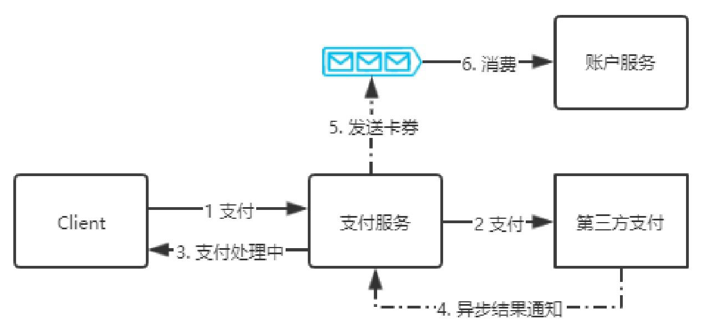
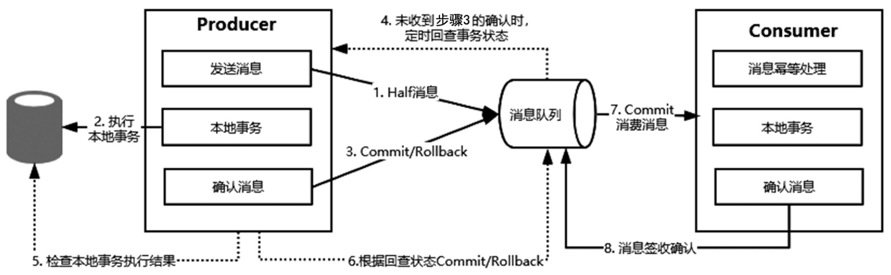

# 基于可靠性消息的最终一致性方案

## 目录

- [什么是可靠性消息最终一致性方案](#什么是可靠性消息最终一致性方案)
- [电商支付场景的例子](#电商支付场景的例子)
- [操作的原子性问题](#操作的原子性问题)
- [RocketMQ事务消息模型](#RocketMQ事务消息模型)

## 什么是可靠性消息最终一致性方案

基于可靠性消息的最终一致性是互联网公司比较常用的分布式数据一致性解决方案，它主要利用消息中间件（Kafka、RocketMQ或RabbitMQ）的可靠性机制来实现数据一致性的投递。

## 电商支付场景的例子

以电商平台的支付场景为例，用户完成订单的支付后不需要同步等待支付结果，可以继续做其他事情。

但是对于系统来说，大部分是在发起支付之后，等到第三方支付平台提供异步支付结果通知，再根据结果来设置该订单的支付状态。并且如果是支付成功的状态，大部分电商平台基于营销策略还会给账户增加一定的积分奖励。所以，当系统接收到第三方返回的支付结果时，需要更新支付服务的支付状态，以及更新账户服务的积分余额，这里就涉及两个服务的数据一致性问题。

**从这个场景中可以发现这里的数据一致性并不要求实时性**，所以我们可以采用基于可靠性消息的最终一致性方案来保证支付服务和账户服务的数据一致性。

流程如下:

- 支付服务收到支付结果通知后，先更新支付订单的状态，再发送一条消息到分布式消息队列中
- 账户服务会监听到指定队列的消息并进行相应的处理，完成数据的同步。



## 操作的原子性问题

我们不难发现一些问题，就是支付服务的本地事务与发送消息这个操作的原子性问题，具体描述如下。

- 先发送消息，再执行数据库事务，在这种情况下可能会出现消息发送成功但是本地事务更新失败的情况，仍然会导致数据不一致的问题。 

  ```
  begin transaction;
  sendMsg();
  updateStatus();
  commit transaction;
  ```

- 先执行数据库事务操作，再发送消息，在这种情况下可能会出现MQ响应超时导致异常，从而将本地事务回滚，但消息可能已经发送成功了，也会存在数据不一致的问题。

```
begin transaction;
updateStatus();
sendMsg();
commit transaction;
```

## RocketMQ事务消息模型

以上问题也有很多成熟的解决方案，以RocketMQ为例，它提供了事务消息模型，如图8-8所示，具体的执行逻辑如下：

- 生产者发送一个事务消息到消息队列上，消息队列只记录这条消息的数据，此时消费者无法消费这条消息。
- 生产者执行具体的业务逻辑，完成本地事务的操作。
- 接着生产者根据本地事务的执行结果发送一条确认消息给消息队列服务器，如果本地事务执行成功，则发送一个Commit消息，表示在第一步中发送的消息可以被消费，否则，消息队列服务器会把第一步存储的消息删除。
- 如果生产者在执行本地事务的过程中因为某些情况一直未给消息队列服务器发送确认，那么消息队列服务器会定时主动回查生产者获取本地事务的执行结果，然后根据回查结果来决定这条消息是否需要投递给消费者。
- 消息队列服务器上存储的消息被生产者确认之后，消费者就可以消费这条消息，消息消费完成之后发送一个确认标识给消息队列服务器，表示该消息投递成功。

#### RocketMQ事务消息模型图示



在RocketMQ事务消息模型中，事务是由生产者来完成的，消费者不需要考虑，因为消息队列可靠性投递机制的存在，如果消费者没有签收该消息，那么消息队列服务器会重复投递，从而实现生产者的本地数据和消费者的本地数据在消息队列的机制下达到最终一致。

## 核心

在RocketMQ的事务消息模型中最核心的机制应该是事务回查，实际上查询模式在很多类似的场景中都可以应用。在分布式系统中，由于网络通信的存在，服务之间的远程通信除成功和失败两种结果外，还存在一种未知状态，比如网络超时。

服务提供者可以提供一个查询接口向外部输出操作的执行状态，服务调用方可以通过调用该接口得知之前操作的结果并进行相应的处理。
