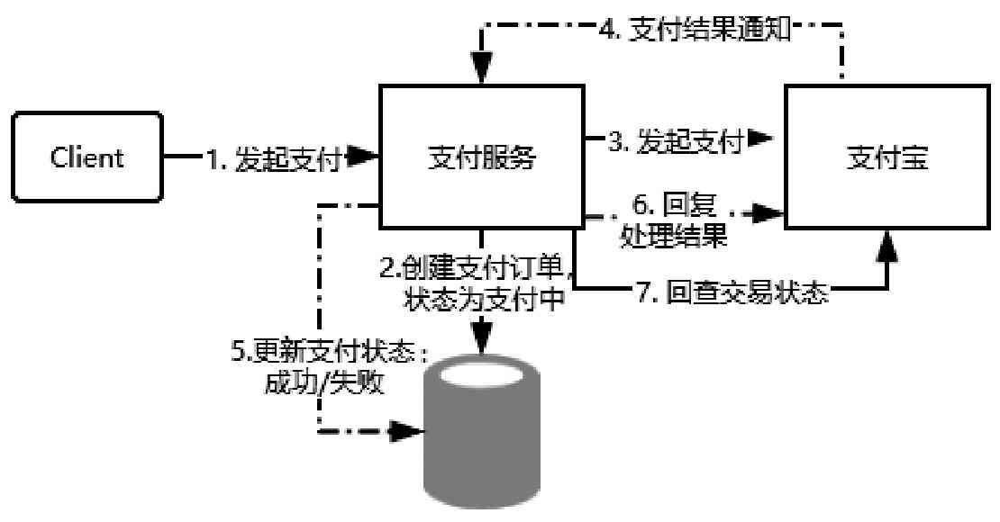

# 最大努力通知型

最大努力通知型和基于可靠性消息的最终一致性方案的实现是类似的，它是一种比较简单的柔性事务解决方案，也比较适用于对数据一致性要求不高的场景，最典型的使用场景是支付宝支付结果通知，实现流程如图所示。

下面站在商户的角度来分析最大努力通知型的处理过程。

- 商户先创建一个支付订单，然后调用支付宝发起支付请求。
- 支付宝唤醒支付页面完成支付操作，支付宝同样会针对该商户创建一个支付交易，并且根据用户的支付结果记录支付状态。
- 支付完成后触发一个回调通知给商户，商户收到该通知后，根据结果修改本地支付订单的状态，并且返回一个处理状态给支付宝。

针对这个订单，在理想状态下支付宝的交易状态和商户的交易状态会在通知完成后达到最终一致。

但是由于网络的不确定性，支付结果通知可能会失败或者丢失，导致商户端的支付订单的状态是未知的。所以最大努力通知型的作用就体现了，如果商户端在收到支付结果通知后没有返回一个“SUCCESS”状态码，那么这个支付结果回调请求会以衰减重试机制（逐步拉大通知的间隔）继续触发，

比如1min、5min、10min、30min……直到达到最大通知次数。如果达到指定次数后商户还没有返回确认状态，怎么处理呢？

- 支付宝提供了一个交易结果查询接口，可以根据这个支付订单号去支付宝查询支付状态，然后根据返回的结果来更新商户的支付订单状态，这个过程可以通过定时器来触发，也可以通过人工对账来触发。

**从上述分析可以发现，所谓的最大努力通知，就是在商户端如果没有返回一个消息确认时，支付宝会不断地进行重试，直到收到一个消息确认或者达到最大重试次数。**

不难发现它的实现机制和 [事务消息模型的消费者消费模型](070-基于可靠性消息的最终一致性方案.md#RocketMQ事务消息模型图示) 类似

**在消费者没有向消息中间件服务器发送确认之前，这个消息会被重复投递，确保消息的可靠性消费。**

