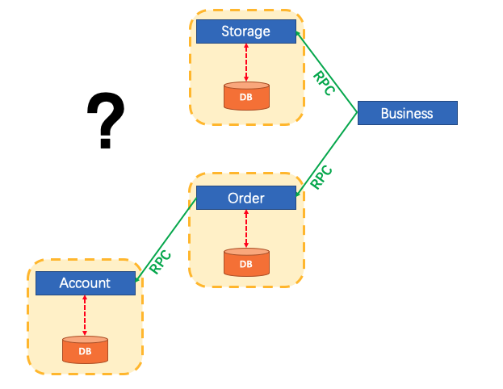
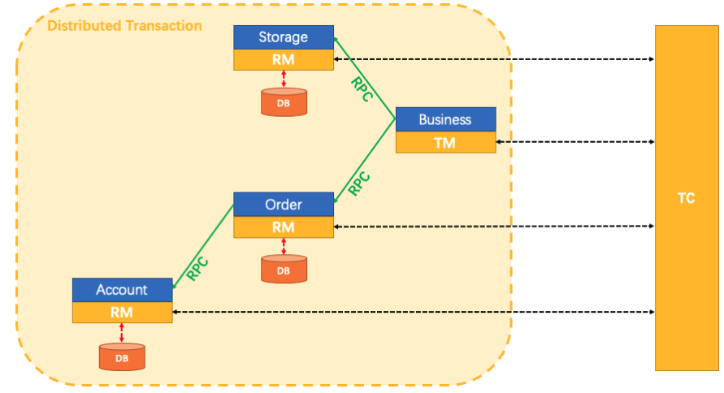
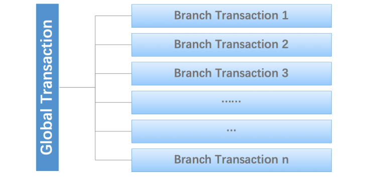
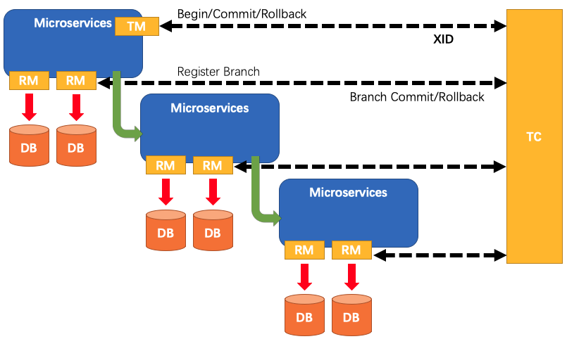

# 分布式事务解决方案-Seata

> 本文来自官方 [README](https://github.com/seata/seata/blob/develop/README.md),但是加入了自己的理解

Seata 是一款开源的分布式事务解决方案，致力于提供高性能和简单易用的分布式事务服务。Seata 将为用户提供了 AT、TCC、SAGA 和 XA 事务模式，为用户打造一站式的分布式解决方案。

要理解 Seata 是做什么的,我们先要理解分布式事务

## 微服务系统中的分布式事务问题

我们先想象以下一个传统的单体应用,业务逻辑分为三块,它们都是单独使用在本地数据源;

正常情况下,数据的一致性往往由本地事务来确保,如下图:

但是在微服务架构中,3 哥模块改变了:

- 上述的3 个模块被设计成了 3 个各自使用不同数据源的模块,参考文章([Pattern: Database per service](http://microservices.io/patterns/data/database-per-service.html)).
- 数据的一致性还是由各个服务的本地事务进行确保

每个单体服务能够确保事务,但是整个使用到三个服务的业务逻辑应该怎么确保呢?

\

## How Seata do?

Seata 的出现就是解决上述的问题

如何定义分布式事务呢?

我们认为: 一个分布式的事务实际上就是

- 一个由一堆**分支事务**组合而成的**全局的事务**
- 通常情况下分支事务往往是本地事务

### 

## Seata 有三个基础的组件

Seata 有三个基础的组件:

- **Transaction Coordinator(TC): **事务协调者 ,维护全局和分支事务的状态，驱动全局事务提交或回滚。
- **Transaction Manager(TM):**  事务管理器,定义全局事务的范围：开始全局事务、提交或回滚全局事务。
- **Resource Manager(RM):**   资源管理器 ,管理分支事务处理的资源，与TC交谈以注册分支事务和报告分支事务的状态，并驱动分支事务提交或回滚。

一个典型的 Seata 管理的分布式事务声明周期

1. TM 请求 TC 开启一个全局的事务(global transaction),TC 确保 XID 能够唯一代表这个全局事务

1. XID 通过微服务的调用链进行传播
2. RM 注册本地事务到 TC, 作为XID 指定的全局事务的分支事务
3. TM 请求 TC 提交或者回滚 XID 对应的全局事务
4. TC 驱动 XID 对应的全局事务的所有分支事务提交或者回滚 

