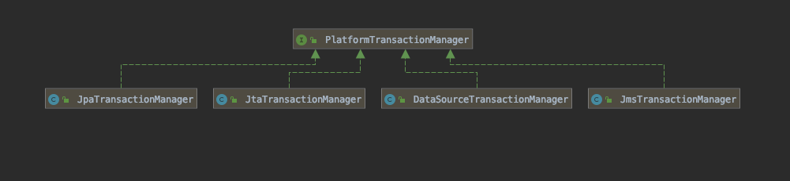

# PlatformTransactionManager事务管理器

这是Spring事务基础结构中的中心接口。应用程序可以直接使用它，但它主要不是作为API:通常，应用程序将通过AOP使用TransactionTemplate或声明性事务界定。
对于实现类，建议从提供的`AbstractPlatformTransactionManager`类派生，该类预先实现了定义的传播行为并负责事务同步处理。子类必须为底层事务的特定状态实现模板方法，例如:begin、suspend、resume、commit。

这个策略接口的默认实现是`JtaTransactionManager`和`DataSourceTransactionManager`，它们可以作为其他事务策略的实现指南。

```java
public interface PlatformTransactionManager {
	//获取当前激活的事务
	TransactionStatus getTransaction(@Nullable TransactionDefinition definition) throws TransactionException;
  // 提交
	void commit(TransactionStatus status) throws TransactionException;
	//回滚
	void rollback(TransactionStatus status) throws TransactionException;
}
```

## PlatformTransactionManager的常见实现




- `JmsTransactionManager` 独立 JMS 的事务管理器,将JMS连接(Connection)/会话(Session) 对从指定的`ConnectionFactory`绑定到线程，可能允许每个`ConnectionFactory`绑定一个线程会话。
- `JpaTransactionManager` 对 JAP(Java persistence API) 的事务进行管理
- `JtaTransactionManager` 对 JTA (Java Transaction API)的事务管理
- `DataSourceTransactionManager` 使用 JDBC 进行事务管理

### 代码方式实现

除了使用常用的`@Transactional`注解外,可以手动进行事务管理,.通过`PlatformTransactionManager`手动开启一个事务,提交一个事务的方式

```java
/**
 * Spring 事务代码手动执行方式
 *
 * @author EricChen 2020/01/01 18:38
 */
@Service
public class OrderServiceImpl implements IOrderService {

    @Autowired
    private PlatformTransactionManager platformtransactionManager;

    @Override
    public void createOrder() {
        DefaultTransactionDefinition transactionDefinition = new DefaultTransactionDefinition();
        transactionDefinition.setPropagationBehavior(DefaultTransactionDefinition.PROPAGATION_REQUIRED);
        TransactionStatus transaction = platformtransactionManager.getTransaction(transactionDefinition);
        try {
            if (true) {
                throw new IllegalArgumentException();
            }
            platformtransactionManager.commit(transaction);
        } catch (Exception e) {
            platformtransactionManager.rollback(transaction);
        }
    }
}

```