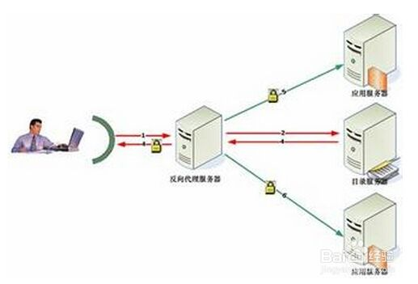

[返回目录](/README.md)

# 什么是反向代理

要弄清楚这个问题，首先要弄清楚什么是正向代理。

## 正向代理

1. PC1将请求发送到代理服务器
2. 代理服务器将请求发送到Internet
3. 对应的Internet服务器完成相应，返回给代理服务器
4. 代理服务器将相应返回给PC1

这种方式称为正向代理。

## 反向代理

假如淘宝（www.taobao.com）和天猫（www.tmall.com）使用的是同一台反向代理服务器，他们共享同一个公网，一个IP可以对应多个域名，当用户使用淘宝或者天猫进行访问时，访问的是同一个IP（192.168.11.11）

1. 用户访问反向代理服务器，反向代理服务器获取到用户访问的域名
2. 反向代理服务器根据用户访问的域名，将请求发送到不同的应用服务器中
3. 当使用（www.taobao.com）访问192.168.11.11时，反向代理服务器将其转发到淘宝对应的应用服务器中
4. 当使用（www.tmall.com）访问192.168.11.11时，反向代理服务器将其转发到天猫对应的应用服务器中

这，就是反向代理。

**正向代理代理客户端，反向代理代理服务器**

## 反向代理配置

[传送门](/action/reverseProxy.md)

