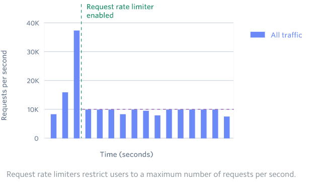
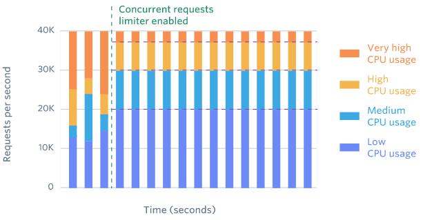

# 01-限流介绍

[TOC]

> https://stripe.com/blog/rate-limiters

## 为什么要限流

在互联网应用中有很多突发性的高并发访问场景,如果秒杀,双十一大促

这些场景的特点是访问量会远远超过系统所能处理的并发数

如果在没有任何保护的情况下,所有请求进入服务器,很可能会导致宕机

**怎么解决?**

- 缓存

- 熔断

- 降级

  > 当服务器出现问题或者影响到核心流程的性能的时候,暂时屏蔽掉,等待高峰过去或者问题解决后再打开

-  限流

## 限流方式

- 限制总并发数,比如数据库连接池,线程池
- 限制瞬时并发数(如 nginx 的 limit_conn 模块,用来限制瞬时并发连接数)
- 限制时间窗口内的平均速率(Guava 的 RateLimiter , nginx 的 limit_req 模块,用来限制每秒的平均速率)
- 限制 MQ 的消费速率
- 限制远程接口的调用速率
- 根据网络连接数,网络流量,CPU 和内存负载来限流

## 限流算法

-  [计数器算法](03-计数器算法.md) 
-  [滑动窗口算法](02-滑动窗口算法.md) 
-  [令牌桶算法](04-令牌桶算法.md) 
-  [漏桶限流算法](05-漏桶限流算法.md) 

## 什么是限流器

Rate Limiter , 限流器用于控制网络请求的速率,

#### 什么时候能用到

当你的用户能够接受接受请求速度略慢但是能够正常相应的请求

如果是实时相应的行为,就不适合了,因为限流器会在一定范围内限制请求速度

如果是实时响应,我们应该考虑添加更多的架构容量

## 负载开关(Load Shedding)

 **限流器非常有用,但是有的时候我们需要关掉一些低优先级的服务来确保高优先级的服务能够正常运行**

> 这个也好理解,双十一的时候,查询订单历史的服务就不可用,这是一种服务降级的处理,把服务器资源有限用来更加优先的服务

## 考虑限流器的类型

一旦我们知道了限流器可以提高 API 的可靠性,我们应该考虑

- 请求数限流器
- 并发限流器

#### 请求数限流器

控制速率的方式限流

限制这个用户每秒请求的次数

#### 并发限流器

控制并发的方式限流

> 你只能同时访问 20 个请求,控制并发

有一些资源很耗费 CPU,我们需要考虑并发量

