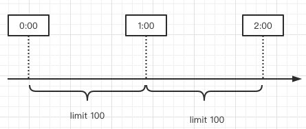
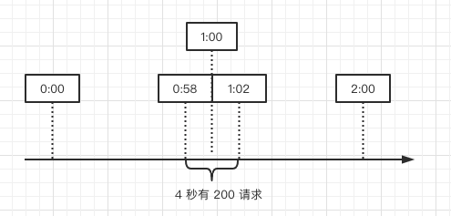

# 02-计数器算法

[TOC]

计数器算法是比较简单的限流实现算法,在指定周期内累加访问次数,当访问次数达到一定的阈值时,触发限流策略,当下一个时间周期时,访问次数清零

## 应用场景

比如限制同一个用户触发短信发送的次数

## 具体实现

先定每一分钟能够处理的总的请求数为 100,在第一个一份中内,一共请求 60 次,接着得个一分钟内,counter 又从 0 开始计数,在一分半钟内,已经达到了最大限流的阈值,这个时候后续的所有请求都会被拒绝

 

#### 计数器算法的临界问题

算法存在临界问题,在第一分钟的 0:58 秒和第二分钟的 1:02 秒这个时间段内,分别出现了 100 个请求,整体来看就会出现 4 秒内总的请求量达到了 200, 超出阈值