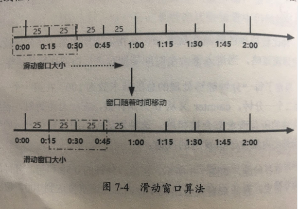

# 03-滑动窗口算法

[TOC]

为了解决计数器算法带来的临界问题,引入了滑动窗口算法

滑动窗口算法是一种流量控制技术,TCP 网络通讯协议中,就采用了滑动窗口算法来解决网络拥塞的情况

## 原理

滑动窗口指的就是在固定的窗口中分隔出多个小时间窗口,分别在每个小时间窗口中记录访问次数,然后根据时间将窗口向前滑动并删除过期的小时间窗口

最终只需要统计滑动窗口范围内的小时间窗口即可

## 图示

我们将一分钟拆分为 4 个小时间窗口,每个小时间窗口最多能够处理 25 个请求,并且通过虚线表示滑动窗口的大小,当前窗口的大小是 2, 也就是在这个窗口内最多能够处理 50 个请求

同时滑动窗口会随着时间往前移动,比如前面 15 秒结束之后,窗口会滑动 15-45 秒这个范围,然后再新的窗口中重新统计数据,这种方式很好的解决了固定窗口算法的临界问题

- Sentinel 就是采用的滑动窗口算法来实现限流的
- TCP 协议使用滑动窗口来解决网络拥塞的问题

  

## 实例

-  [使用 Redis 进行简单限流](../../13-persistence/02-Redis/03-Redis的基本数据结构/13-限流.md#简单限流) 

